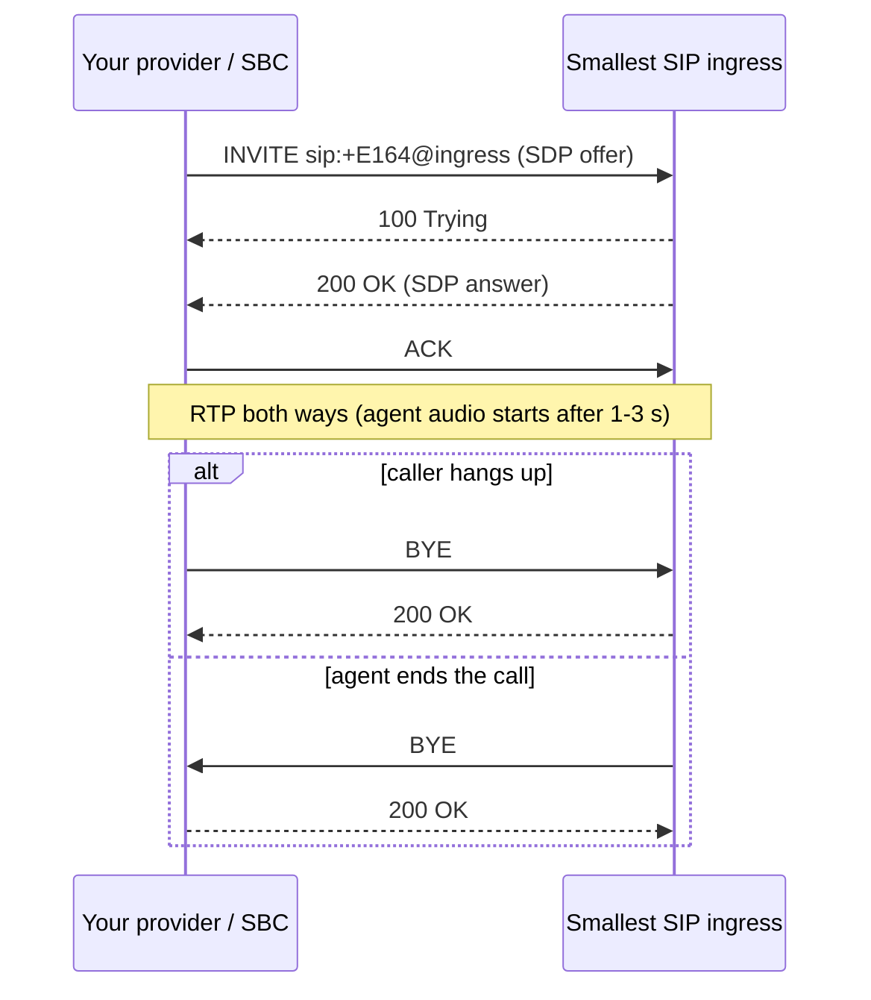
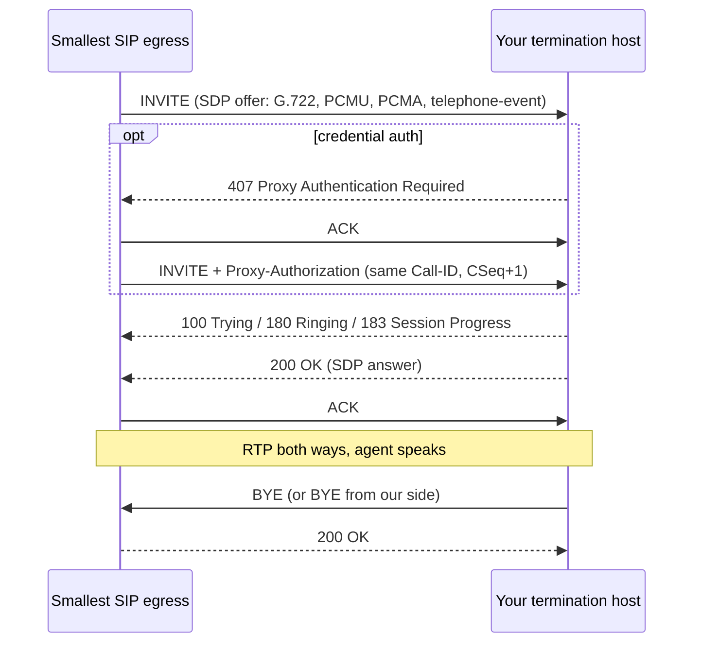
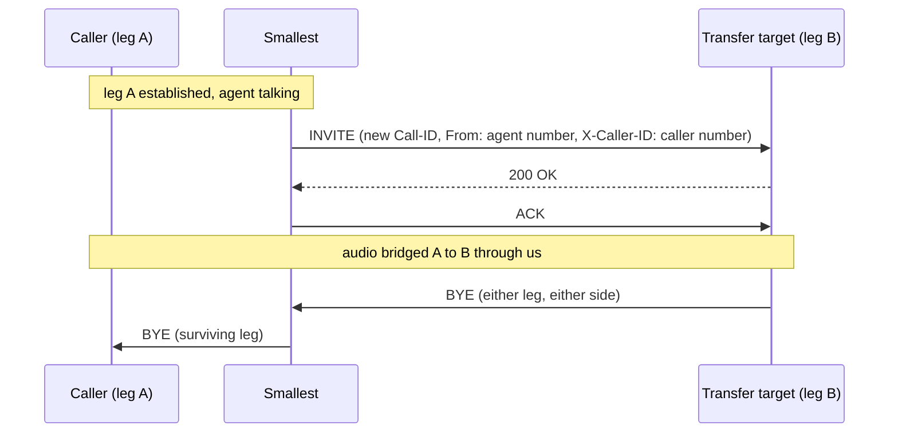

This page documents the wire-level contract behind [SIP Trunking](/voice-agents/platform/deploy/phone-numbers/sip-trunking): every message your SBC or provider will see, taken from real production captures. Read the SIP Trunking page first for setup; come here when you are integrating a switch, reading a packet capture, or debugging a call.

On the wire you will only ever see five things from us: `INVITE`, `ACK`, `CANCEL`, `BYE`, and DTMF as RFC 2833/4733 `telephone-event` in RTP. We never send SIP REFER, re-INVITE hold, or SIP INFO. The AI agent itself is not a SIP endpoint; it joins the call behind our media edge and is invisible in SIP signalling.

## Inbound call flow

Calls are answered as soon as the dialed number matches an imported number. The agent joins right after, so expect a fast `200 OK` followed by a short lead-in (typically 1 to 3 seconds) of silent RTP from our side before the agent speaks. Keep sending RTP during this window.



Inbound rejections: a failed trunk authentication returns `403`; a dialed number that matches no imported number returns `404` or `486`. An INVITE is never left unanswered, so a total timeout means your INVITE did not reach us (see [Silence, no SIP response](/voice-agents/platform/deploy/phone-numbers/sip-trunking#troubleshooting)).

## Outbound call flow

Outbound calls from your agent arrive at your termination host as a standard INVITE. If your trunk uses credential auth, expect the digest flow: we answer your `401`/`407` challenge with a second INVITE carrying the `Authorization` header, on the same Call-ID with the CSeq incremented.



### How we handle your responses

| Your final response | What we do |
|---|---|
| `200 OK` | Call proceeds; agent audio starts right after our `ACK`. |
| `486`, `600` (busy), `403`, `603` (rejected), `404` (invalid), `408`, `480` (no answer) | Attempt ends immediately. No retry. |
| `500`, `503` | Retried as brand-new calls (new Call-ID), a handful of attempts with increasing backoff. |
| Ringing with no final response | We send `CANCEL` after the ringing timeout; expect `200 OK` for the CANCEL plus `487` for the INVITE. |

## A real INVITE

Captured from a production outbound call, with numbers, credentials, and hosts genericised. Expect this exact structure at your termination host.

```
INVITE sip:+91XXXXXXXX87@sip.yourprovider.com;transport=tcp SIP/2.0
Via: SIP/2.0/TCP 198.51.100.10:9264;branch=z9hG4bK.z3Rpfi4xiY2dCtJH;alias
CSeq: 1 INVITE
Call-ID: t3TJgtjXwvytRUjF7bjAOay47xO
Content-Length: 290
To: <sip:+91XXXXXXXX87@sip.yourprovider.com;transport=tcp>
From: "Agent" <sip:+91XXXXXXXX96@YOUR_SIP_INGRESS.sip.smallest.ai;transport=tcp>;tag=SCL_xxxxxxxxxxxx
Contact: <sip:198.51.100.10:9000;transport=tcp>
Content-Type: application/sdp
Allow: INVITE, ACK, CANCEL, BYE, NOTIFY, REFER, MESSAGE, OPTIONS, INFO, SUBSCRIBE
Max-Forwards: 70

v=0
o=- 5905402662650182008 5905402662650182008 IN IP4 198.51.100.10
s=LiveKit
c=IN IP4 198.51.100.10
t=0 0
m=audio 53970 RTP/AVP 9 0 8 101
a=rtpmap:9 G722/8000
a=rtpmap:0 PCMU/8000
a=rtpmap:8 PCMA/8000
a=rtpmap:101 telephone-event/8000
a=fmtp:101 0-16
a=ptime:20
a=sendrecv
```

Things worth noticing:

- **The `From` tag is our call ID** (`SCL_...`). Quote it in any support ticket: it is the key we use to pull the call's logs and packet capture.
- **SDP offer order**: G.722 first, then PCMU, PCMA, plus `telephone-event` (payload type 101, events 0-16) for DTMF. `ptime` is 20 ms. Your `200 OK` picks the codec.
- The `Allow` header advertises more methods than we use; the messages listed at the top of this page are the only ones you will actually receive.
- SIP session timers are supported: a `Session-Expires` requirement in your `200 OK` is honored.

## Transfers on the wire

When an agent transfers a call, we do **not** send SIP REFER, so your trunk needs no REFER support. Instead we place a second, independent outbound call on the same trunk and bridge the audio:



Practical consequences:

- Leg B's INVITE carries the header `X-Caller-ID` with the original caller's number. The network caller ID (`From`) is the agent's own number; surface `X-Caller-ID` on your side if you want the target to see who is being transferred.
- A transferred call occupies **two channels** on the trunk for its full duration.
- The transfer target must be dialable on the same trunk.
- Every leg always ends with its own explicit `BYE` (or `CANCEL` if it never answered).

## Timers

| Timer | Value | What you see |
|---|---|---|
| No RTP at call setup | 30 s | `BYE` from us |
| No RTP mid-call | 15 s | `BYE` from us (raiseable per trunk on request, up to 10 min) |
| Transfer target ringing | 30 s | `CANCEL` on the transfer leg |
| Maximum call duration | 30 min | `BYE` on all legs |

If your media stack suppresses RTP during silence, enable comfort noise or ask support to raise the media timeout on your trunk; otherwise quiet calls get torn down.

## Debugging a call with support

Every call on our side has a full packet capture (SIP + RTP). To get a fast answer:

1. Grab our call ID: it is the `tag` on the `From` header of any INVITE we sent you (`SCL_...`). For inbound calls, it is on the messages we send back to you.
2. Capture your own side if you can (`tcpdump -i any -s0 -w sip.pcap 'port 5060 or port 5061 or portrange 10000-60000'`).
3. Email `support@smallest.ai` with the call ID, your capture, the exact `To:` and Request-URI of one failing INVITE, and the transport you configured.

Comparing your capture against ours settles almost every interop question in one pass. For self-diagnosis first, walk the [troubleshooting section](/voice-agents/platform/deploy/phone-numbers/sip-trunking#troubleshooting) on the SIP Trunking page.

## Region routing

Our SIP endpoint is global anycast: your INVITE lands in the region closest to where your provider sends it from. If your traffic is latency-sensitive and concentrated in one region (for example, India), region pinning is available; contact support.
