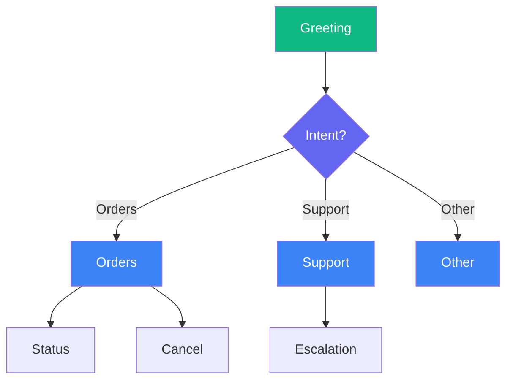

Real conversations are not linear. Users change topics, ask clarifying questions, and skip ahead. Good flow design handles these patterns gracefully.

## Linear vs Branching Flows

**Linear flow**: A to B to C. Simple but rigid.

**Branching flow**: A leads to B or C depending on user input. Flexible but complex.

Most production agents need branching.

## Designing Flows

Start by mapping the conversation:



## State Machine Approach

Track conversation state explicitly:

```python
from enum import Enum


class ConversationState(Enum):
    GREETING = "greeting"
    COLLECTING_ORDER_ID = "collecting_order_id"
    SHOWING_STATUS = "showing_status"
    HANDLING_CANCELLATION = "handling_cancellation"
    CONFIRMING = "confirming"
    DONE = "done"


class OrderAgent(OutputSwarmNode):
    def __init__(self):
        super().__init__(name="order-agent")
        self.state = ConversationState.GREETING
        self.order_id = None
        self.pending_action = None

    async def generate_response(self):
        # Get last user message
        user_msgs = [m for m in self.context.messages if m["role"] == "user"]
        user_message = user_msgs[-1]["content"] if user_msgs else ""
        
        if self.state == ConversationState.GREETING:
            yield "Hello! I can help you check an order or cancel one."
            yield " What would you like to do?"
            self.state = ConversationState.COLLECTING_ORDER_ID
            
        elif self.state == ConversationState.COLLECTING_ORDER_ID:
            # Extract order ID
            self.order_id = self._extract_order_id(user_message)
            
            if self.order_id:
                yield f"Got it, order {self.order_id}. "
                yield "Do you want to check the status or cancel it?"
                self.state = ConversationState.CONFIRMING
            else:
                yield "I need your order ID. It starts with ORD-."
                
        elif self.state == ConversationState.CONFIRMING:
            if "status" in user_message.lower():
                self.state = ConversationState.SHOWING_STATUS
                async for chunk in self._show_status():
                    yield chunk
            elif "cancel" in user_message.lower():
                self.state = ConversationState.HANDLING_CANCELLATION
                async for chunk in self._handle_cancel():
                    yield chunk
```

## Conditional Branching

Branch based on user input or data:

```python
async def generate_response(self):
    user_intent = self._classify_intent()
    
    if user_intent == "order_status":
        async for chunk in self._handle_order_status():
            yield chunk
            
    elif user_intent == "cancel_order":
        # Check if order is cancellable first
        order = await self._get_order()
        
        if order.status == "shipped":
            yield "This order has already shipped. "
            yield "Would you like to start a return instead?"
            self.pending_action = "return"
        else:
            yield "I can cancel this order. "
            yield "This action cannot be undone. Should I proceed?"
            self.pending_action = "cancel"
            
    elif user_intent == "confirm":
        if self.pending_action == "cancel":
            await self._cancel_order()
            yield "Done. Your order has been cancelled."
        elif self.pending_action == "return":
            async for chunk in self._start_return():
                yield chunk
```

## Collecting Information

Gather required data step by step:

```python
class IntakeAgent(OutputSwarmNode):
    def __init__(self):
        super().__init__(name="intake-agent")
        self.required_fields = ["name", "email", "issue"]
        self.collected = {}
        self.current_field = 0

    async def generate_response(self):
        # Get last user message
        user_msgs = [m for m in self.context.messages if m["role"] == "user"]
        user_message = user_msgs[-1]["content"] if user_msgs else ""
        
        # Store the answer to the previous question
        if self.current_field > 0:
            prev_field = self.required_fields[self.current_field - 1]
            self.collected[prev_field] = user_message
        
        # Check if we have everything
        if self.current_field >= len(self.required_fields):
            yield "Thanks! I have everything I need. "
            yield f"Name: {self.collected['name']}, "
            yield f"Email: {self.collected['email']}. "
            yield "Someone will reach out about your issue shortly."
            return
        
        # Ask for the next field
        field = self.required_fields[self.current_field]
        self.current_field += 1
        
        prompts = {
            "name": "What is your name?",
            "email": "What is your email address?",
            "issue": "Please describe your issue briefly."
        }
        
        yield prompts[field]
```

## Handling Topic Changes

Users switch topics. Detect and handle it:

```python
async def generate_response(self):
    # Get last user message
    user_msgs = [m for m in self.context.messages if m["role"] == "user"]
    user_message = user_msgs[-1]["content"] if user_msgs else ""
    
    # Detect topic change
    new_topic = self._detect_topic(user_message)
    
    if new_topic and new_topic != self.current_topic:
        # Acknowledge the switch
        yield f"Switching to {new_topic}. "
        
        # Clean up previous topic state
        self._reset_topic_state()
        
        self.current_topic = new_topic
    
    # Handle current topic
    if self.current_topic == "orders":
        async for chunk in self._handle_orders():
            yield chunk
    elif self.current_topic == "billing":
        async for chunk in self._handle_billing():
            yield chunk
```

## Confirmation Loops

For important actions, confirm before proceeding:

```python
async def generate_response(self):
    # Get last user message
    user_msgs = [m for m in self.context.messages if m["role"] == "user"]
    user_message = user_msgs[-1]["content"] if user_msgs else ""
    
    if self.awaiting_confirmation:
        if self._is_affirmative(user_message):
            await self._execute_action()
            yield "Done."
            self.awaiting_confirmation = False
        elif self._is_negative(user_message):
            yield "Okay, I won't do that. Is there anything else?"
            self.awaiting_confirmation = False
        else:
            yield "Please say yes or no."
        return
    
    # Normal flow...
    if self._wants_to_delete():
        yield "This will permanently delete your data. Are you sure?"
        self.awaiting_confirmation = True
        self.pending_action = "delete"
```

## Flow Recovery

Help users who get lost:

```python
async def generate_response(self):
    # Get last user message
    user_msgs = [m for m in self.context.messages if m["role"] == "user"]
    user_message = user_msgs[-1]["content"] if user_msgs else ""
    
    # Detect if user is confused
    confusion_signals = ["what", "huh", "confused", "start over", "help"]
    
    if any(sig in user_message.lower() for sig in confusion_signals):
        yield "No problem! Let me help. "
        yield "You can ask me to: "
        yield "Check an order, cancel an order, or talk to someone. "
        yield "What would you like?"
        
        # Reset to known state
        self.state = ConversationState.GREETING
        return
    
    # Normal flow...
```

---

## Tips

<AccordionGroup>
  <Accordion title="Use enums for state">
    Explicit states prevent bugs. You always know exactly where in the flow you are.
  </Accordion>
  <Accordion title="Handle confusion gracefully">
    Detect words like "help", "confused", "start over" and offer a reset.
  </Accordion>
  <Accordion title="Confirm destructive actions">
    Always ask "are you sure?" before deleting, cancelling, or changing important data.
  </Accordion>
</AccordionGroup>

