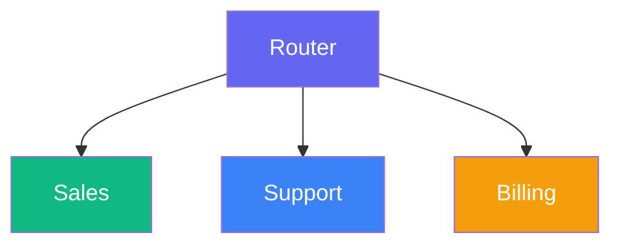
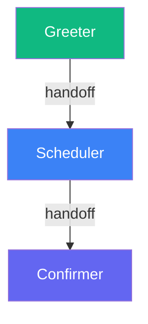

A single agent can only do so much. For complex use cases, connect multiple specialized agents. Each agent focuses on what it does best, and orchestration coordinates them.

## Why Multiple Agents?

| Approach | Pros | Cons |
|----------|------|------|
| Single agent | Simple, less latency | Prompt becomes too complex |
| Multiple agents | Focused prompts, easier to maintain | More coordination needed |

Use multiple agents when:
- Different tasks require different prompts or tools
- You need to route users to specialists
- Workflows have distinct phases

## The Router Pattern

A lightweight router node analyzes intent and directs traffic:



### Implementation

```python
from smallestai.atoms.swarm.nodes import SwarmNode, OutputSwarmNode


class RouterNode(SwarmNode):
    """Routes conversations to the appropriate specialist."""
    
    def __init__(self, sales_agent, support_agent, billing_agent):
        super().__init__(name="router")
        self.sales = sales_agent
        self.support = support_agent
        self.billing = billing_agent

    async def process_event(self, event):
        # Simple keyword-based routing
        if hasattr(event, "content"):
            content = event.content.lower()
            
            if any(word in content for word in ["buy", "price", "demo"]):
                event.metadata["route"] = "sales"
            elif any(word in content for word in ["broken", "help", "issue"]):
                event.metadata["route"] = "support"
            elif any(word in content for word in ["invoice", "payment", "bill"]):
                event.metadata["route"] = "billing"
            else:
                event.metadata["route"] = "support"  # Default
        
        await self.send_event(event)


class SalesAgent(OutputSwarmNode):
    """Handles sales inquiries."""
    
    def __init__(self):
        super().__init__(name="sales-agent")
    
    async def process_event(self, event):
        if event.metadata.get("route") == "sales":
            await super().process_event(event)
        else:
            await self.send_event(event)


class SupportAgent(OutputSwarmNode):
    """Handles support requests."""
    
    def __init__(self):
        super().__init__(name="support-agent")
    
    async def process_event(self, event):
        if event.metadata.get("route") == "support":
            await super().process_event(event)
        else:
            await self.send_event(event)
```

### Setting Up the Graph

```python
async def setup(session: SwarmSession):
    # Create agents
    sales = SalesAgent()
    support = SupportAgent()
    billing = BillingAgent()
    router = RouterNode(sales, support, billing)
    
    # Add to session
    session.add_node(router)
    session.add_node(sales)
    session.add_node(support)
    session.add_node(billing)
    
    # Connect the graph
    session.add_edge(router, sales)
    session.add_edge(router, support)
    session.add_edge(router, billing)
    
    await session.start()
    await session.wait_until_complete()
```

## The Handoff Pattern

An agent explicitly transfers control when it reaches its limits:



### Implementation

```python
class GreeterAgent(OutputSwarmNode):
    """Greets users and hands off to scheduler."""
    
    async def generate_response(self):
        # Get last user message
        user_messages = [m for m in self.context.messages if m["role"] == "user"]
        user_message = user_messages[-1]["content"] if user_messages else ""
        
        if "appointment" in user_message.lower():
            # Trigger handoff
            await self.send_event(HandoffEvent(
                target="scheduler",
                reason="User wants to schedule",
                context={"user_name": self.user_name}
            ))
            yield "Let me transfer you to our scheduling assistant."
            return
        
        # Normal greeting
        yield "Hello! How can I help you today?"


class SchedulerAgent(OutputSwarmNode):
    """Handles appointment scheduling."""
    
    async def process_event(self, event):
        if isinstance(event, HandoffEvent) and event.target == "scheduler":
            # Received handoff, take over
            self.handoff_context = event.context
            
        await super().process_event(event)
```

## Shared Context

When handing off, pass relevant context:

```python
class HandoffEvent(SDKEvent):
    """Custom event for agent handoffs."""
    type: str = "internal.handoff"
    target: str  # Target agent name
    reason: str  # Why the handoff is happening
    context: dict = {}  # Shared data


class PrequalAgent(OutputSwarmNode):
    def __init__(self):
        super().__init__(name="prequal-agent")
        self.collected_data = {}

    async def generate_response(self):
        # Check if we have all needed info
        if self._qualification_complete():
            await self.send_event(HandoffEvent(
                target="closer",
                reason="Qualification complete",
                context={
                    "lead_name": self.collected_data["name"],
                    "company": self.collected_data["company"],
                    "budget": self.collected_data["budget"],
                    "timeline": self.collected_data["timeline"]
                }
            ))
            yield "Great! Let me connect you with our sales team."
            return
        
        # Continue qualification...
```

## LLM-Based Routing

For complex routing, use an LLM:

```python
from smallestai.atoms.swarm.nodes import SwarmNode
from smallestai.atoms.swarm.clients.openai import OpenAIClient

class SmartRouterNode(SwarmNode):
    def __init__(self):
        super().__init__(name="smart-router")
        self.llm = OpenAIClient(model="gpt-4o-mini")

    async def process_event(self, event):
        if not hasattr(event, "content"):
            await self.send_event(event)
            return
        
        # Ask LLM to classify
        response = await self.llm.chat(
            messages=[
                {
                    "role": "system",
                    "content": """Classify the user intent. Respond with one word:
- SALES: pricing, demos, purchasing
- SUPPORT: issues, bugs, help
- BILLING: invoices, payments, refunds
- GENERAL: everything else"""
                },
                {"role": "user", "content": event.content}
            ]
        )
        
        intent = response.content.strip().upper()
        event.metadata["route"] = intent.lower()
        
        await self.send_event(event)
```

## Fallback Agents

Add a fallback for unhandled cases:

```python
class FallbackAgent(OutputSwarmNode):
    """Handles requests that don't match any specialist."""
    
    async def process_event(self, event):
        route = event.metadata.get("route")
        
        # Only handle if no other agent claimed it
        if route == "general" or route is None:
            await super().process_event(event)
        else:
            await self.send_event(event)
```

## Monitoring Handoffs

Log handoffs for debugging:

```python
class LoggingRouterNode(SwarmNode):
    async def process_event(self, event):
        route = self._determine_route(event)
        event.metadata["route"] = route
        
        logger.info(
            f"Routing to {route}",
            extra={
                "event_type": event.type,
                "route": route,
                "session_id": self.session_id
            }
        )
        
        await self.send_event(event)
```

---

## Tips

<AccordionGroup>
  <Accordion title="Start with keyword routing">
    Simple keyword matching covers most cases. Add LLM routing only if needed.
  </Accordion>
  <Accordion title="Pass context on handoff">
    Include what the previous agent learned so users don't repeat themselves.
  </Accordion>
  <Accordion title="Always have a fallback">
    Route to a general agent if no specialist matches. Never leave users hanging.
  </Accordion>
</AccordionGroup>

