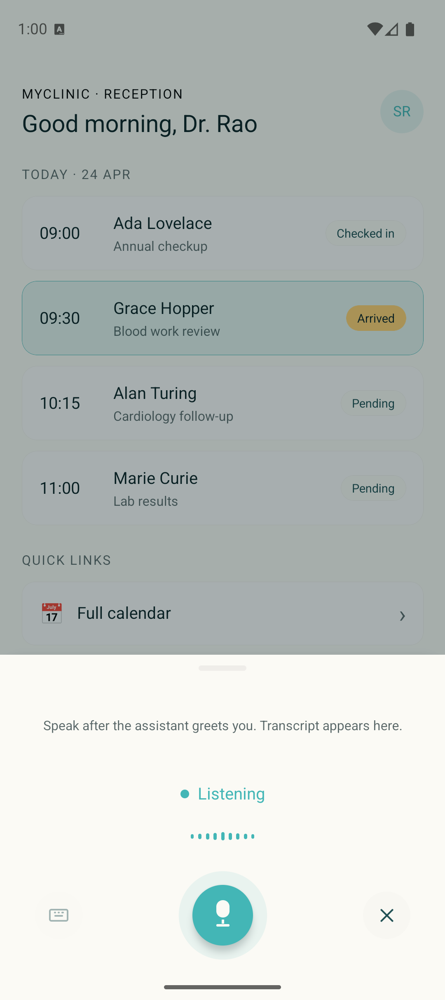
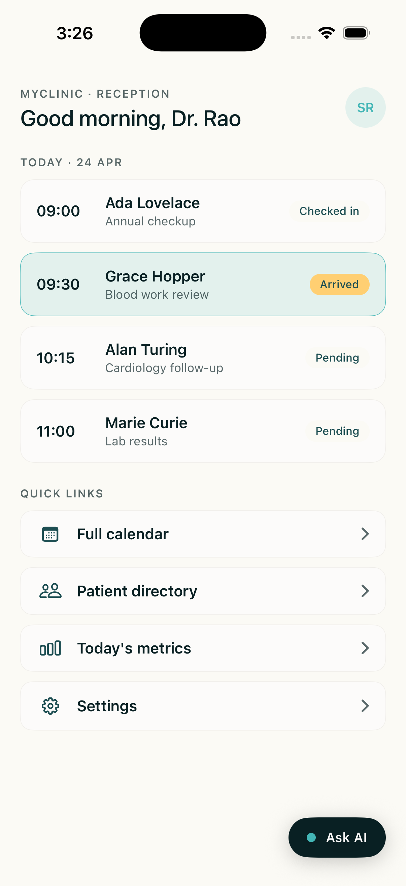
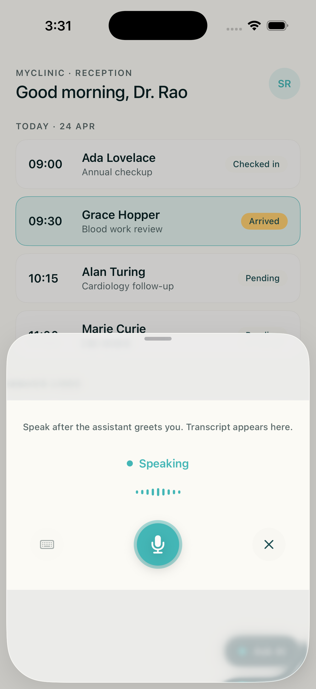
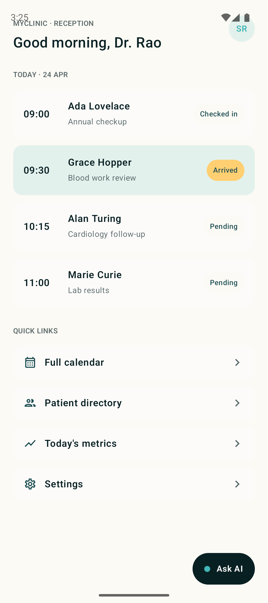
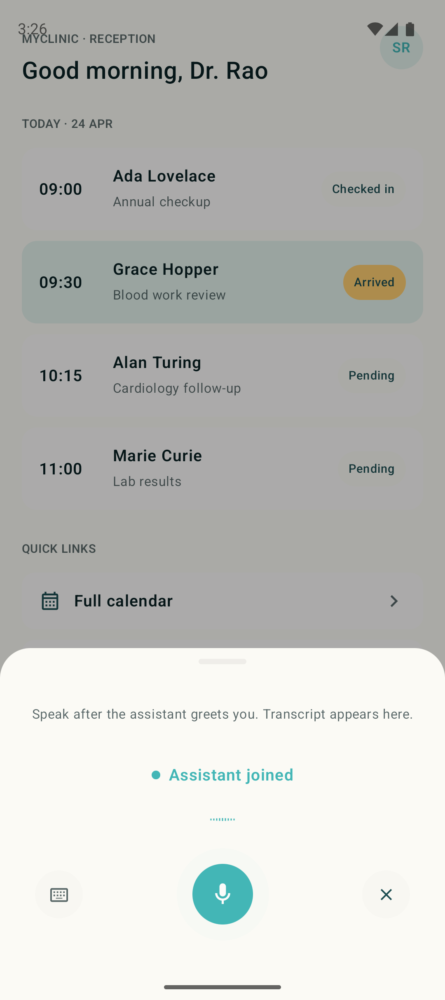
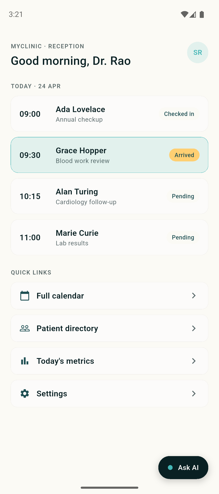
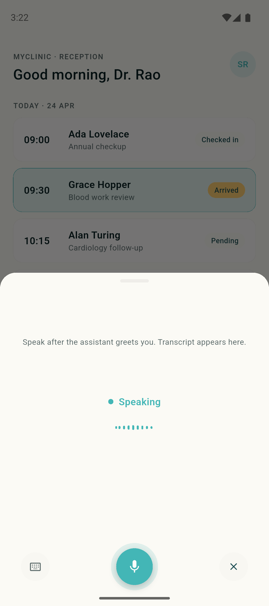

There are two paths to put a voice agent inside your product:

1. **Embed** a pre-built component. Drop a widget into the app you already ship and get a voice session behind a single call.
2. **Integrate** the Atoms WebSocket yourself. More code to own, full control over the UI and the audio session.

The table below maps each platform to both paths.

## At a glance

| Platform | Embed (widget) | Integrate (WebSocket) |
|---|---|---|
| **Web**              | [`<atoms-widget>` script tag](#web) | [WebSocket SDK](/atoms/atoms-platform/integrate/web-socket-sdk) |
| **React Native**     | [`react_native_voice_widget`](https://github.com/smallest-inc/cookbook/tree/main/voice-agents/react_native_voice_widget) | [React Native guide](/atoms/atoms-platform/integrate/mobile-integrations/react-native) |
| **iOS (Swift)**      | [`ios_swift_voice_widget`](https://github.com/smallest-inc/cookbook/tree/main/voice-agents/ios_swift_voice_widget) | [iOS Swift guide](/atoms/atoms-platform/integrate/mobile-integrations/i-os-swift) |
| **Android (Kotlin)** | [`android_kotlin_voice_widget`](https://github.com/smallest-inc/cookbook/tree/main/voice-agents/android_kotlin_voice_widget) | [Android Kotlin guide](/atoms/atoms-platform/integrate/mobile-integrations/android-kotlin) |
| **Flutter**          | [`flutter_voice_widget`](https://github.com/smallest-inc/cookbook/tree/main/voice-agents/flutter_voice_widget) | [Flutter guide](/atoms/atoms-platform/integrate/mobile-integrations/flutter) |

Every mobile widget follows the same pattern: a floating pill in the host app, a bottom sheet with a live voice session on tap, and a single public API that accepts an API key and an agent ID. The implementations are independent per platform, with no shared runtime, so each widget looks and behaves native.

If you need full control of the screen instead of a drop-in component, the [reference apps](#reference-apps) show the same transport and audio code in a full-screen voice UI.

## Web

Paste two lines into any HTML page:

```html
<atoms-widget assistant-id="YOUR_AGENT_ID"></atoms-widget>
<script src="https://unpkg.com/atoms-widget-core@latest/dist/embed/widget.umd.js"></script>
```

That renders a floating call bubble on the page. Clicking it opens a voice session with your agent. The component is a web-standard Custom Element and works in any framework (React, Vue, Svelte, plain HTML). Configure theme, position, and agent ID through HTML attributes.

To customize the widget's appearance or placement, see the [Widget features reference](/atoms/atoms-platform/features/widget).

## React Native

```tsx
import { AtomsWidget } from './widget/AtomsWidget';

<AtomsWidget apiKey={API_KEY} agentId={AGENT_ID} label="Ask AI" />
```

The [React Native widget cookbook](https://github.com/smallest-inc/cookbook/tree/main/voice-agents/react_native_voice_widget) ships an Expo app with the widget wired into a MyClinic receptionist host. It uses `react-native-audio-api` for mic capture and gapless playback, owns the WebSocket session, and exposes a mute button plus a live transcript.

| Host with pill | Sheet open |
|---|---|
|  |  |

For integrating the transport into an existing RN app without the widget wrapper, follow the [React Native integration guide](/atoms/atoms-platform/integrate/mobile-integrations/react-native).

## iOS (Swift)

```swift
import SwiftUI

struct RootView: View {
    var body: some View {
        ZStack {
            YourHostScreen()
            AtomsWidget(apiKey: API_KEY, agentId: AGENT_ID, label: "Ask AI")
        }
    }
}
```

The [iOS Swift widget cookbook](https://github.com/smallest-inc/cookbook/tree/main/voice-agents/ios_swift_voice_widget) is a SwiftUI component built on `URLSessionWebSocketTask` and `AVAudioEngine`, with no external dependencies. Xcode project is generated by `xcodegen` from `project.yml`, so you can audit the full build config at a glance.

| Host with pill | Sheet open |
|---|---|
|  |  |

For integrating into an existing app without the widget wrapper, see the [iOS Swift guide](/atoms/atoms-platform/integrate/mobile-integrations/i-os-swift).

## Android (Kotlin)

```kotlin
import ai.smallest.atomswidget.AtomsWidget

setContent {
    Box(Modifier.fillMaxSize()) {
        YourHostScreen()
        AtomsWidget(apiKey = API_KEY, agentId = AGENT_ID, label = "Ask AI")
    }
}
```

The [Android Kotlin widget cookbook](https://github.com/smallest-inc/cookbook/tree/main/voice-agents/android_kotlin_voice_widget) is a Jetpack Compose composable that uses OkHttp's WebSocket client and platform `AudioRecord` / `AudioTrack`. Material 3 `ModalBottomSheet` manages the sheet. Gradle injects credentials via `BuildConfig`.

| Host with pill | Sheet open |
|---|---|
|  |  |

For integrating into an existing app without the widget wrapper, see the [Android Kotlin guide](/atoms/atoms-platform/integrate/mobile-integrations/android-kotlin).

## Flutter

```dart
AtomsWidget(apiKey: API_KEY, agentId: AGENT_ID, label: 'Ask AI')
```

The [Flutter widget cookbook](https://github.com/smallest-inc/cookbook/tree/main/voice-agents/flutter_voice_widget) is a Material widget on top of `web_socket_channel`, the `record` package for PCM capture, and `flutter_pcm_sound` for playback. Credentials are injected via `--dart-define` at build time.

| Host with pill | Sheet open |
|---|---|
|  |  |

For integrating into an existing app without the widget wrapper, see the [Flutter guide](/atoms/atoms-platform/integrate/mobile-integrations/flutter).

## Reference apps

If the widget pattern is too constrained (for example, you want voice to own the whole screen, or you want to study the transport plumbing in isolation), the cookbook also ships full-screen reference apps per platform:

- [React Native (Hearthside)](https://github.com/smallest-inc/cookbook/tree/main/voice-agents/react_native_voice_agent)
- [iOS Swift](https://github.com/smallest-inc/cookbook/tree/main/voice-agents/ios_swift_voice_agent)
- [Android Kotlin](https://github.com/smallest-inc/cookbook/tree/main/voice-agents/android_kotlin_voice_agent)
- [Flutter](https://github.com/smallest-inc/cookbook/tree/main/voice-agents/flutter_voice_agent)

Each is a runnable app with the same transport and audio code as the matching widget. Fork it, swap the agent ID, ship.

The [`MOBILE_COOKBOOKS.md`](https://github.com/smallest-inc/cookbook/blob/main/voice-agents/MOBILE_COOKBOOKS.md) cross-reference in the cookbook repo covers validation checklists, shared debug patterns (transport counter, mute-for-loop-debugging, Android emulator mic toggle, iOS simulator audio caveat), and a "when to use which cookbook" matrix.

## Roadmap

First-party SDK packages on npm, Swift Package Manager, Maven, and pub.dev are the next step. The transport, audio, and UI code in the widget cookbooks today becomes the SDK tomorrow. Until then, the cookbooks are the supported embed path.

## Reference

- [Realtime Agent WebSocket API](/atoms/api-reference/api-reference/realtime-agent/realtime-agent). The protocol every client speaks.
- [WebSocket SDK (web)](/atoms/atoms-platform/integrate/web-socket-sdk). The browser-side JS SDK.
- [Widget features](/atoms/atoms-platform/features/widget). Web widget configuration options.
