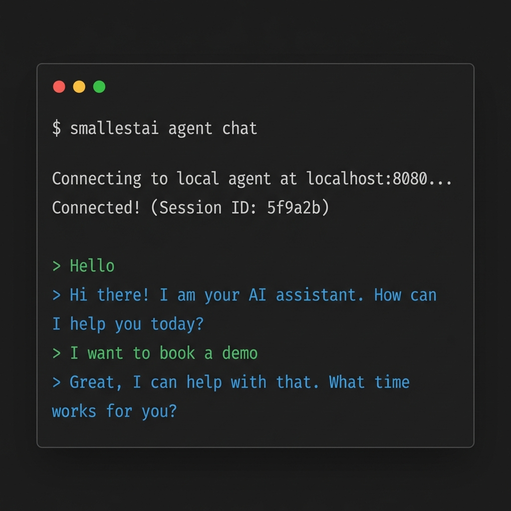

The Atoms CLI is built for rapid iteration. Test your agent locally with a single command, then deploy to the cloud when ready. No configuration files, no Docker, no infrastructure management.

<Info>
  **Local-first development**: Run and test your agent entirely on your machine. Deploy only when you're satisfied.
</Info>

---

## Installation

The CLI comes bundled with the SDK:

```bash
pip install smallestai
```

Verify the installation:

```bash
smallestai --help
```

---

## Local Development Workflow

The CLI's best feature is instant local testing. No need to deploy to test changes.

<Steps>
  <Step title="Start Your Agent Server">
    Run your agent file to start a local WebSocket server:
    
    ```bash
    python your_agent.py
    ```
    
    This spins up a server on `localhost:8080` that mimics the production environment.
  </Step>
  
  <Step title="Connect via CLI">
    In another terminal, start an interactive voice session:
    
    ```bash
    smallestai agent chat
    ```
    
    The CLI connects to your local server and lets you converse with your agent in real-time.
    
    
  </Step>
  
  <Step title="Iterate Rapidly">
    Make code changes, restart the server, and reconnect with `chat`. No redeploys needed.
  </Step>
</Steps>

---

## Cloud Deployment

When you're ready for production, deploy to Smallest AI's managed infrastructure.

<Warning>
  **Prerequisite:** You must first create an agent on the [Atoms platform](https://atoms.smallest.ai) before deploying. The CLI links your local code to an existing platform agent.
</Warning>

<Steps>
  <Step title="Authenticate">
    ```bash
    smallestai auth login
    ```
    
    Opens a browser for OAuth. Your credentials are stored locally.
  </Step>
  
  <Step title="Link to Platform Agent">
    ```bash
    smallestai agent init
    ```
    
    Select which agent from [atoms.smallest.ai](https://atoms.smallest.ai) to link your local code to.
  </Step>
  
  <Step title="Deploy">
    ```bash
    smallestai agent deploy --entry-point your_agent.py
    ```
    
    Packages your code and pushes it to the cloud. Takes about 30 seconds.
  </Step>
  
  <Step title="Go Live">
    ```bash
    smallestai agent builds
    ```
    
    Select your build and choose **Make Live** to start serving traffic.
  </Step>
</Steps>

---

## Command Reference

### Authentication

| Command | Description |
|---------|-------------|
| `smallestai auth login` | Authenticate with your Smallest AI account |
| `smallestai auth logout` | Clear stored credentials |

### Agent Management

| Command | Description |
|---------|-------------|
| `smallestai agent init` | Link local directory to a platform agent |
| `smallestai agent deploy` | Deploy code to the cloud |
| `smallestai agent builds` | View and manage deployments |
| `smallestai agent chat` | Start interactive session with local agent |

### Common Options

| Option | Description |
|--------|-------------|
| `--entry-point <file>` | Specify the main Python file (default: `server.py`) |
| `--help` | Show help for any command |

---

## Build Management

Deployments are not live by default. This gives you a safety buffer.

<Warning>
  **One Live Build Per Agent**: Making a new build live automatically takes down the previous one.
</Warning>

**To promote a build:**
1. Run `smallestai agent builds`
2. Select the desired build
3. Choose **Make Live**

**To roll back:**
1. Run `smallestai agent builds`
2. Select the previous build
3. Choose **Make Live**

**To take down completely:**
1. Run `smallestai agent builds`
2. Select the **LIVE** build
3. Choose **Take Down**
