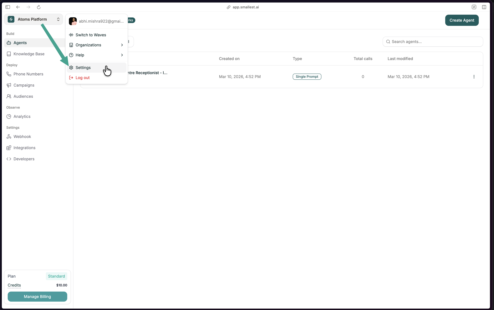
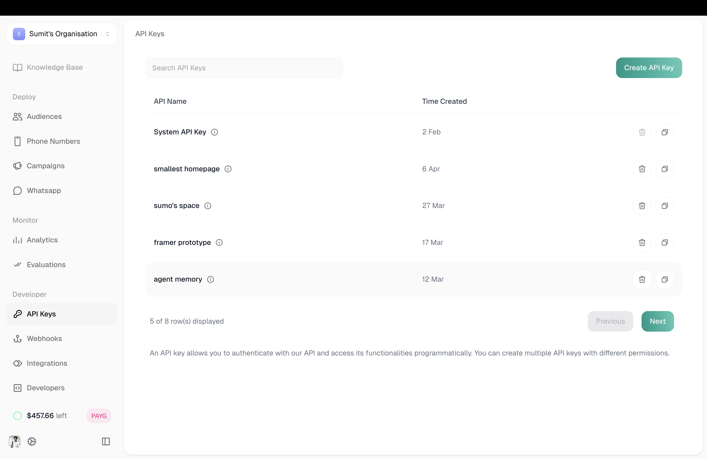
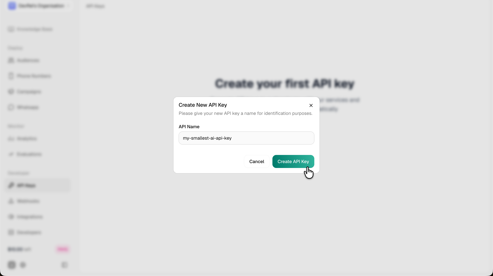

The Smallest MCP Server connects your AI editor to the Smallest AI platform. No console tab-switching — just type what you want in natural language.

---

## Prerequisites

The MCP server runs via **npx**, which requires **Node.js** installed on your machine. Pick your experience level:

<Tabs>
  <Tab title="I'm non-technical">
    This is a one-time setup that takes about 5 minutes. Pick your computer type:

    <Tabs>
      <Tab title="Mac">
        <Steps>
          <Step title="Open Terminal">
            Press **Cmd + Space** to open Spotlight, type **Terminal**, and press Enter. A window with a blinking cursor will appear — this is where you'll paste commands.
          </Step>

          <Step title="Install Homebrew">
            Homebrew is a free tool that helps install software on Mac. Copy this entire line and paste it into Terminal, then press Enter:

            ```bash
            /bin/bash -c "$(curl -fsSL https://raw.githubusercontent.com/Homebrew/install/HEAD/install.sh)"
            ```

            It will ask for your **Mac password** (the one you use to log in). Type it and press Enter — **you won't see any characters appear while typing, that's normal**.

            Wait for it to finish (1-2 minutes).

            <Callout intent="info">
              If it says "Homebrew is already installed" — great, skip to the next step.
            </Callout>

            **Important for newer Macs (M1/M2/M3/M4):** After Homebrew finishes, it will show a "Next steps" section with two commands. Copy and paste them one at a time:
            ```bash
            echo >> ~/.zprofile
            echo 'eval "$(/opt/homebrew/bin/brew shellenv)"' >> ~/.zprofile
            eval "$(/opt/homebrew/bin/brew shellenv)"
            ```
          </Step>

          <Step title="Install Node.js">
            Paste this into Terminal and press Enter:
            ```bash
            brew install node
            ```
            Wait for it to finish (1-2 minutes).
          </Step>

          <Step title="Check it worked">
            Paste this and press Enter:
            ```bash
            node --version
            ```
            If you see a number like `v22.x.x` — you're done with prerequisites!
          </Step>
        </Steps>

        <Callout intent="warn">
          **Stuck?** If anything fails, the simplest alternative is to go to [nodejs.org](https://nodejs.org/), click the big green **LTS** button, download the `.pkg` file, and double-click it to install.
        </Callout>
      </Tab>
      <Tab title="Windows">
        <Steps>
          <Step title="Download Node.js">
            Go to [nodejs.org](https://nodejs.org/) and click the big green **LTS** button. This downloads an installer file.
          </Step>

          <Step title="Run the installer">
            Find the downloaded file (usually in your Downloads folder — it's called something like `node-v22.x.x-x64.msi`). Double-click it.

            Click **Next** through each screen. **Don't change any settings** — the defaults are correct.

            Click **Install** when prompted, then **Finish**.
          </Step>

          <Step title="Restart your computer">
            This makes sure Windows recognizes the new software. Save your work and restart.
          </Step>

          <Step title="Check it worked">
            After restarting, press **Windows key**, type **PowerShell**, and open it. Paste this and press Enter:
            ```powershell
            node --version
            ```
            If you see a number like `v22.x.x` — you're done with prerequisites!
          </Step>
        </Steps>

        <Callout intent="warn">
          **If it says "node is not recognized":** Make sure you restarted your computer after installing. If it still doesn't work, run the installer again and make sure **"Add to PATH"** is checked.
        </Callout>
      </Tab>
    </Tabs>
  </Tab>
  <Tab title="I'm a developer">
    Requires **Node.js 18+**.

    <Tabs>
      <Tab title="Mac">
        ```bash
        brew install node    # or: nvm install 22
        ```
      </Tab>
      <Tab title="Windows">
        ```powershell
        winget install OpenJS.NodeJS.LTS
        ```
      </Tab>
      <Tab title="Linux">
        ```bash
        curl -fsSL https://deb.nodesource.com/setup_22.x | sudo -E bash -
        sudo apt-get install -y nodejs
        ```
      </Tab>
    </Tabs>

    Verify: `node --version` should show v18+.
  </Tab>
</Tabs>

---

## Setup

<Steps>
  <Step title="Get your API key">
    Open [app.smallest.ai](https://app.smallest.ai?utm_source=documentation&utm_medium=docs), click your profile in the top-left, and go to **Settings**.

    <Frame caption="Open Settings from your profile dropdown">
      
    </Frame>

    Click **API Keys** in the sidebar, then **Create API Key**.

    <Frame caption="Create a new API key from the API Keys settings page">
      
    </Frame>

    Name your key and click **Create API Key**. Copy it — it starts with `sk_`.

    <Frame caption="Name your key and click Create">
      
    </Frame>
  </Step>

  <Step title="Configure your editor">
    <Tabs>
      <Tab title="Claude Desktop">
        <Steps>
          <Step title="Open the config">
            Open **Claude Desktop** → click the **Settings** gear icon (bottom-left) → **Developer** → **Edit Config**

            This opens a file in your text editor.
          </Step>
          <Step title="Paste the config">
            Replace everything in the file with this (or add the `"smallest"` section if you already have other servers):

            ```json
            {
              "mcpServers": {
                "smallest": {
                  "command": "npx",
                  "args": ["-y", "@developer-smallestai/smallest-mcp-server"],
                  "env": {
                    "ATOMS_API_KEY": "sk_paste_your_key_here"
                  }
                }
              }
            }
            ```

            **Replace** `sk_paste_your_key_here` with the API key you copied in Step 1.
          </Step>
          <Step title="Save the file">
            Press **Cmd+S** (Mac) or **Ctrl+S** (Windows) to save.
          </Step>
        </Steps>
      </Tab>
      <Tab title="Cursor">
        Open (or create) the config file:
        - **Mac / Linux:** `~/.cursor/mcp.json`
        - **Windows:** `%USERPROFILE%\.cursor\mcp.json`

        ```json
        {
          "mcpServers": {
            "smallest": {
              "command": "npx",
              "args": ["-y", "@developer-smallestai/smallest-mcp-server"],
              "env": {
                "ATOMS_API_KEY": "sk_paste_your_key_here"
              }
            }
          }
        }
        ```

        **Replace** `sk_paste_your_key_here` with your actual API key.
      </Tab>
      <Tab title="Claude Code">
        Run this in your terminal:

        ```bash
        claude mcp add smallest -- npx -y @developer-smallestai/smallest-mcp-server
        ```

        Then set your API key:

        ```bash
        claude mcp update smallest --env ATOMS_API_KEY=sk_paste_your_key_here
        ```
      </Tab>
    </Tabs>

    <Callout intent="warn">
      Don't share your API key or commit it to git.
    </Callout>
  </Step>

  <Step title="Restart your editor">
    <Tabs>
      <Tab title="Claude Desktop">
        Fully quit the app (**Cmd+Q** on Mac, or right-click the taskbar icon → Quit on Windows) and reopen it.
      </Tab>
      <Tab title="Cursor">
        `Cmd+Shift+P` (Mac) or `Ctrl+Shift+P` (Windows) → type **Developer: Reload Window** → press Enter
      </Tab>
      <Tab title="Claude Code">
        Start a new session — the MCP is loaded automatically.
      </Tab>
    </Tabs>
  </Step>

  <Step title="Verify">
    Type this in chat:

    ```
    List all my agents
    ```

    You should see your agents listed back. You're set up!
  </Step>
</Steps>

---

## What can you do?

Just type in your editor's chat — the AI picks the right tool:

<Tabs>
  <Tab title="View data">
    ```
    Show me all failed calls from this week
    ```
    ```
    What's our total call spend this month?
    ```
    ```
    List all my agents
    ```
  </Tab>
  <Tab title="Debug">
    ```
    Debug call CALL-1234567890-abc123
    ```
    Returns the full transcript, errors, timing, costs, and post-call analytics.
  </Tab>
  <Tab title="Build">
    ```
    Create a new agent called "Support Bot"
    ```
    ```
    Update its prompt to: "You are a helpful support agent..."
    ```
  </Tab>
  <Tab title="Call">
    ```
    Call +14155551234 using the "Sales" agent
    ```
    Triggers a real outbound call — the agent follows its configured prompt.
  </Tab>
  <Tab title="TTS & STT">
    ```
    Convert this text to speech using the yuvika voice: "Hello, welcome to Smallest AI"
    ```
    ```
    Transcribe this audio file: ~/Desktop/recording.wav
    ```
  </Tab>
  <Tab title="Analytics">
    ```
    Show me the dashboard for the last 30 days
    ```
    ```
    Compare agent performance this week
    ```
    ```
    What's the hourly call distribution today?
    ```
  </Tab>
</Tabs>

See the full list in the **[Prompt Cookbook](/atoms/mcp/using-the-mcp/prompt-cookbook)**.
