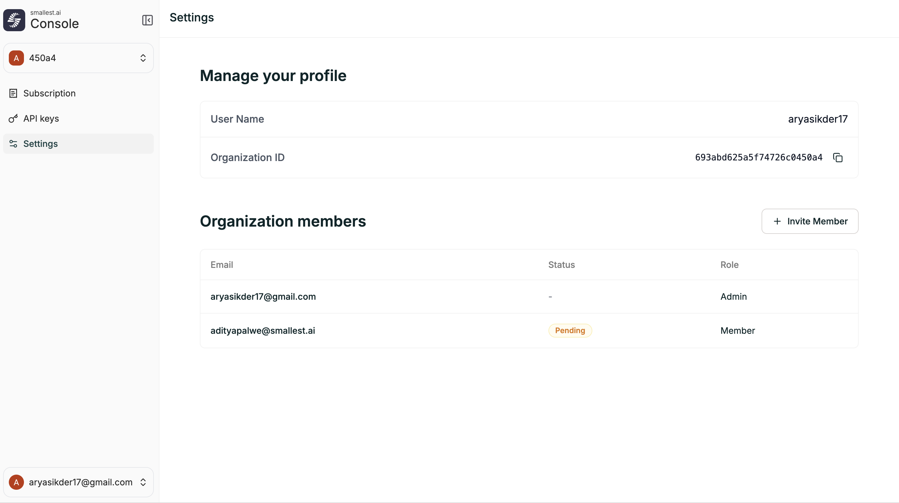

**Location:** [console.smallest.ai](https://console.smallest.ai) → Settings

<Frame caption="Settings page">
  
</Frame>

---

## Profile

The Settings page shows your account details:

| Field | Description |
|-------|-------------|
| **User Name** | Your display name |
| **Organization ID** | Unique identifier for your organization (click to copy) |

---

## Organization Members

Manage who has access to your organization. You can invite new members and see the status of existing ones.

### Inviting a Member

1. Go to [console.smallest.ai](https://console.smallest.ai) → **Settings**
2. Click **+ Invite Member**
3. Enter the team member's email address
4. The invitee will receive an email to join your organization

### Member Details

The members table shows:

| Column | Description |
|--------|-------------|
| **Email** | The member's email address |
| **Status** | Active or **Pending** (invitation sent but not yet accepted) |
| **Role** | **Admin** or **Member** |

### Roles

| Role | Access |
|------|--------|
| **Admin** | Full access — manage agents, campaigns, settings, billing, and team members |
| **Member** | Standard access — work with agents and campaigns, no team or billing management |
