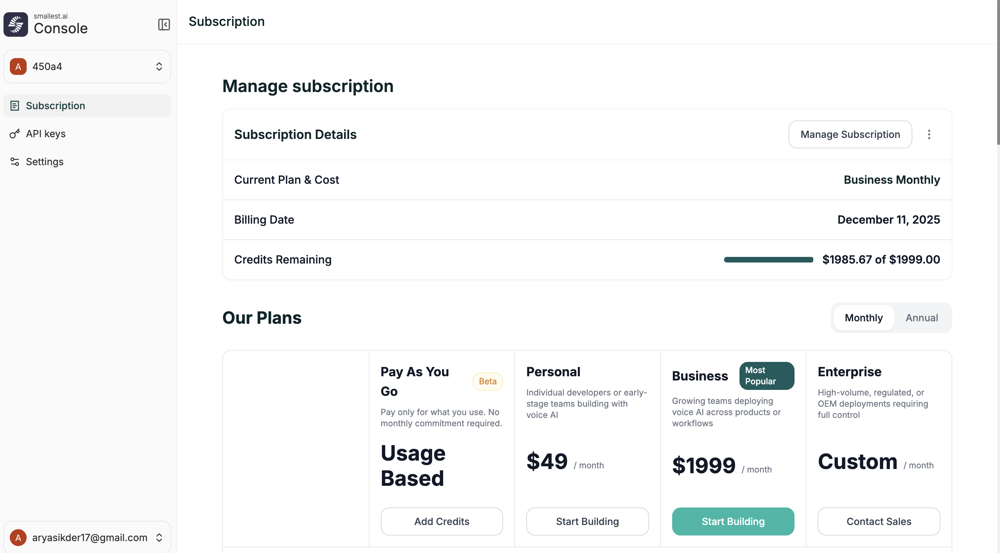

**Location:** [app.smallest.ai](https://app.smallest.ai) → Subscription

<Frame caption="Subscription page">
  
</Frame>

---

## Manage Subscription

The Subscription page shows your current plan, billing date, and remaining credits. Click **Manage Subscription** to upgrade, downgrade, or update payment details.

---

## Plans

Plans are available on **Monthly** or **Annual** billing. All plans include access to the no-code Agent Builder and Agentic Graph Builder.

| | Pay As You Go | Personal | Business | Enterprise |
|---|---|---|---|---|
| **Price** | Usage Based | $49/month | $1,999/month | Custom |
| **AI Agents** | 5 | 5 | 20 | Unlimited |
| **Campaigns** | 60 | 60 | 1,000 | Custom |
| **Parallel Calls** | 1 | 1 | 10 | Custom |
| **Cost/min (India)** | ~$0.09 | ~$0.09 | ~$0.07 | Custom |
| **Cost/min (US)** | ~$0.15 | ~$0.15 | ~$0.12 | Custom |
| **Voice Clones** | 5 | 5 | 15 | Unlimited |
| **API Access** | Limited | Limited | Full | Full |
| **CRM Integrations** | — | — | ✅ | ✅ |
| **Compliance (HIPAA, SOC2)** | — | — | — | ✅ |
| **On-premise Deployment** | — | — | — | ✅ |
| **Support** | Email | Email | Slack + Priority | Custom SLA |

---

## Questions?

<Card title="Contact Sales" icon="envelope" href="mailto:sales@smallest.ai">
  Custom pricing for enterprise or high-volume needs
</Card>
