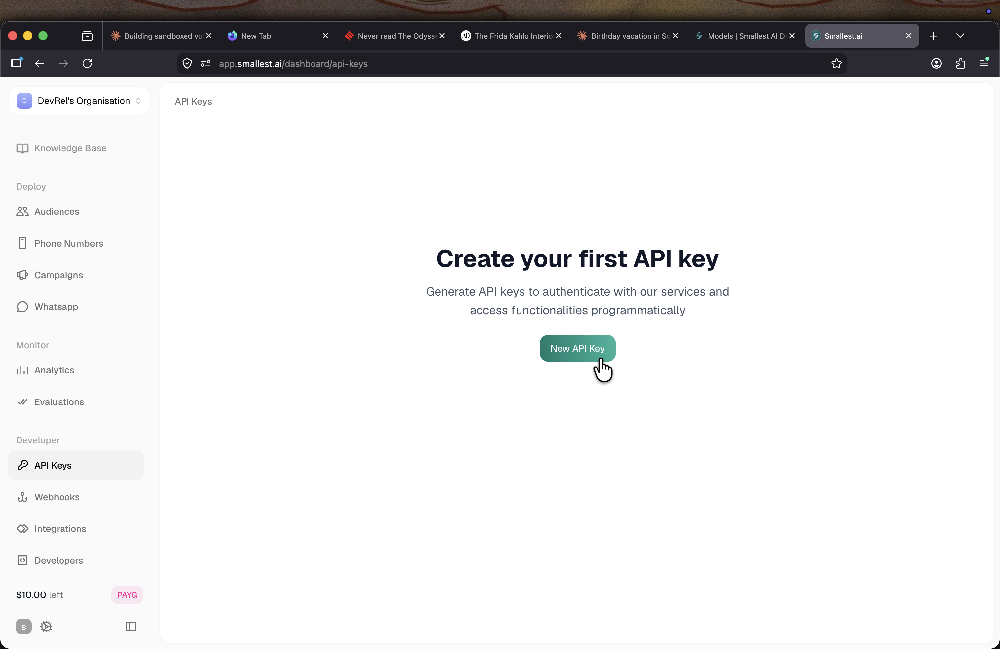
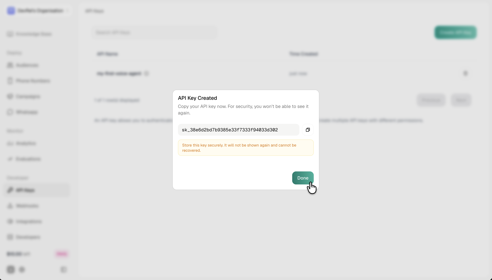

Every request to the Smallest AI API is authenticated with a bearer API key. This page walks through creating a key from the console, using it in code, and rotating or revoking it when you need to.

```
Authorization: Bearer YOUR_API_KEY
```

The same key works across Atoms (agents, calls, campaigns) and Waves (Pulse STT, Lightning TTS, Electron LLM, Hydra S2S). Usage is tracked per key against your account quota.

## Create an API key

<Steps>
  <Step title="Open the API Keys page">
    In the [Smallest AI console](https://app.smallest.ai/dashboard), open the **Developer** section in the left sidebar and select **API Keys**, or jump directly to [app.smallest.ai/dashboard/api-keys](https://app.smallest.ai/dashboard/api-keys?utm_source=documentation&utm_medium=api-keys).

    If this is your first key, you'll see an empty state with a **New API Key** button. Otherwise you'll see the list of existing keys with a **Create API Key** button in the top-right.

    <Frame caption="API Keys page, empty state">
      
    </Frame>
  </Step>
  <Step title="Name the key">
    Click **New API Key** (or **Create API Key**). Enter a descriptive name identifying where the key will be used (e.g. `production`, `staging`, `dev-team`, or `my-voice-agent`). Names are for your reference only and can be reused across environments.

    Click **Create API Key** in the dialog to confirm.

    <Frame caption="Create New API Key dialog">
      
    </Frame>
  </Step>
  <Step title="Copy the key immediately">
    The generated key is shown once, then hidden. It starts with `sk_` followed by a random suffix. Click the copy icon and paste it somewhere safe before dismissing the dialog.

    <Warning>
      Keys are **shown only once at creation**. If you lose it, you'll need to create a new key and revoke the old one. There's no way to recover the value later.
    </Warning>

    <Frame caption="Generated API key with the copy control">
      
    </Frame>
  </Step>
  <Step title="Store it in your environment">
    Set the key as an environment variable so your code picks it up automatically:

    ```bash
    export SMALLEST_API_KEY="sk_your_key_here"
    ```

    Add the line to your `.bashrc` or `.zshrc` (or your team's secrets manager for production) to persist across sessions. Never hard-code the key in source, and never commit it to version control.
  </Step>
</Steps>

## Use the key

Include the key in the `Authorization` header on every request.

<CodeGroup>

```bash cURL
curl -X GET "https://api.smallest.ai/atoms/v1/agent" \
  -H "Authorization: Bearer $SMALLEST_API_KEY"
```

```python Python
import os
from smallestai.atoms import AtomsClient

# Reads SMALLEST_API_KEY from environment automatically
client = AtomsClient()

# Or pass explicitly if you manage secrets differently
client = AtomsClient(api_key=os.environ["SMALLEST_API_KEY"])

agents = client.agent.list()
```

```javascript Node.js
import { AtomsClient } from "@smallest/atoms";

// Reads SMALLEST_API_KEY from environment automatically
const client = new AtomsClient();

const agents = await client.agent.list();
```

</CodeGroup>

For Waves (TTS, STT, LLM, S2S), the same key authenticates every route:

```bash
curl -X POST "https://api.smallest.ai/waves/v1/tts" \
  -H "Authorization: Bearer $SMALLEST_API_KEY" \
  -H "Content-Type: application/json" \
  -H "Accept: audio/wav" \
  -d '{"text": "Hello from Smallest AI.", "voice_id": "meher", "model": "lightning_v3.1_pro", "output_format": "wav"}' \
  --output hello.wav
```

## Manage existing keys

The API Keys page lists every key on your organization with its name, creation time, and controls to copy or revoke.

| Action | How |
|--------|-----|
| **Search** | Filter the list by name with the search bar above the table. |
| **Delete** | Click the trash icon next to a key to revoke it. Any request made with a revoked key returns `401 Unauthorized` immediately. |

<Tip>
  Create one key per environment (production, staging, dev) so you can rotate or revoke each independently without breaking the others. Reusing a single key everywhere means a single leaked key forces a full-fleet rotation.
</Tip>

## Rotate a key

Rotating regularly limits blast radius if a key ever leaks. The recommended cadence: every 90 days, on any team change, or immediately if you suspect exposure (e.g. an accidental commit to a public repo).

1. Create a new key on the dashboard with a name reflecting the rotation (e.g. `production-2026-q3`).
2. Update your environment or secrets manager with the new value.
3. Deploy the change to every service that uses the key.
4. Confirm requests succeed with the new key.
5. Revoke the old key from the dashboard.

## Security

<Warning>
  Your API key grants full account access. Never commit it to version control, expose it in browser or mobile client code, or share it in Slack / email / support tickets.
</Warning>

- Store keys in environment variables or a secrets manager, never in source.
- Add `.env` to `.gitignore` locally, and use platform secrets (GitHub Actions secrets, Vercel env vars, AWS Secrets Manager, etc.) for CI and production.
- Prefer a proxy server for browser and mobile apps: your app calls your backend, your backend calls Smallest AI with the key.
- Revoke immediately if a key is exposed and rotate the affected services.

## Errors

| Status | Meaning | Action |
|--------|---------|--------|
| `401 Unauthorized` | Missing, malformed, or revoked API key | Check the `Authorization` header. Confirm the key is active on the dashboard. |
| `403 Forbidden` | Key is valid but not authorized for this endpoint | Contact support if you expect access; some endpoints are gated per plan. |
| `429 Too Many Requests` | Rate limit or concurrency ceiling reached | Wait and retry with backoff. See your plan on [Subscription & Plans](/atoms/atoms-platform/account/subscription-plans). |

For concurrency limits and rate-limit specifics, see [Concurrency & Limits](/waves/api-reference/api-references/concurrency-and-limits) on the Waves side; Atoms shares the same quota.
