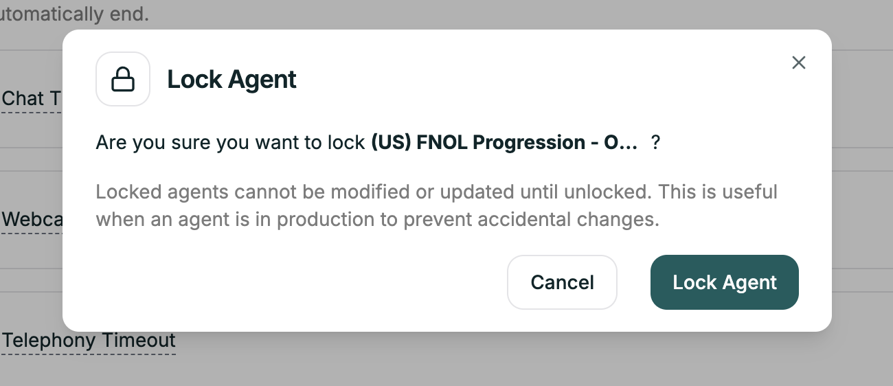

Once your agent is working well, lock it. Locking prevents accidental edits that could break a production agent.

**Location:** Top right → **Lock Agent** toggle

<Frame caption="Lock Agent toggle">
  
</Frame>

---

## How It Works

Toggle **Lock Agent** to ON — all editing becomes disabled.

**What's blocked:**
- Prompt editing
- Configuration changes
- Settings modifications
- Node changes (Convo Flow)

**What still works:**
- Test Agent
- View Conversation Logs
- Live calls continue normally

To make changes, toggle it back to OFF, edit, test, then re-lock.

---

## Related

<CardGroup cols={2}>
  <Card title="Testing" icon="flask" href="/atoms/atoms-platform/analytics-and-logs/testing">
    Test before locking
  </Card>
  <Card title="Phone Numbers" icon="phone" href="/atoms/atoms-platform/deployment/phone-numbers">
    Deploy to production
  </Card>
</CardGroup>
