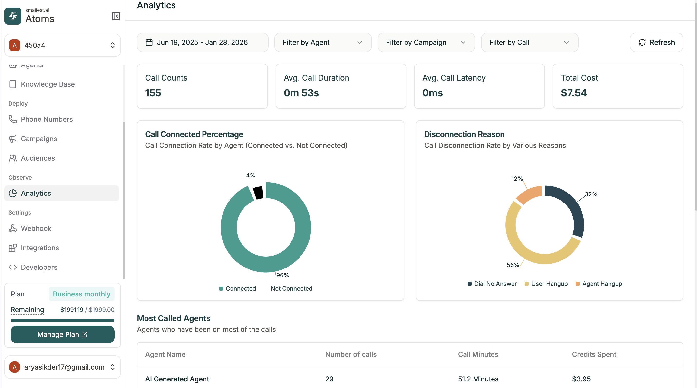

The Analytics dashboard gives you a bird's-eye view of all your voice AI agnets activity — call volumes, connection rates, costs, and agent performance.

**Location:** Left Sidebar → Observe → Analytics

<Frame>
  
</Frame>

---

## Filters

Narrow down your data with the filters at the top:

| Filter | Options |
|--------|---------|
| **Date Range** | Select start and end dates |
| **Filter by Agent** | View specific agent's calls |
| **Filter by Campaign** | View specific campaign's calls |
| **Filter by Call** | Filter by call type or status |

Click **Refresh** to update the dashboard with your selections.

---

## Summary Cards

Quick metrics at the top of the dashboard:

| Metric | Description |
|--------|-------------|
| **Call Counts** | Total number of calls |
| **Avg. Call Duration** | Average length of calls |
| **Avg. Call Latency** | Average response time |
| **Total Cost** | Credits spent on calls |

---

## Charts

### Call Connected Percentage

Pie chart showing the connection rate by agent—how many calls connected vs. didn't connect.

### Disconnection Reason

Breakdown of why calls ended:
- **Dial No Answer** — Contact didn't pick up
- **User Hangup** — Contact ended the call
- **Agent Hangup** — Agent ended the call

---

## Most Called Agents

Table showing which agents handled the most calls:

| Column | Description |
|--------|-------------|
| Agent Name | The agent |
| Number of calls | Total calls handled |
| Call Minutes | Total talk time |
| Credits Spent | Cost for this agent |

---

## Related

<CardGroup cols={2}>
  <Card title="Conversation Logs" icon="list" href="/atoms/atoms-platform/analytics-and-logs/conversation-logs">
    Drill into individual call details
  </Card>
  <Card title="Campaigns" icon="bullhorn" href="/atoms/atoms-platform/deployment/campaigns">
    View campaign-specific analytics
  </Card>
</CardGroup>
