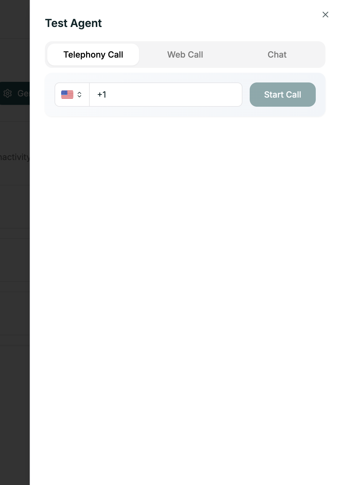
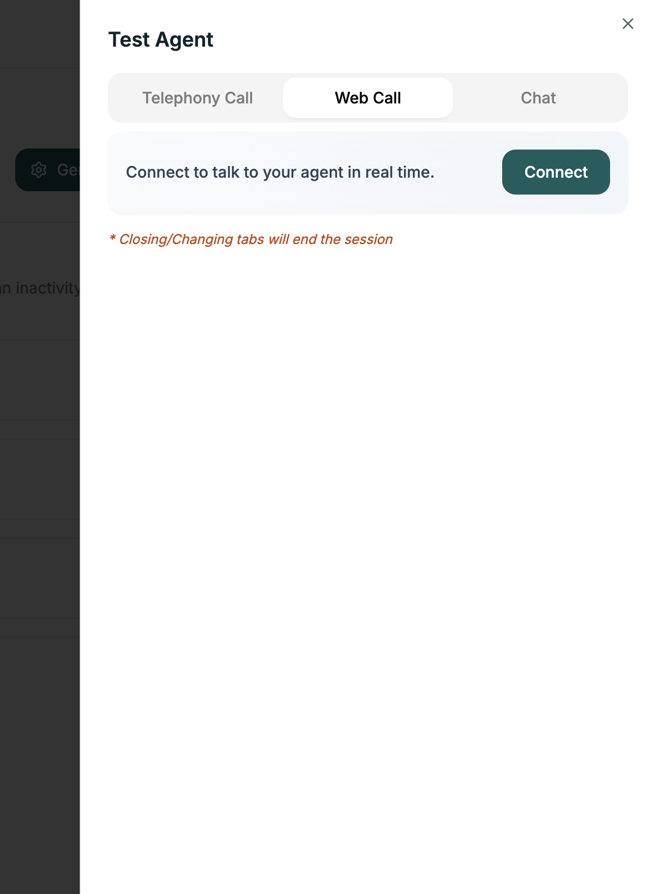
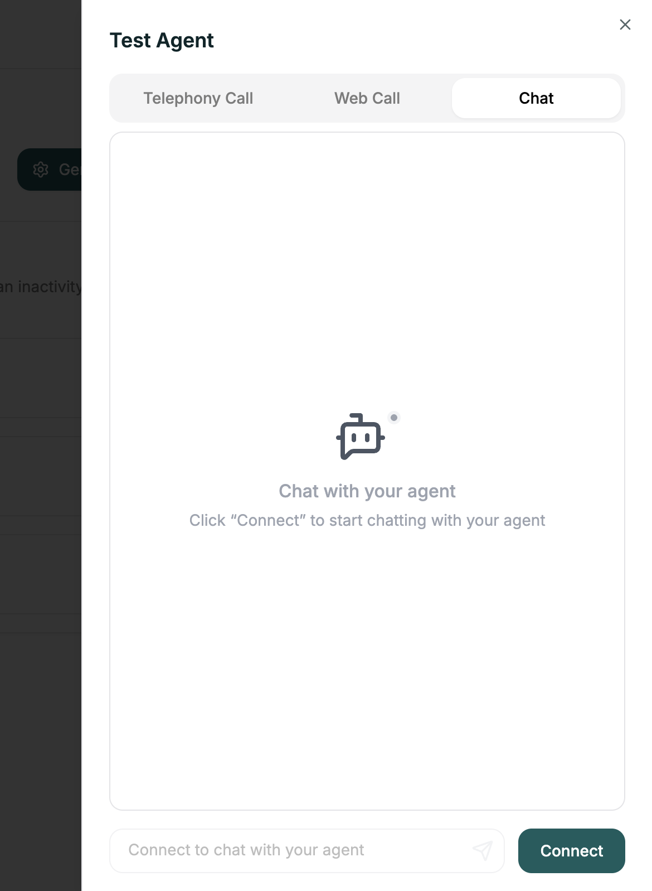

Testing is the difference between a great agent and a frustrating one. Atoms gives you three ways to test, so you can catch issues before real callers do.

**Location:** Top right → **Test Agent** button

---

## Three Test Modes

<Tabs>
  <Tab title="Web Call">
    <Frame caption="Web Call test mode">
      
    </Frame>
    
    **Voice call in your browser.** Quick and convenient — no phone needed.
    
    Best for rapid testing during development.
  </Tab>
  
  <Tab title="Telephony Call">
    <Frame caption="Telephony test mode">
      
    </Frame>
    
    **Real phone call.** The authentic experience — exactly what your callers will hear.
    
    Best for final validation before launch.
  </Tab>
  
  <Tab title="Chat">
    <Frame caption="Chat test mode">
      
    </Frame>
    
    **Text-only conversation.** Test conversation logic without voice.
    
    Best for testing branching and prompts quickly.
  </Tab>
</Tabs>

---

## Related

<CardGroup cols={2}>
  <Card title="Conversation Logs" icon="scroll" href="/platform/analytics/conversation-logs">
    Review call transcripts
  </Card>
  <Card title="Lock Your Agent" icon="lock" href="/platform/analytics/locking">
    Protect production agents
  </Card>
</CardGroup>
