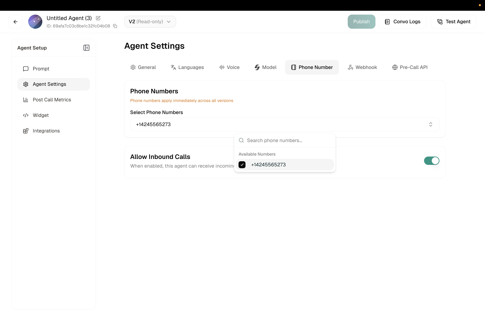

The Phone Number tab lets you connect your agent to a phone number for inbound and outbound calls. Once assigned, callers to that number will reach this agent.

**Location:** Left Sidebar → Agent Settings → Phone Number tab

<Frame caption="Phone Number settings">
  
</Frame>

---

## Select Phone Numbers

Click the dropdown to choose from your available phone numbers. If you haven't set up any numbers yet, you'll see "No phone numbers selected."

You can assign multiple numbers to the same agent if needed.

<Note>
You need to purchase or configure phone numbers before they appear here. See [Phone Numbers](/voice-agents/platform/deploy/phone-numbers) to get started.
</Note>

---

## Related

<CardGroup cols={2}>
  <Card title="Phone Numbers" icon="phone" href="/voice-agents/platform/deploy/phone-numbers">
    Get and manage phone numbers
  </Card>
  <Card title="Campaigns" icon="bullhorn" href="/voice-agents/platform/deploy/campaigns">
    Set up outbound calling
  </Card>
</CardGroup>
