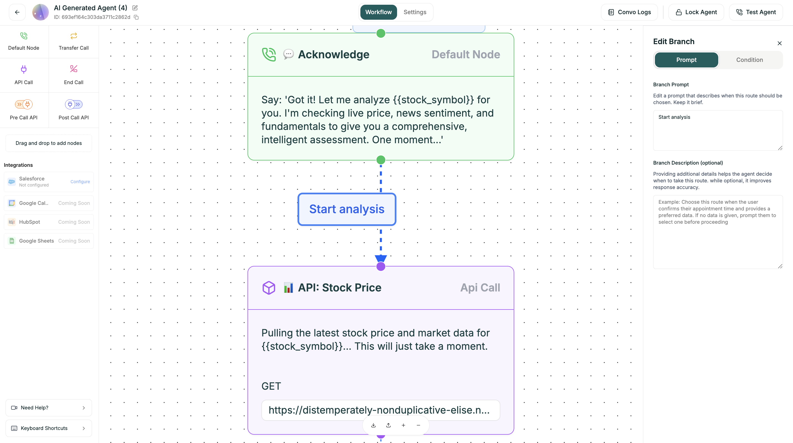

Branching is what makes Conversational Flow powerful. Instead of a linear script, your agent can take different paths based on what callers say, how they respond, or data from your systems.

<Frame caption="A flow with multiple branches">
  
</Frame>

---

## How Branching Works

<Steps>
  <Step title="Agent Asks">
    The current node poses a question or presents options.
  </Step>
  <Step title="Caller Responds">
    The caller says something (or doesn't respond).
  </Step>
  <Step title="Conditions Evaluated">
    The AI checks each branch condition against the response.
  </Step>
  <Step title="Path Selected">
    The matching condition determines which node comes next.
  </Step>
</Steps>

---

## Configuring Branches

Click any Default node, then click **Branching** to configure output paths.


### Adding a Branch

1. Click the Default node you want to branch from
2. Click **Branching** in the configuration panel
3. Click **+ Add Branch**
4. Configure the condition
5. Connect to the target node

### Branch Fields

| Field | Description |
|-------|-------------|
| **Label** | Name shown on the canvas (e.g., "Wants Billing Help") |
| **Condition** | What triggers this path (natural language or variable-based) |
| **Target Node** | Where the conversation goes when this condition matches |

---

## Condition Types

<Tabs>
  <Tab title="Natural Language">
    Write conditions in plain English. The AI interprets caller intent.
    
    **Examples:**
    
    | Condition | Matches When Caller Says |
    |-----------|--------------------------|
    | "User confirms" | "Yes", "Yeah", "That's right", "Correct" |
    | "User declines" | "No", "Nope", "Not really", "I don't think so" |
    | "User asks about billing" | "I have a billing question", "About my invoice" |
    | "User wants to speak to a person" | "Can I talk to someone?", "Get me a human" |
    | "User is frustrated" | Angry tone, complaints, escalation requests |
    | "Anything else" | Fallback — catches everything not matched above |
    
    <Tip>
    Write conditions as if describing the caller's intent, not their exact words. The AI handles variations automatically.
    </Tip>
  </Tab>
  
  <Tab title="Variable-Based">
    Route based on variable values from APIs or collected data.
    
    **Syntax:**
    ```
    {{variable_name}} operator value
    ```
    
    **Operators:**
    
    | Operator | Meaning |
    |----------|---------|
    | `==` | Equals |
    | `!=` | Not equals |
    | `>` | Greater than |
    | `<` | Less than |
    | `>=` | Greater or equal |
    | `<=` | Less or equal |
    
    **Examples:**
    
    | Condition | Logic |
    |-----------|-------|
    | `{{budget}} > 10000` | High-value lead path |
    | `{{account_tier}} == "premium"` | VIP treatment |
    | `{{attempts}} >= 3` | Escalation after 3 tries |
    | `{{api.balance}} < 0` | Negative balance handling |
  </Tab>
  
  <Tab title="Compound (AND/OR)">
    Combine multiple conditions for complex routing.
    
    **AND Conditions:**
    ```
    {{account_tier}} == "premium" && {{budget}} > 10000
    ```
    Both must be true.
    
    **OR Conditions:**
    ```
    {{issue_type}} == "billing" || {{issue_type}} == "payment"
    ```
    Either can be true.
  </Tab>
  
  <Tab title="Default/Fallback">
    Catch-all for when no other condition matches.
    
    Use **"Anything else"** or leave condition empty for fallback behavior.
    
    **Always include a default branch.** It handles:
    - Unexpected responses
    - Unclear answers
    - Edge cases you didn't anticipate
    - Silence or no response
    
    **Good fallback prompt:**
    ```
    I didn't quite catch that. Could you tell me again — 
    are you calling about billing or technical support?
    ```
  </Tab>
</Tabs>

---

## Branch Order Matters

Conditions are evaluated top to bottom. The first matching condition wins.

<Warning>
Put specific conditions first, fallback last. If "Anything else" is first, it will always match and other conditions will never trigger.
</Warning>

**Correct Order:**
1. `{{budget}} >= 50000` → Enterprise Path
2. `{{budget}} >= 10000` → Professional Path
3. `{{budget}} >= 1000` → Starter Path
4. Anything else → Self-Serve Resources

**Incorrect Order:**
1. `{{budget}} >= 1000` ← This catches everything above $1k
2. `{{budget}} >= 10000` ← Never reached
3. `{{budget}} >= 50000` ← Never reached

---

## Real-World Examples

### Support Routing

```
[Ask Issue Type]
"I'm here to help! Are you calling about billing, 
technical support, or something else?"

Branches:
├── "User asks about billing" → [Billing Flow]
├── "User has technical issue" → [Technical Flow]
├── "User wants to speak to someone" → [Transfer Call]
└── "Anything else" → [Clarify and Re-ask]
```

### Lead Qualification

```
[Ask Budget]
"What's your approximate budget for this project?"

→ Store response as {{budget}}

Branches:
├── {{budget}} >= 50000 → [Enterprise Path]
├── {{budget}} >= 10000 → [Professional Path]
├── {{budget}} >= 1000 → [Starter Path]
└── "Anything else" → [Self-Serve Resources]
```

### Confirmation Flow

```
[Confirm Appointment]
"Just to confirm — you'd like to book for 
Tuesday at 3pm. Is that correct?"

Branches:
├── "User confirms" → [Complete Booking]
├── "User wants to change" → [Modify Appointment]
└── "Anything else" → [Re-confirm]
```

### API Response Routing

```
[API Call: Check Account Status]

Branches:
├── {{account_status}} == "active" → [Standard Service]
├── {{account_status}} == "suspended" → [Reactivation Flow]
├── {{account_status}} == "premium" → [VIP Service]
└── API Error → [Fallback / Transfer]
```

---

## Best Practices

<Accordion title="Always include a fallback">
  No matter how many conditions you define, something unexpected will happen.
  
  Your fallback should:
  - Acknowledge the response
  - Re-ask the question differently
  - Offer options to clarify
  
  ```
  "I want to make sure I understand. Are you calling about 
  billing, technical issues, or something else entirely?"
  ```
</Accordion>

<Accordion title="Keep conditions mutually exclusive">
  Avoid overlapping conditions that could both match.
  
  | Overlapping (Bad) | Exclusive (Good) |
  |-------------------|------------------|
  | "support" AND "technical support" | "billing" OR "technical" OR "other" |
  | `>10` AND `>50` | `10-50` AND `>50` |
  
  When conditions overlap, the first one wins — which may not be what you want.
</Accordion>

<Accordion title="Test every branch">
  It's easy to forget a branch while testing. Be systematic:
  
  1. List all possible paths
  2. Test each one deliberately
  3. Try edge cases (silence, gibberish, topic changes)
  4. Review in Conversation Logs
</Accordion>

<Accordion title="Limit branch depth">
  Too many nested branches become impossible to manage.
  
  If your flow is getting too deep:
  - Can you combine some branches?
  - Should some paths be separate flows?
  - Is Single Prompt better for this use case?
</Accordion>

<Accordion title="Use clear branch labels">
  Labels appear on the canvas — make them meaningful.
  
  | Bad Labels | Good Labels |
  |------------|-------------|
  | "Option 1" | "Wants Billing Help" |
  | "Path A" | "Budget > $10k" |
  | "Yes" | "Confirmed Appointment" |
  | "Branch 2" | "Frustrated Customer" |
</Accordion>

---

## Complex Patterns

### Loop Back (Retry)

For scenarios where you need to re-ask:

```
[Ask Budget]
    ↓
[Validate Response]
    ├── Valid → Continue to next step
    └── Invalid → Loop back to [Ask Budget]
```

<Warning>
**Avoid infinite loops.** Add a counter variable and exit after N attempts. After 2-3 retries, offer to transfer or end gracefully.
</Warning>

### Parallel Paths That Merge

Different paths can lead to the same destination:

```
[Qualify Lead]
├── High Budget → [Fast Track] ─────────┐
└── Standard Budget → [Standard Process] ├→ [Schedule Demo]
                                         │
```

### Guard Rails

Add safety branches for edge cases:

```
[Any Node]
├── Normal flow conditions...
├── "User seems upset or frustrated" → [Empathy Response]
├── "User mentions legal or lawsuit" → [Transfer to Manager]
└── "Anything else" → [Standard Fallback]
```

---

## Debugging Branches

When branches don't work as expected:

<Steps>
  <Step title="Check Conversation Logs">
    See exactly which conditions were evaluated and which matched.
  </Step>
  
  <Step title="Verify Condition Syntax">
    Typos in variable names or operators fail silently.
  </Step>
  
  <Step title="Test the Fallback">
    If fallback triggers too often, your conditions may be too specific.
  </Step>
  
  <Step title="Review Branch Order">
    Conditions are checked top to bottom — earlier matches win.
  </Step>
</Steps>

---

## Next

<CardGroup cols={2}>
  <Card title="Variables" icon="brackets-curly" href="/platform/convo-flow/config/variables">
    Dynamic data for conditions and prompts
  </Card>
  <Card title="Test Your Agent" icon="flask" href="/platform/analytics/testing">
    Validate your branches work correctly
  </Card>
</CardGroup>
