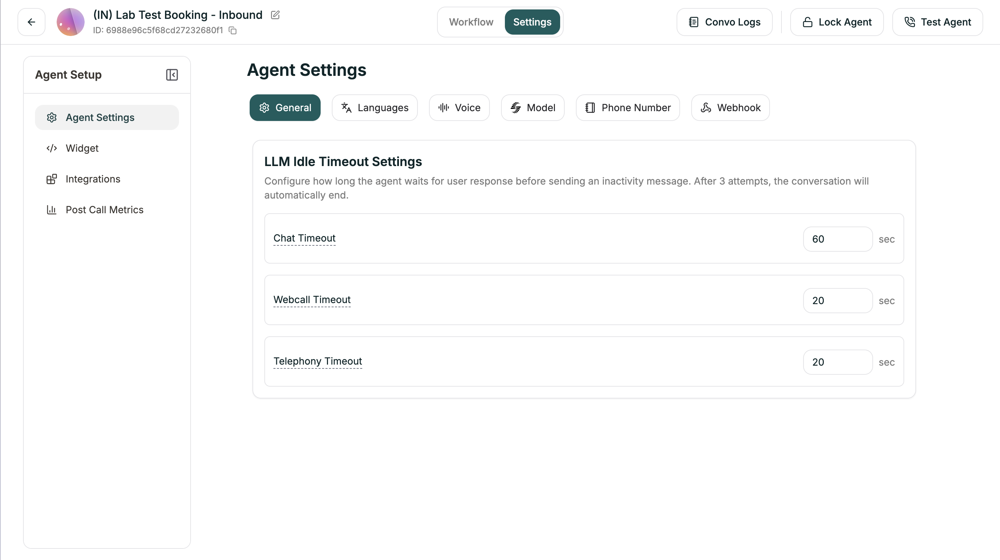

General Settings control how long your agent waits for a response before prompting the caller — and when to give up.

**Location:** Agent Settings → General tab

<Frame caption="General Settings tab">
  
</Frame>

---

## LLM Idle Timeout Settings

Configure how long the agent waits for user response before sending an inactivity message. After 3 attempts with no response, the conversation automatically ends.

| Setting | Default | Description |
|---------|---------|-------------|
| **Chat Timeout** | 60 sec | For text chat conversations |
| **Webcall Timeout** | 20 sec | For browser-based voice calls |
| **Telephony Timeout** | 20 sec | For phone calls |

Each timeout triggers an inactivity prompt. If the user still doesn't respond after 3 prompts, the agent ends the conversation gracefully.

---

## Next

<CardGroup cols={2}>
  <Card title="Test Your Agent" icon="flask" href="/atoms/atoms-platform/analytics-and-logs/testing">
    Try your agent before going live
  </Card>
  <Card title="Conversation Logs" icon="messages" href="/atoms/atoms-platform/analytics-and-logs/conversation-logs">
    Review and analyze calls
  </Card>
</CardGroup>
