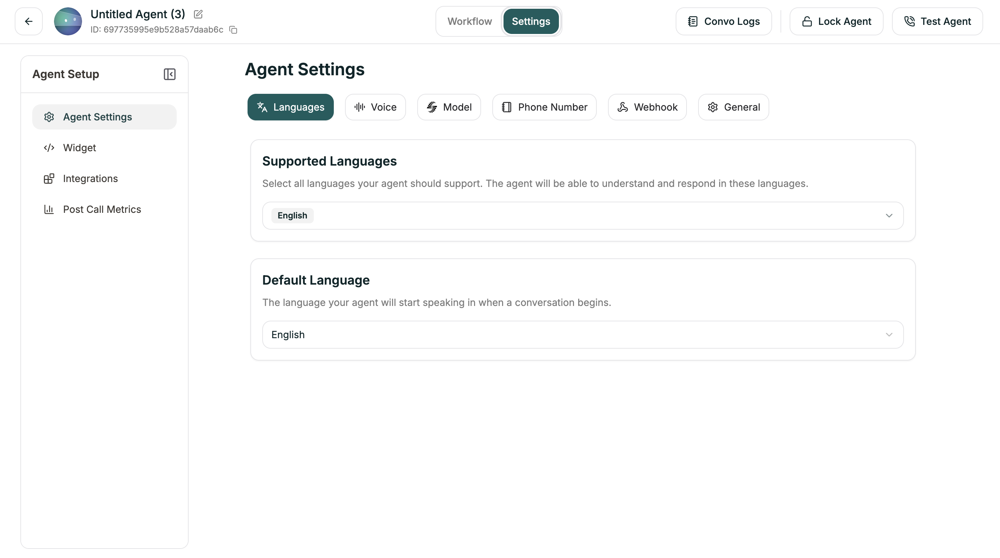

The Languages tab lets you define which languages your Conversational Flow agent can communicate in.

**Location:** Settings tab → Languages

<Frame caption="Languages tab">
  
</Frame>

---

## Configuration

| Setting | Description |
|---------|-------------|
| **Supported Languages** | Languages your agent can speak and understand |
| **Primary Language** | Default language for starting conversations |

---

## Adding Languages

1. Open **Settings** tab
2. Go to **Languages**
3. Click **+ Add Language**
4. Select from available languages
5. Set one as primary

Your agent will start conversations in the primary language but can switch to any supported language if the caller speaks differently.

---

## Language Switching

When combined with **Language Switching** in the Model tab, your agent can automatically detect when a caller speaks a different language and switch accordingly.

---

## Next

<CardGroup cols={2}>
  <Card title="Voice Settings" icon="volume" href="/atoms/atoms-platform/conversational-flow-agents/agent-settings/voice-settings">
    Configure speech speed and pronunciation
  </Card>
  <Card title="Model Settings" icon="microchip" href="/atoms/atoms-platform/conversational-flow-agents/agent-settings/model-settings">
    Set up Global Prompt and Knowledge Base
  </Card>
</CardGroup>
