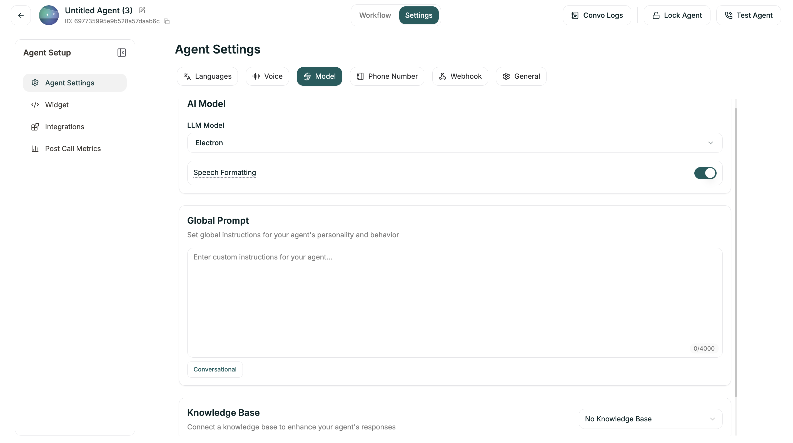

Model Settings control how the AI behaves across your flow — the model powering responses, global instructions, and knowledge base connection.

**Location:** Settings tab → Model

<Frame caption="Model tab for Conversational Flow agents">
  
</Frame>

<Note>
Conversational Flow agents have **Global Prompt** and **Knowledge Base** in this tab since individual prompts are defined per-node in the workflow.
</Note>

---

## AI Model

| Setting | Description |
|---------|-------------|
| **LLM Model** | The AI model (Electron, GPT-4o, etc.) |
| **Language** | Primary language for responses |

---

## Global Prompt

Set global instructions for your agent's personality and behavior. This applies across all nodes (limit: 4,000 characters).

Use this for:
- Personality traits
- Behavioral guidelines
- Consistent phrasing
- Company-specific instructions

Node-specific prompts add to the Global Prompt. Use Global Prompt for consistency, node prompts for specific questions.

---

## Knowledge Base

Connect a knowledge base for reference material.

| Option | Description |
|--------|-------------|
| **No Knowledge Base** | Agent uses only prompts |
| **[Your KB]** | Agent can search for answers |

---

## Speech Formatting

When enabled (default: ON), transcripts are automatically formatted for readability — punctuation, paragraphs, and proper formatting for dates and numbers.

---

## Language Switching

Enable your agent to switch languages mid-conversation (default: ON).

### Advanced Settings

| Setting | Default | Description |
|---------|---------|-------------|
| **Minimum Words** | 2 | Words before considering a switch |
| **Strong Signal** | 0.7 | Confidence for immediate switch |
| **Weak Signal** | 0.3 | Confidence for tentative detection |
| **Consecutive Weak** | 2 | Weak signals needed to switch |

Defaults work for most cases. Adjust only if seeing unwanted switching.

---

## Next

<CardGroup cols={2}>
  <Card title="Knowledge Base" icon="book" href="/atoms/atoms-platform/features/knowledge-base">
    Create and manage knowledge bases
  </Card>
  <Card title="Voice Settings" icon="volume" href="/atoms/atoms-platform/conversational-flow-agents/agent-settings/voice-settings">
    Configure speech and pronunciation
  </Card>
</CardGroup>
