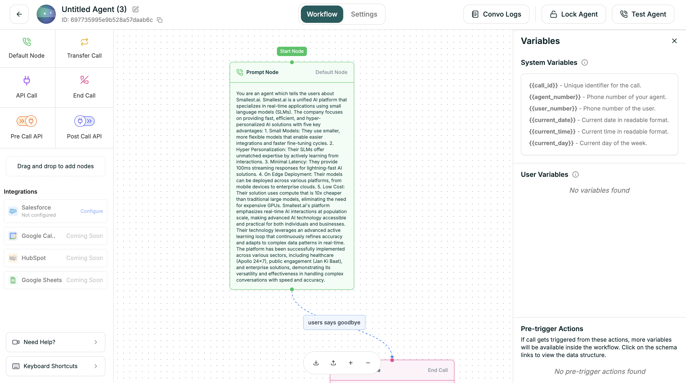

Variables let you personalize conversations with dynamic data — caller information, API responses, or values you define.

**Location:** Workflow tab → **{ } Variables** button (top right)

<Frame caption="Variables panel">
  
</Frame>

---

## Variable Types

| Type | Source | Example |
|------|--------|---------|
| **User Defined** | Variables you create | `{{company_name}}`, `{{promo_code}}` |
| **System** | Platform-provided (read-only) | `{{caller_phone}}`, `{{call_duration}}` |
| **API** | Extracted from API responses | `{{customer_name}}`, `{{account_tier}}` |

---

## Syntax

Use double curly braces anywhere in prompts or conditions:

```
Hello {{customer_name}}! Thanks for calling {{company_name}}.
```

### Default Values

Handle missing variables with the pipe syntax:

```
Hello {{customer_name|there}}!
```

If `customer_name` is empty → "Hello there!"

---

## System Variables

| Variable | Description |
|----------|-------------|
| `{{caller_phone}}` | Caller's phone number |
| `{{call_time}}` | When call started |
| `{{call_duration}}` | Elapsed seconds |
| `{{call_direction}}` | "inbound" or "outbound" |
| `{{agent_id}}` | This agent's ID |
| `{{call_id}}` | Unique call identifier |

---

## Creating Variables

1. Click **{ } Variables** in the workflow tab
2. Go to **User Defined** tab
3. Click **+ Add Variable**
4. Enter name and default value

---

## Extracting from APIs

In API nodes, use **Extract Response Data** to create variables from responses:

| JSONPath | Variable |
|----------|----------|
| `$.data.name` | `customer_name` |
| `$.data.tier` | `account_tier` |
