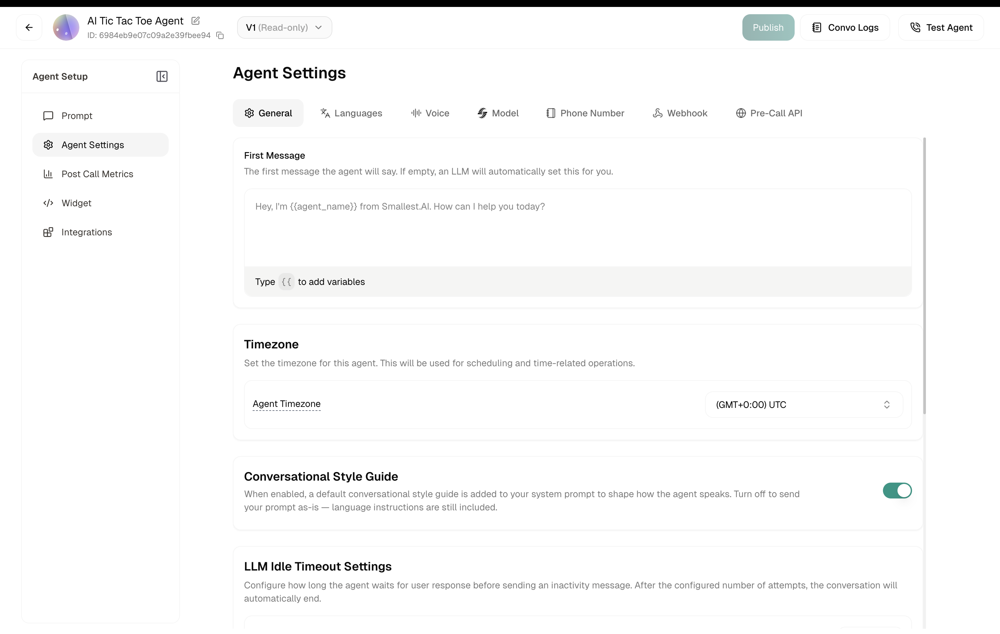
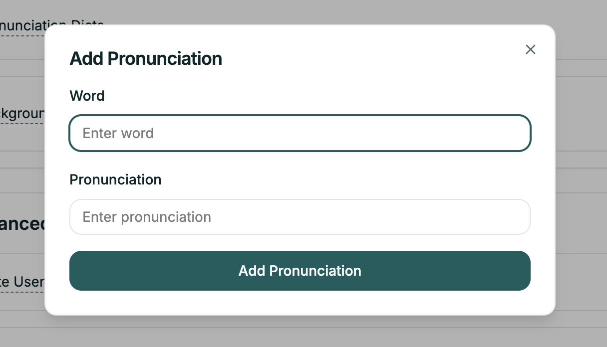

Voice Settings give you precise control over how your agent sounds and listens. From speech speed to background ambiance, pronunciation rules to turn-taking — this is where you shape the audio experience.

**Location:** Settings tab → Voice

<Frame caption="The Voice Settings tab">
  
</Frame>

---

## Voice

Select the voice for your agent. Click the dropdown to browse available voices — you can preview each one before selecting.

---

## Speech Settings

### Speech Speed

Control how fast your agent speaks.

| Control | Range | Default |
|---------|-------|---------|
| Slider | Slow ↔ Fast | 1 |

Slide left for a more measured, deliberate pace. Slide right for quicker delivery. Find the sweet spot that matches your use case — slower often works better for complex information, faster for simple confirmations.

---

## Pronunciation & Background

### Pronunciation Dictionaries

Add custom pronunciations for words that aren't pronounced correctly by the default voice.

This is especially useful for:
- Brand names
- Technical terms
- Proper nouns
- Industry-specific jargon

**To add a pronunciation:** Click **Add Pronunciation** to open the modal.

<Frame caption="Add Pronunciation modal">
  
</Frame>

| Field | Description |
|-------|-------------|
| **Word** | The word as written |
| **Pronunciation** | How it should sound |

### Background Sound

Add ambient audio behind your agent's voice for a more natural feel.

| Option | Description |
|--------|-------------|
| **None** | Silent background (default) |
| **Office** | Subtle office ambiance |
| **Call Center** | Busy call center sounds |
| **Static** | Light static noise |
| **Cafe** | Coffee shop atmosphere |

---

## Advanced Voice Settings

### Mute User Until First Bot Response

When enabled, the user's audio is muted until the agent's first response is complete. Useful for preventing early interruptions during the greeting.

### Voicemail Detection

Detects when a call goes to voicemail instead of reaching a live person.

<Warning>
Voicemail detection may not work as expected if **Release Time** is less than 0.6 seconds.
</Warning>

### Personal Info Redaction (PII)

Automatically redacts sensitive personal information from transcripts and logs.

### Denoising

Filters out background noise and improves voice clarity before processing. This helps reduce false detections caused by environmental sounds — useful when callers are in noisy environments.

---

## Voice Detection

Fine-tune how your agent recognizes when someone is speaking.

### Confidence

Minimum probability score to classify audio as speech.

- **Higher values** → Fewer false positives (ignores background noise, but may miss softer speech)
- **Lower values** → Catches softer speech but may trigger on noise

| Default | Range |
|---------|-------|
| 0.70 | 0 – 1 |

### Min Volume

Volume floor below which audio is ignored, even if detected as speech. Filters out quiet background noise that might otherwise be misclassified.

| Default | Range |
|---------|-------|
| 0.60 | 0 – 1 |

### Trigger Time (Seconds)

Duration of continuous speech needed before the system registers "user is speaking." Prevents brief noises (coughs, clicks, background sounds) from triggering speech detection.

| Default | Range |
|---------|-------|
| 0.10 | 0 – 1 |

### Release Time (Seconds)

Duration of silence needed after speech before the system considers the user done talking. This directly sets the minimum turn-taking latency — lower values make the agent respond faster but risk cutting off the user mid-thought.

| Default | Range |
|---------|-------|
| 0.30 | 0 – 1+ |

<Tip>
**Start with defaults.** Only adjust these if you're experiencing specific issues like missed words or premature responses.
</Tip>

---

## Smart Turn Detection

Intelligent detection of when the caller is done speaking. When enabled, the agent uses context and speech patterns — not just silence — to determine when it's time to respond.

This reduces the need to rely solely on Release Time for turn-taking. The model analyzes prosody, sentence completion, and conversational patterns to make smarter decisions about when the user has finished their turn.

### Wait Time (Seconds)

When Smart Turn Detection is enabled, this sets the maximum time the agent will wait for additional speech before responding. Acts as an upper bound — the agent may respond sooner if the model detects the user is done.

| Default | Range |
|---------|-------|
| 1.00 | 0 – 5 |

---

## Interruption Backoff Timer

Cooldown period (in seconds) after the agent starts speaking during which user speech is ignored. Prevents the agent from being cut off prematurely — especially useful when the agent's first few words overlap with the caller's audio.

| Default | Range |
|---------|-------|
| 0 (disabled) | 0 – 5 |

This helps prevent conversation loops when the caller and agent interrupt each other — the agent will wait this duration before allowing itself to be interrupted again.

<Note>
For per-node interruption control, use the **Uninterruptible** toggle on Default nodes.
</Note>

---

## Next

<CardGroup cols={2}>
  <Card title="Model Settings" icon="microchip" href="/atoms/atoms-platform/conversational-flow-agents/agent-settings/model-settings">
    Configure AI model, Global Prompt, and Knowledge Base
  </Card>
  <Card title="General Settings" icon="gear" href="/atoms/atoms-platform/conversational-flow-agents/agent-settings/general-settings">
    Set timeout behavior
  </Card>
</CardGroup>
