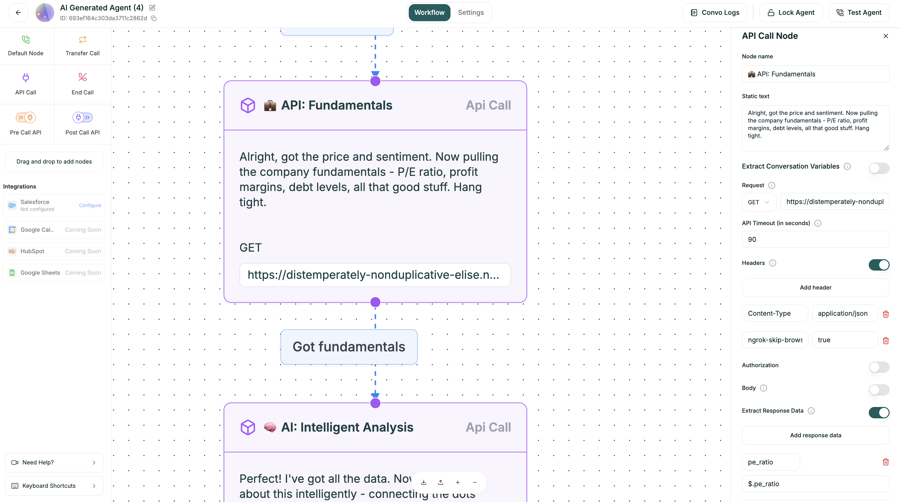
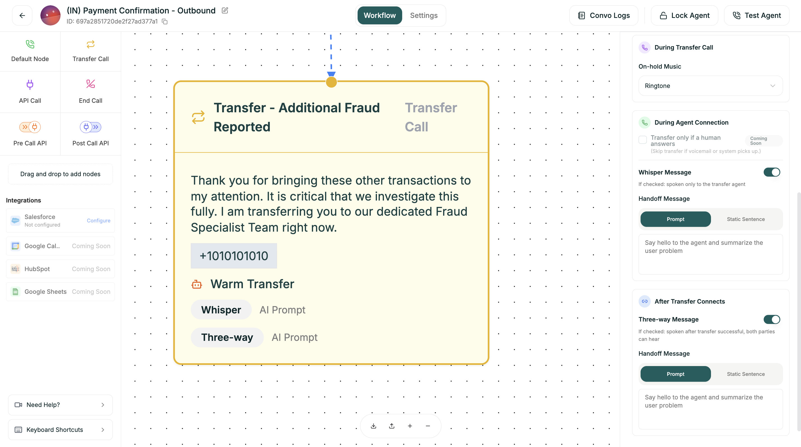
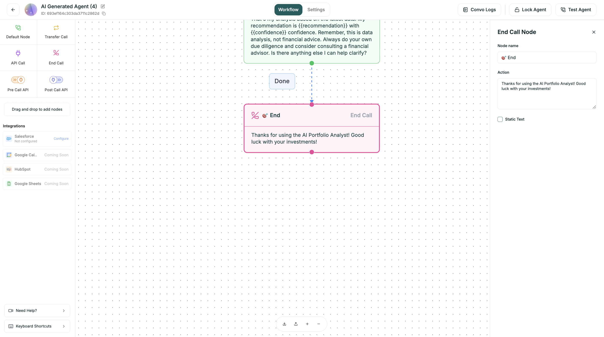
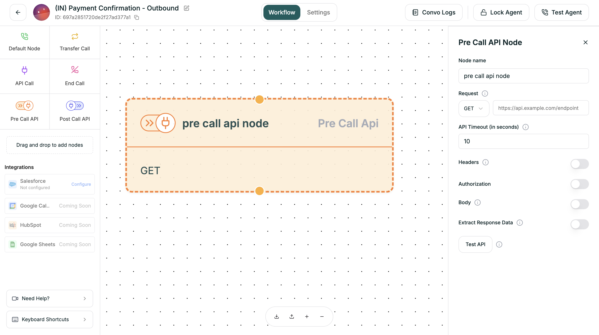
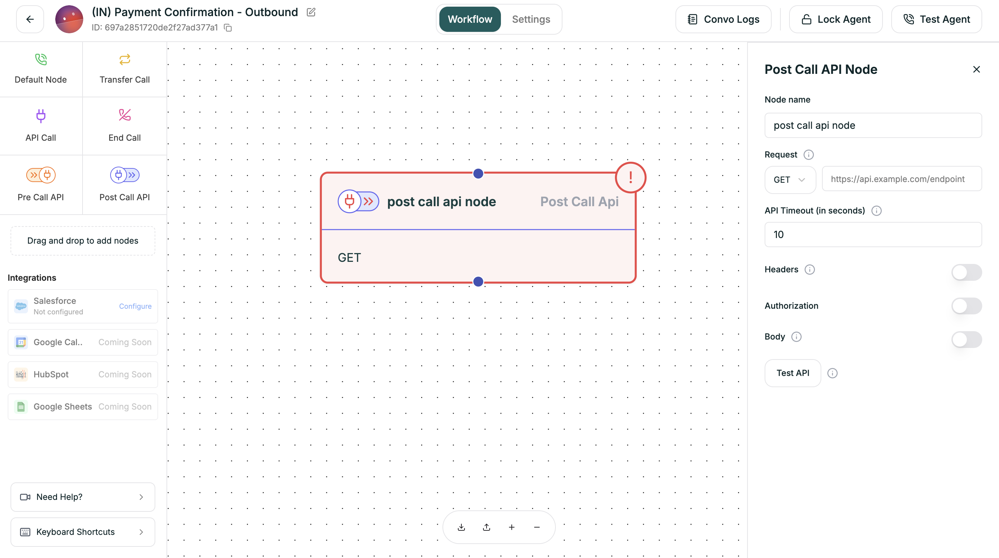

Nodes are the building blocks of your conversation flow. Each type serves a specific purpose in guiding the conversation from start to finish.

---

## Node Types at a Glance

| Node | Purpose | When to Use |
|------|---------|-------------|
| [Default](#default-node) | Conversation step | Each conversation point where the agent speaks and listens |
| [API Call](#api-call-node) | External data | Fetch or send data mid-conversation |
| [Transfer Call](#transfer-call-node) | Handoff to human | Connect caller to a live agent |
| [End Call](#end-call-node) | Terminate call | Natural conversation endings |
| [Pre-Call API](#pre-call-api-node) | Load context | Get data before the call starts |
| [Post-Call API](#post-call-api-node) | Save data | Send data after the call ends |

---

## Default Node

The workhorse of your flow. Each Default node represents one step in the conversation where your agent speaks and waits for a response.

<Frame caption="Default node on canvas">
  
</Frame>

### Configuration

Click a Default node to open its settings panel.

| Field | Description |
|-------|-------------|
| **Name** | Identifier shown on the canvas |
| **Prompt** | What the agent says at this step |
| **Branches** | Output paths based on caller response |

### Uninterruptible Mode

When enabled, the user cannot interrupt the bot while it is speaking on this node. This ensures the bot completes its message before any user interaction is allowed.

| Setting | Behavior |
|---------|----------|
| **OFF** (default) | Caller can interrupt at any time |
| **ON** | Bot must finish speaking before caller input is processed |

<Tip>
Use Uninterruptible mode for critical messages like legal disclaimers, confirmation summaries, or important instructions that shouldn't be cut off.
</Tip>

### Example Prompts

<Tabs>
  <Tab title="Greeting">
    ```
    Hi! Thanks for calling Acme Support. My name is Alex. 
    How can I help you today?
    ```
  </Tab>
  
  <Tab title="Question">
    ```
    I'd be happy to help with that. First, could you tell 
    me your account number or the email on file?
    ```
  </Tab>
  
  <Tab title="Confirmation">
    ```
    Just to confirm — you'd like to schedule a demo for 
    next Tuesday at 2pm. Is that correct?
    ```
  </Tab>
</Tabs>

---

## API Call Node

Connect your agent to external systems mid-conversation. Fetch data, book appointments, update records — anything your APIs can do.

<Frame caption="API Call node on canvas">
  
</Frame>

### Requirements

<Warning>
**API Call nodes have connection requirements:**
- Must have at least one incoming connection
- Must have at least one outgoing connection
- Must have an endpoint URL configured
</Warning>

### Configuration

Click an API Call node to configure the request.

<Tabs>
  <Tab title="Request">
    Select the HTTP method and enter the full API endpoint URL you want to call.
    
    | Field | Description |
    |-------|-------------|
    | **Method** | HTTP method (GET, POST, PUT, PATCH, DELETE) |
    | **URL** | Full endpoint URL (e.g., `https://api.example.com/customers`) |
    
    Use variables in the URL for dynamic requests:
    
    ```
    https://api.example.com/customers/{{caller_phone}}
    ```
  </Tab>
  
  <Tab title="Headers">
    Add custom headers to your API request. These are key-value pairs, often used for things like Content-Type or API keys.
    
    | Common Headers | Example Value |
    |----------------|---------------|
    | `Content-Type` | `application/json` |
    | `Authorization` | `Bearer {{api_key}}` |
    | `X-API-Key` | `your-api-key-here` |
    
    Click **+ Add Header** to add each header.
  </Tab>
  
  <Tab title="Body">
    Construct the data payload for your request. This is typically required for POST, PUT, or PATCH methods.
    
    ```json
    {
      "phone": "{{caller_phone}}",
      "name": "{{customer_name}}",
      "action": "lookup"
    }
    ```
    
    Variables are replaced with actual values at runtime.
  </Tab>
  
  <Tab title="Extract Response Data">
    Specify a variable name and a JSONPath expression to extract a specific value from the API response. This value is then stored in the variables for use in subsequent steps.
    
    | Field | Description |
    |-------|-------------|
    | **Variable Name** | Name to store the extracted value (e.g., `customer_name`) |
    | **JSONPath** | Path to the value in the response (e.g., `$.data.name`) |
    
    **Example:**
    
    If your API returns:
    ```json
    {
      "data": {
        "name": "John Smith",
        "tier": "premium",
        "balance": 1500
      }
    }
    ```
    
    Extract mappings:
    | Variable | JSONPath |
    |----------|----------|
    | `customer_name` | `$.data.name` |
    | `account_tier` | `$.data.tier` |
    | `balance` | `$.data.balance` |
    
    Use in later nodes: `"Hi {{customer_name}}, I see you're a {{account_tier}} member."`
  </Tab>
</Tabs>

### Branching on Results

After extracting response data, you can branch based on the results:

```
[API Call: Check Account]
├── Success ({{account_tier}} == "premium") → VIP Flow
├── Success ({{account_tier}} == "basic") → Standard Flow
├── Error → Fallback / Transfer
```

---

## Transfer Call Node

Hand the conversation to a human when needed — for escalations, complex issues, or high-value opportunities.

<Frame caption="Transfer Call node on canvas">
  
</Frame>

### Configuration

| Field | Required | Description |
|-------|----------|-------------|
| **Name** | Yes | Identifier (e.g., `transfer_to_sales`) |
| **Description** | Yes | When this transfer should trigger |
| **Phone Number** | Yes | Transfer destination with country code |
| **Transfer Type** | Yes | Cold or Warm |

### Transfer Types

<Tabs>
  <Tab title="Cold Transfer">
    **Immediate handoff.** The caller is connected directly to the destination without any briefing to the receiving agent.
    
    | Pros | Cons |
    |------|------|
    | Fast | No context for receiving agent |
    | Simple | Caller may repeat themselves |
    
    **Best for:**
    - Simple escalations
    - When context isn't needed
    - Time-sensitive transfers
    - High call volume scenarios
  </Tab>
  
  <Tab title="Warm Transfer">
    **AI briefs the agent first.** The receiving agent gets context before the caller joins.
    
    | Pros | Cons |
    |------|------|
    | Human has context | Slightly longer |
    | Better experience | More configuration |
    
    **Best for:**
    - Complex issues needing context
    - VIP callers
    - When continuity matters
    
    ### Warm Transfer Options
    
    | Setting | Description |
    |---------|-------------|
    | **On-hold Music** | What the caller hears while waiting for connection |
    | **Transfer if Human** | Skip transfer if voicemail detected (coming soon) |
    | **Whisper Message** | Private message only the agent hears before connecting |
    | **Handoff Message** | What the AI says to brief the receiving agent |
    | **Three-way Message** | Message both parties hear when connected |
    
    **Example Whisper Message:**
    ```
    Incoming transfer: Customer calling about a billing dispute. 
    They've been charged twice for order #12345. 
    Identity already verified.
    ```
    
    **Example Three-way Message:**
    ```
    I've connected you with Sarah from our billing team. 
    Sarah, this customer is calling about a duplicate charge.
    ```
  </Tab>
</Tabs>

---

## End Call Node

Gracefully conclude the conversation when the interaction is complete.

<Frame caption="End Call node on canvas">
  
</Frame>

### Configuration

| Field | Description |
|-------|-------------|
| **Name** | Identifier for this ending |
| **Closing Message** | Final words before hanging up |

### Example Closings

<Tabs>
  <Tab title="Successful">
    ```
    Great! You're all set. Is there anything else I can 
    help you with today? ... Perfect, thank you for calling 
    Acme. Have a wonderful day!
    ```
  </Tab>
  
  <Tab title="Transferred">
    ```
    I'm connecting you now. Thanks for calling Acme, and 
    have a great day!
    ```
  </Tab>
  
  <Tab title="Not Qualified">
    ```
    Thanks so much for your interest. I'll have someone 
    send over some resources that might be helpful. Take care!
    ```
  </Tab>
</Tabs>

<Warning>
**Every path must end.** Make sure all branches in your flow eventually reach an End Call or Transfer Call node.
</Warning>

---

## Pre-Call API Node

Execute API calls *before* your agent says hello. Perfect for loading personalized data that shapes the entire conversation.

<Frame caption="Pre-Call API node">
  
</Frame>

### When It Runs

The Pre-Call API executes immediately when the call connects, before any conversation:

1. Phone rings / Call connects
2. **Pre-Call API executes** ← Here
3. Data available in variables
4. Conversation starts (first Default node)

### Configuration

Pre-Call API uses the same configuration as the [API Call node](#api-call-node):

- **Request:** Method + URL
- **Headers:** Key-value pairs
- **Body:** JSON payload (for POST requests)
- **Extract Response Data:** Variable name + JSONPath

### Use Cases

| Scenario | What to Fetch |
|----------|---------------|
| **CRM Lookup** | Customer history before greeting |
| **Account Status** | Check for open issues or alerts |
| **Personalization** | Load name, preferences, language |
| **Routing Logic** | VIP status, time zone, special handling |

### Example

```
GET https://crm.example.com/lookup?phone={{caller_phone}}

Response Mapping:
  $.customer_name → customer_name
  $.last_ticket → last_issue
  $.tier → account_tier
```

Your greeting node can now say:

```
"Hi {{customer_name}}! Thanks for calling back. 
Are you still having trouble with {{last_issue}}?"
```

---

## Post-Call API Node

Trigger actions *after* the call ends. Perfect for logging outcomes, updating CRMs, and triggering follow-ups.

<Frame caption="Post-Call API node">
  
</Frame>

### When It Runs

The Post-Call API executes after the conversation ends:

1. Conversation ends (End Call node reached)
2. Call terminates
3. **Post-Call API executes** ← Here
4. Data saved externally

### Configuration

Post-Call API uses the same configuration as the [API Call node](#api-call-node):

- **Request:** Method + URL
- **Headers:** Key-value pairs  
- **Body:** JSON payload (typically POST)
- **Extract Response Data:** Variable name + JSONPath

### Use Cases

| Scenario | What to Send |
|----------|--------------|
| **CRM Logging** | Call summary, outcome, duration |
| **Ticket Creation** | Issue details, priority level |
| **Follow-up Triggers** | Send email confirmations, SMS receipts |
| **Analytics** | Custom metrics, conversion tracking |

### Example

```
POST https://crm.example.com/calls

Body:
{
  "phone": "{{caller_phone}}",
  "duration": "{{call_duration}}",
  "outcome": "{{disposition}}",
  "notes": "{{call_summary}}",
  "agent_id": "{{agent_id}}",
  "collected": {
    "name": "{{collected_name}}",
    "budget": "{{collected_budget}}"
  }
}
```

---

## Choosing the Right Node

| If you need to... | Use |
|-------------------|-----|
| Ask a question or give information | Default Node |
| Make the bot uninterruptible for a message | Default Node with Uninterruptible ON |
| Get external data mid-conversation | API Call Node |
| Transfer to a human | Transfer Call Node |
| End the conversation | End Call Node |
| Load data before the call starts | Pre-Call API Node |
| Save data after the call ends | Post-Call API Node |

---

## Next

<CardGroup cols={2}>
  <Card title="Conditions & Branching" icon="code-branch" href="/platform/convo-flow/conditions">
    Create dynamic conversation paths
  </Card>
  <Card title="Variables" icon="brackets-curly" href="/platform/convo-flow/config/variables">
    Use dynamic data in your nodes
  </Card>
</CardGroup>
