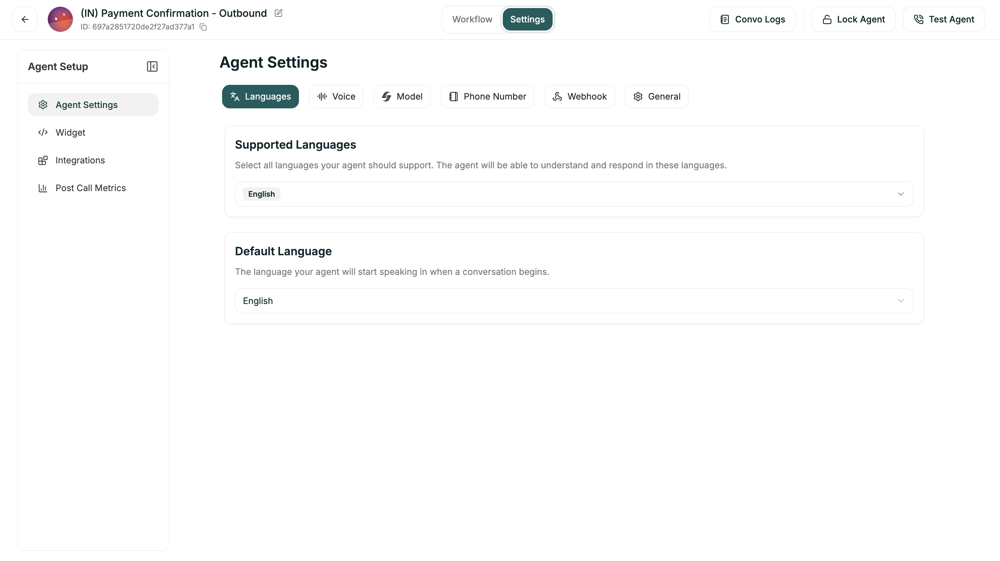

A Conversational Flow agent guides callers through a designed path. You create a visual workflow of nodes — each representing a step in the conversation — and connect them with branches that determine where the conversation goes based on what the caller says.

---

## When to Use

Conversational Flow is ideal for **structured, goal-oriented conversations** — lead qualification, appointment booking, surveys, intake forms. Choose it when you need specific data collected in a specific order, or when different responses should lead to fundamentally different paths.

For **open-ended, flexible conversations** like general support or FAQs, consider [Single Prompt](/atoms/atoms-platform/single-prompt-agents/overview) instead.

---

## How It Works

Think of your workflow as a roadmap. Each node represents a step where the agent takes action — asking a question, making an API call, or transferring the caller. Branches connect these steps, and the caller's responses determine which path to take.

Unlike Single Prompt agents that interpret instructions dynamically, Conversational Flow agents follow your designed structure. This gives you predictable, consistent conversations — every caller gets the same thorough experience.

---

## Capabilities

**Visual workflow design.** Drag nodes onto a canvas, connect them with branches, and see your entire conversation flow at a glance. Complex logic becomes manageable when you can see it.

**Precise data collection.** Each node can collect specific information. You control exactly what gets asked, in what order, and what happens based on the answers.

**Mid-conversation API calls.** Nodes can fetch external data, check availability, update CRMs, or trigger any API — and branch based on the results.

**Multiple paths to multiple outcomes.** Different caller responses lead to different experiences. Qualified leads go to sales, support issues go to technicians, everyone gets the right path.

---

## Building a Conversational Flow Agent

You'll create three things:

**1. The Workflow**

This is the core. Your workflow includes:
- **Nodes** — Each step: greetings, questions, API calls, transfers, endings
- **Branches** — Conditions that route callers based on their responses
- **Variables** — Dynamic data used throughout the conversation

**2. Global Prompt** (optional)

Set personality and behavior guidelines that apply across all nodes. This keeps your agent consistent without repeating instructions in every node.

**3. Voice and Model**

Pick the voice your agent speaks with and the AI model that powers its understanding.

---

## The Editor

Once you create a Conversational Flow agent, you land in the editor with two main tabs.

<Tabs>
  <Tab title="Workflow Tab">
    <Frame caption="The Workflow tab">
      
    </Frame>
    
    | Area | Location | What It Does |
    |------|----------|--------------|
    | **Node Palette** | Left panel | Drag nodes onto your workflow |
    | **Canvas** | Center | Where you build and visualize your flow |
    | **Variables** | Top right button | Manage flow-wide variables |
    | **Node Config** | Right panel | Configure selected node |
  </Tab>
  
  <Tab title="Settings Tab">
    <Frame caption="The Settings tab">
      
    </Frame>
    
    | Section | What It Configures |
    |---------|-------------------|
    | **Languages** | Supported languages for your agent |
    | **Voice** | Speech speed, pronunciation, turn detection |
    | **Model** | AI model, Global Prompt, Knowledge Base |
    | **Phone Number** | Assigned phone number |
    | **Webhooks** | Event notifications |
    | **General** | Timeout settings |
  </Tab>
</Tabs>

---

## After You Launch

Once your agent is live, refinement happens in a few places:

**Flow adjustments.** Review call logs, find where callers drop off or get stuck, and refine your nodes and branches.

**Prompt updates.** Tweak individual node prompts or the global prompt to improve how the agent sounds and responds.

**Voice tuning.** Adjust speech speed, add pronunciation rules, tweak turn-taking behavior.

**Branch refinement.** Add new conditions, adjust thresholds, handle edge cases you discover.

---

## Get Started

<CardGroup cols={2}>
  <Card title="Start from Scratch" icon="plus" href="/atoms/atoms-platform/conversational-flow-agents/creating-your-agent/manual-setup">
    Blank canvas with full control over your workflow
  </Card>
  <Card title="Start with Template" icon="grid-2" href="/atoms/atoms-platform/conversational-flow-agents/creating-your-agent/from-template">
    Pre-built flows for common use cases
  </Card>
</CardGroup>
