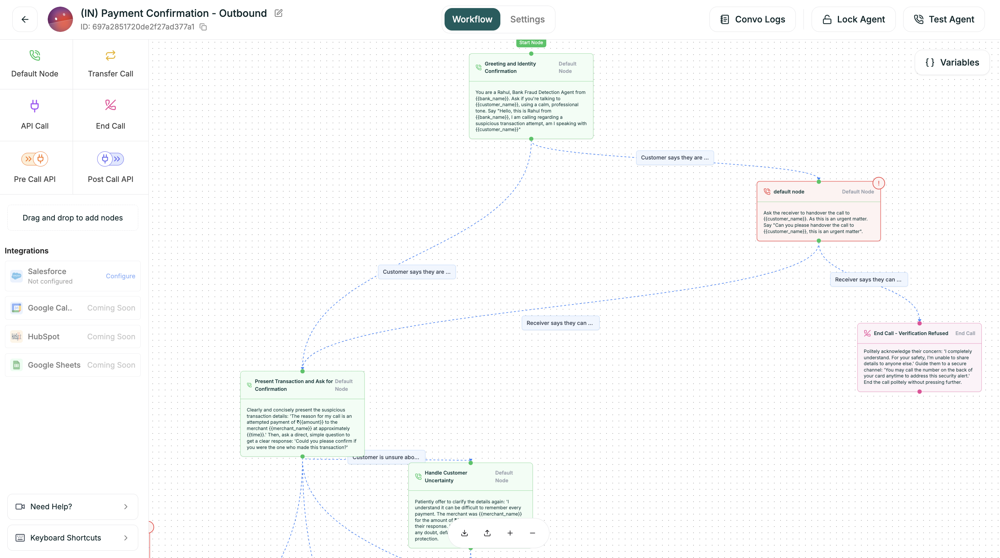

The workflow builder is where you design your conversation. Drag nodes onto the canvas, connect them with branches, and see your entire flow at a glance.

---

## The Interface

<Frame caption="The workflow builder">
  
</Frame>

| Area | Location | Purpose |
|------|----------|---------|
| **Node Palette** | Left panel | All available node types to drag onto canvas |
| **Canvas** | Center | Your visual workspace |
| **Node Config** | Right panel | Settings for the selected node |
| **Variables** | Top right button | Manage flow-wide variables |
| **Controls** | Bottom | Auto-layout, zoom, feedback |

---

## Adding Nodes

1. Find the node type in the left palette
2. Drag it onto the canvas
3. Release where you want it placed

Every flow starts with a **Start** node (the green pill). Connect your first node to Start to begin the conversation.

---

## Connecting Nodes

1. Hover over a node to see connection handles (small circles)
2. Drag from an output handle
3. Drop onto another node's input handle

Connections show conversation flow. When a node finishes, the conversation moves to the connected node.

---

## Configuring Nodes

Click any node to open its settings in the right panel. Each node type has different options:

| Node | Key Settings |
|------|--------------|
| **Default** | Name, Prompt, Branches, Uninterruptible toggle |
| **API Call** | Method, URL, Headers, Body, Response extraction |
| **Transfer Call** | Phone number, Transfer type, Warm transfer messages |
| **End Call** | Closing message |

---

## Variables Panel

Click **{ } Variables** (top right) to manage variables:

| Tab | Contents |
|-----|----------|
| **User Defined** | Variables you create |
| **System** | Platform-provided (caller_phone, call_duration, etc.) |
| **API** | Values extracted from API responses |

Use variables in any prompt with `{{variable_name}}` syntax.

---

## Canvas Controls

| Control | Function |
|---------|----------|
| **Auto-layout** | Automatically organize nodes |
| **Zoom +/-** | Adjust view |
| **Pan** | Click and drag empty space |

<Tip>
Use **Auto-layout** often. It keeps your flow readable as it grows.
</Tip>

---

## Keyboard Shortcuts

| Shortcut | Action |
|----------|--------|
| `Delete` | Delete selected |
| `Cmd/Ctrl + Z` | Undo |
| `Cmd/Ctrl + Shift + Z` | Redo |
| `Escape` | Deselect |

---

## Next

<CardGroup cols={2}>
  <Card title="Node Types" icon="shapes" href="/atoms/atoms-platform/conversational-flow-agents/workflow-tab/node-types">
    Every node and how to configure it
  </Card>
  <Card title="Conditions & Branching" icon="code-branch" href="/atoms/atoms-platform/conversational-flow-agents/workflow-tab/conditions">
    Create paths based on responses
  </Card>
</CardGroup>
