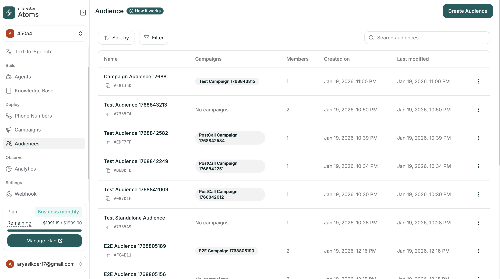
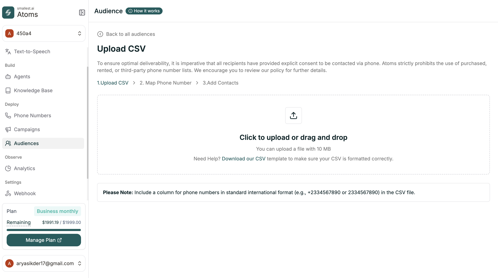
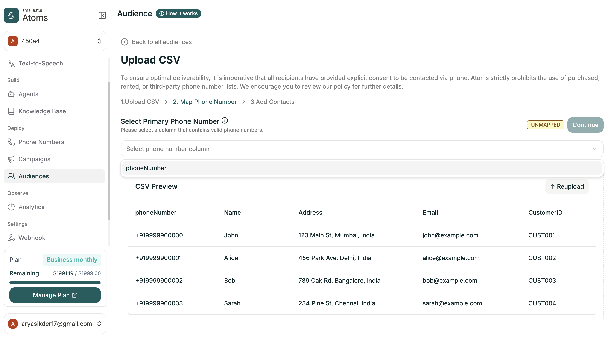
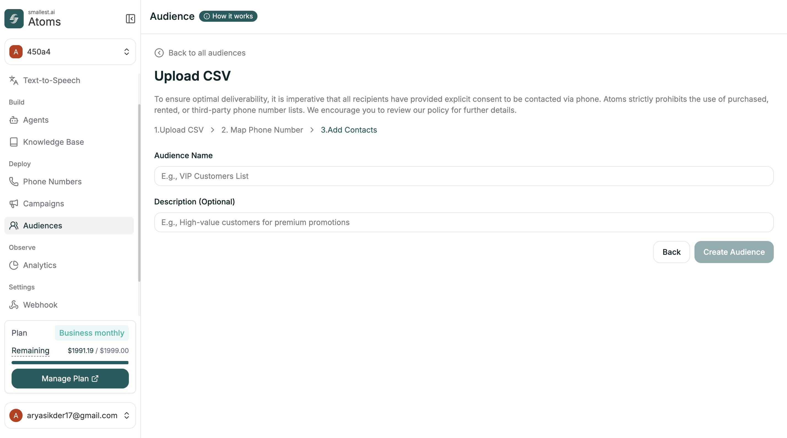
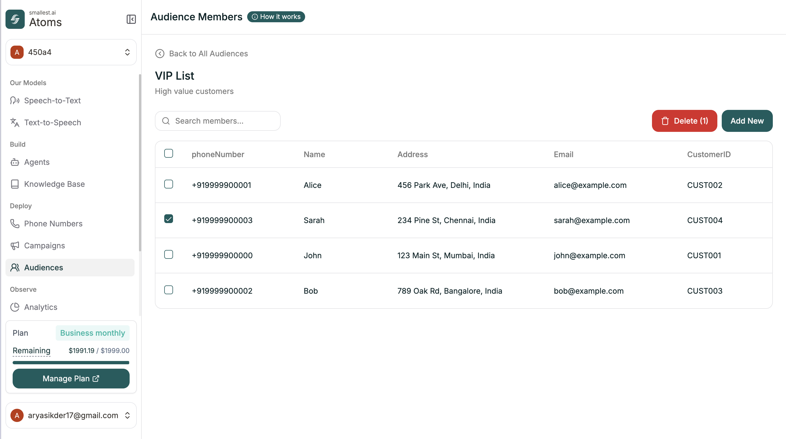
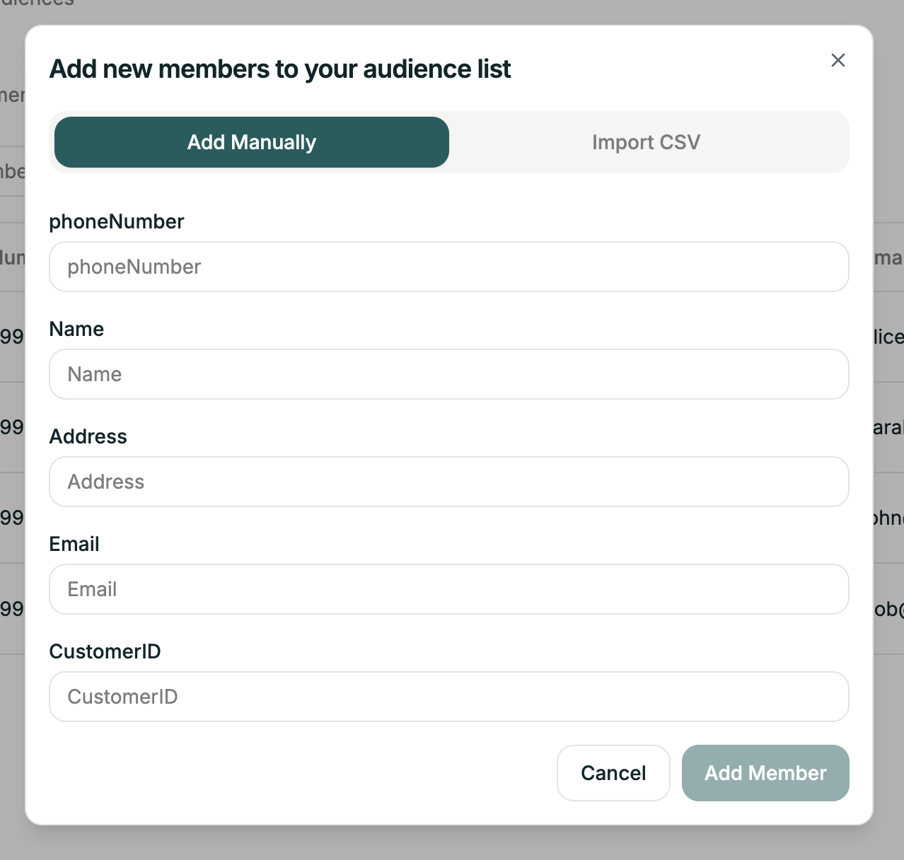
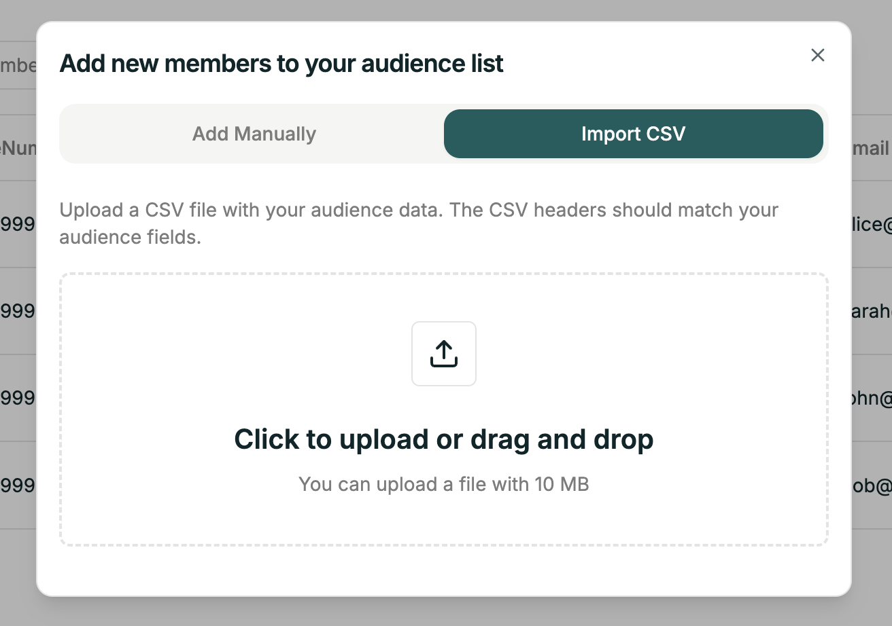

Audiences are your contact lists — the people your agents will call during campaigns. Each audience contains phone numbers and any additional information you want your agent to reference during conversations.

---

## Your Audiences

<Frame>
  
</Frame>

The Audiences page shows all your contact lists at a glance.

| Column | Description |
|--------|-------------|
| Name | Audience name and ID |
| Campaigns | Campaigns using this audience |
| Members | Number of contacts |
| Created on | When the audience was created |
| Last modified | Last update time |
| Actions | Three-dot menu for options |

**Sorting Options:**
- Created on
- Total members  
- Last modified

**Filter Options:**
- All Audiences
- With Campaigns
- Without Campaigns

---

## Creating an Audience

Click **Create Audience** (green button, top right) to start a three-step process.

<Steps>
  <Step title="Upload CSV">
    <Frame>
      
    </Frame>

    <Warning>
      All recipients must have explicit consent to be contacted. Atoms prohibits purchased, rented, or third-party phone lists.
    </Warning>

    Upload a CSV with your contacts (max 10 MB). Your CSV needs a phone number column—everything else is flexible.

    ```csv
    phoneNumber,Name,Email,CustomerID
    919999900000,John,john@example.com,CUST001
    919999900001,Alice,alice@example.com,CUST002
    ```

    Phone numbers should be in international format (`+919999900000` or `919999900000`).
  </Step>

  <Step title="Map Phone Number">
    Tell us which column contains the phone numbers.

    <Frame>
      
    </Frame>

    You'll see a preview of your CSV data. Select the column that contains valid phone numbers from the dropdown.

    <Tip>
      Only the phone number column needs to be mapped—everything else is up to you. Include any additional information you want available during calls (names, order IDs, account numbers, etc.).
    </Tip>
  </Step>

  <Step title="Add Contacts">
    Give your audience a name and optional description.

    <Frame>
      
    </Frame>

    | Field | Required | Example |
    |-------|----------|---------|
    | Audience Name | Yes | VIP Customers List |
    | Description | No | High-value customers for premium promotions |

    Click **Create Audience** to finish.
  </Step>
</Steps>

---

## Managing Audience Members

Click any audience to view and manage its contacts.

<Frame>
  
</Frame>

Here you can:
- **Search** for specific members
- **Select contacts** using checkboxes
- **Delete** selected contacts with the Delete button
- **Add new** contacts with the Add New button

---

## Adding Members to Existing Audiences

Click **Add New** to add contacts to an existing audience. You have two options:

<Tabs>
  <Tab title="Add Manually">
    <Frame>
      
    </Frame>

    Fill in the contact details one at a time:
    - **phoneNumber** (required) — in international format
    - Plus any other fields defined in your audience

    Click **Add Member** to save.
  </Tab>

  <Tab title="Import CSV">
    <Frame>
      
    </Frame>

    Upload another CSV file to add contacts in bulk.
    
    - CSV headers should match your audience fields
    - Maximum file size: 10 MB
    - Click to upload or drag and drop
  </Tab>
</Tabs>

---

## Using Audience Data in Calls

The columns you upload become available as variables during campaigns. If your CSV has a "Name" column, your agent can greet callers by name.

See [Variables](/platform/building-agents/configuring/variables) for more.

---

## Related

<CardGroup cols={2}>
  <Card title="Campaigns" icon="bullhorn" href="/platform/deployment/campaigns">
    Create outbound calling programs
  </Card>
  <Card title="Phone Numbers" icon="phone" href="/platform/deployment/phone-numbers">
    Manage your phone numbers
  </Card>
</CardGroup>
