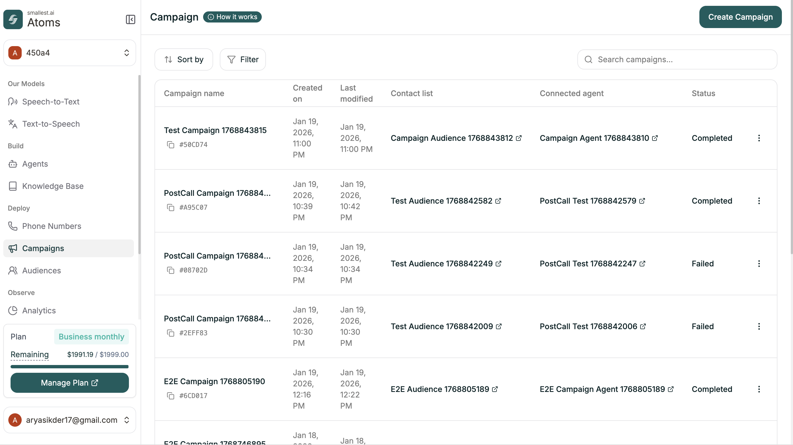
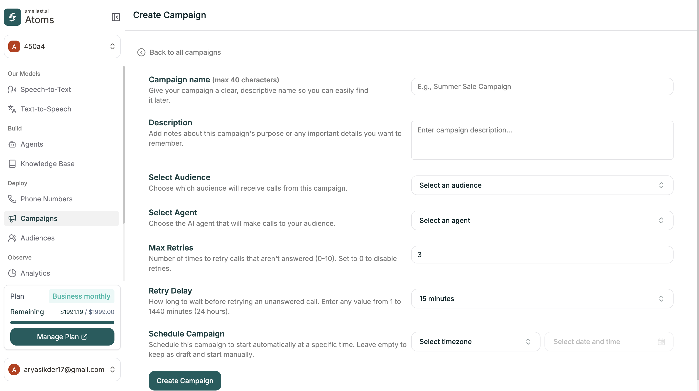
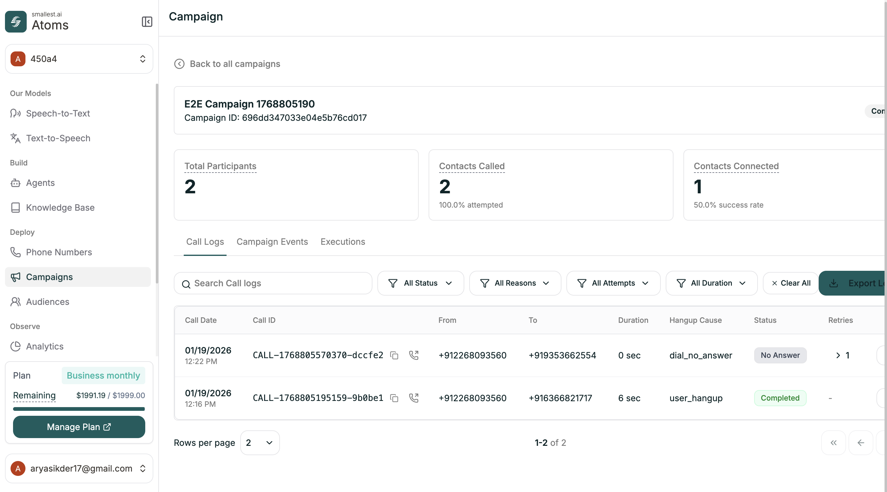
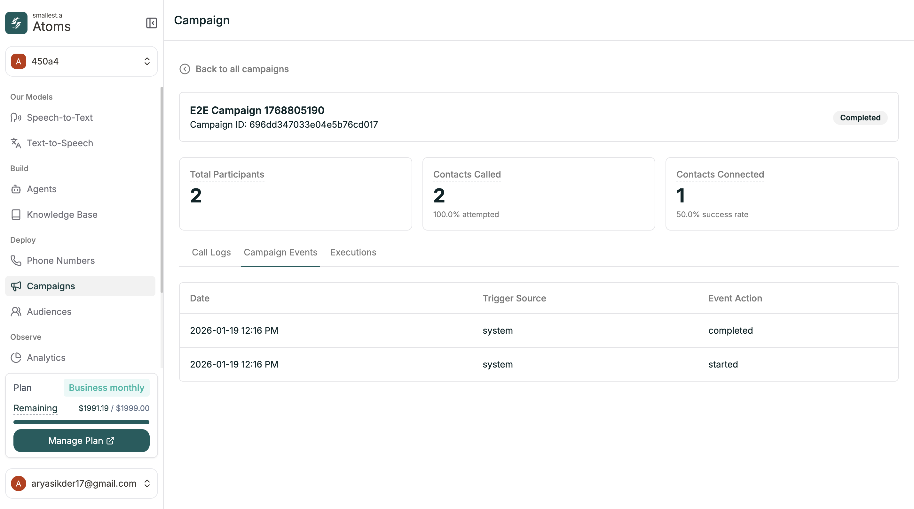
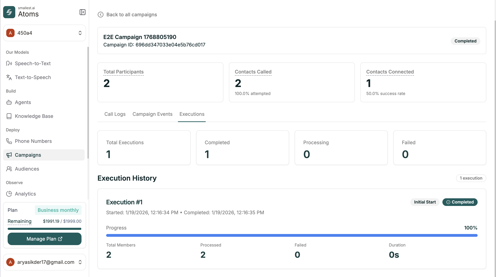

Campaigns let you reach out to your audiences automatically. Set up an agent, pick an audience, and let Atoms call through your contact list.

---

## Your Campaigns

<Frame>
  
</Frame>

The Campaigns page shows all your outbound calling programs.

| Column | Description |
|--------|-------------|
| Campaign name | Name and ID |
| Created on | When the campaign was created |
| Last modified | Last update time |
| Contact list | Linked audience |
| Connected agent | Agent making the calls |
| Status | Draft, Scheduled, Active, Paused, Completed, or Failed |

**Sorting:** Created on, Last modified

**Filters:** All, Draft, Scheduled, Active, Paused, Completed

---

## Creating a Campaign

Click **Create Campaign** (green button, top right).

<Frame>
  
</Frame>

| Field | Required | Description |
|-------|----------|-------------|
| **Campaign name** | Yes | Max 40 characters |
| **Description** | No | Notes about this campaign's purpose |
| **Select Audience** | Yes | Which contact list to call |
| **Select Agent** | Yes | Which agent makes the calls |
| **Max Retries** | No | Times to retry unanswered calls (0-10). Set to 0 to disable. |
| **Retry Delay** | No | Wait time before retrying (1-1440 minutes) |
| **Schedule Campaign** | No | Set timezone + date/time to start automatically. Leave empty to save as draft. |

Click **Create Campaign** when done.

<Tip>
Leave scheduling empty to save as a draft. You can start it manually later.
</Tip>

---

## Campaign Analytics

Click any campaign to view its performance. You'll see summary cards at the top:

| Metric | Description |
|--------|-------------|
| Total Participants | Contacts in the audience |
| Contacts Called | How many were attempted (% of total) |
| Contacts Connected | Successful connections (% success rate) |

Below that, three tabs show detailed analytics:

<Tabs>
  <Tab title="Call Logs">
    <Frame>
      
    </Frame>

    Individual call records for this campaign. Same interface as [Conversation Logs](/platform/building-agents/testing-launch/conversation-logs)—click any call to see the full transcript, events, and metrics.
  </Tab>

  <Tab title="Campaign Events">
    <Frame>
      
    </Frame>

    Timeline of campaign lifecycle events.

    | Column | Description |
    |--------|-------------|
    | Date | When the event occurred |
    | Trigger Source | What triggered the event (system, manual) |
    | Event Action | What happened (started, paused, completed, etc.) |
  </Tab>

  <Tab title="Executions">
    <Frame>
      
    </Frame>

    Execution runs and their results.

    **Summary:** Total Executions, Completed, Processing, Failed

    **Execution History** shows each run with:
    - Start and completion time
    - Progress bar
    - Total Members, Processed, Failed, Duration
  </Tab>
</Tabs>

---

## Campaign Statuses

| Status | Meaning |
|--------|---------|
| Draft | Saved but not scheduled or started |
| Scheduled | Set to start at a future time |
| Active | Currently making calls |
| Paused | Temporarily stopped |
| Completed | All contacts processed |
| Failed | Encountered an error |

---

## Related

<CardGroup cols={2}>
  <Card title="Audiences" icon="users" href="/platform/deployment/audiences">
    Create contact lists for campaigns
  </Card>
  <Card title="Phone Numbers" icon="phone" href="/platform/deployment/phone-numbers">
    Get numbers for outbound calls
  </Card>
</CardGroup>
