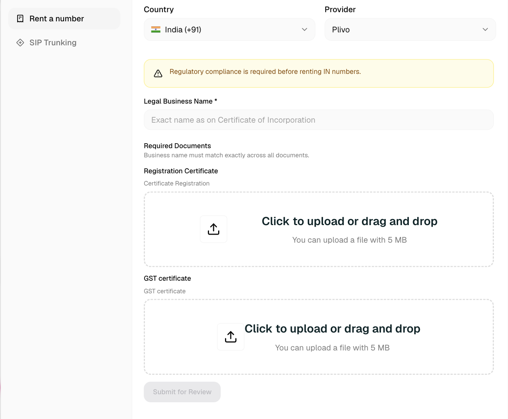

Phone Numbers let your agents make and receive real phone calls. Rent numbers directly through the platform, or import your own via SIP.

---

## Your Numbers

<Frame>
  
</Frame>

The main view shows all your phone numbers with key details:

| Field | Description |
|-------|-------------|
| **Number** | The phone number |
| **Provider** | Telephony provider (e.g., Plivo) |
| **Connected Agent** | Which agent is assigned |
| **Agent Name** | Name of the connected agent |
| **Rent Date** | When you acquired the number |
| **Monthly Cost** | Recurring cost |
| **Status** | Active or inactive |

Click any number in the list to see its details and manage it.

---

## Adding a Number

Click **Add Number** in the top right. You have two options:

<Tabs>
  <Tab title="Rent Number">
    <Frame caption="Rent Number modal">
      
    </Frame>
    
    Rent a new phone number directly through the platform.
    
    1. Click **Add Number** → **Rent Number**
    2. Select your country and preferences
    3. Choose from available numbers
    4. Complete the rental
    
    For most countries, the number appears in your list immediately, ready to assign to an agent.

    <Warning>
      Indian phone numbers require regulatory compliance approval before activation. You may need to submit identity or business documents, such as registration and GST certificates, before the number can be activated.
    </Warning>

    <Frame caption="India number compliance review">
      
    </Frame>
  </Tab>
  
  <Tab title="Import SIP">
    <Frame caption="Import SIP Number modal">
      
    </Frame>
    
    Bring your own number via SIP trunking.
    
    | Field | Required | Description |
    |-------|----------|-------------|
    | **Phone Number** | Yes | Your existing number |
    | **SIP Termination URL** | Yes | Your provider's SIP host where outbound calls are sent. a hostname or IP, optionally with a port (e.g. `sip.yourprovider.com:5060`) |
    | **Display Name** | No | Friendly name for the number |
    | **Username** | No | For SIP authentication |
    | **Password** | No | For SIP authentication |
    | **SIP Origination URL** | - | Provided by the platform (copy this to your provider) |
    
    <Note>
    The SIP Termination URL must point to your **SIP provider's** server (not a website URL). Full SIP URIs like `sip:sip.yourprovider.com:5060` are accepted and automatically normalized.
    </Note>
    
    Click **Add Custom Number** when done.
  </Tab>
</Tabs>

---

## Assigning to an Agent

Once you have a number, assign it to an agent:

1. Open your agent
2. Go to **Agent Settings** → **Phone Number** tab
3. Select the number from the dropdown
4. Save

Now calls to that number will be handled by your agent.

---

## Releasing a Number

To stop using a number, click it in the list and click **Release**.

<Warning>
Releasing a number expires it at the end of the month and **cannot be undone**. The number cannot be reused.
</Warning>

---

## Call Controls

During an active call, agents can perform these actions:

| Action | Description |
|--------|-------------|
| **Transfer** | Connect the caller to a human or an external number |
| **Hold** | Place the caller on hold with music |
| **End** | Gracefully terminate the call |
| **DTMF** | Detect keypad presses (menu navigation, PIN entry) |
| **Record** | Start or stop call recording |

Configure these on the agent under **Agent Config**. See [Agent Config](/voice-agents/platform/create-agent/agent-config) for the End Call and Transfer Call settings.

---

## SIP Providers

The platform works with any provider that supports standard SIP trunking. Common choices:

| Provider | Notes |
|----------|-------|
| **Twilio** | Elastic SIP Trunking; termination + origination URIs on your Twilio console |
| **Telnyx** | Global SIP trunk; termination URI from your Telnyx portal |
| **Vonage** | SIP trunking (Nexmo); requires trunk provisioning through account manager |
| **Your own PBX / VoIP** | Any provider that speaks SIP works. provide your termination URL and we handle the rest |

The platform routes outbound calls to your SIP termination URL and gives you an **Origination URL** to configure in your provider so inbound calls reach your agent.

---

## Related

<CardGroup cols={2}>
  <Card title="Audiences" icon="users" href="/voice-agents/platform/deploy/audiences">
    Manage contact lists for campaigns
  </Card>
  <Card title="Campaigns" icon="bullhorn" href="/voice-agents/platform/deploy/campaigns">
    Use numbers for outbound calling
  </Card>
</CardGroup>
