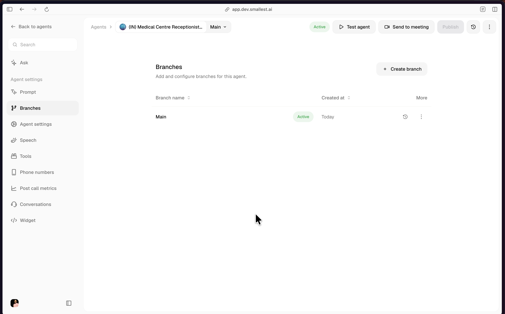
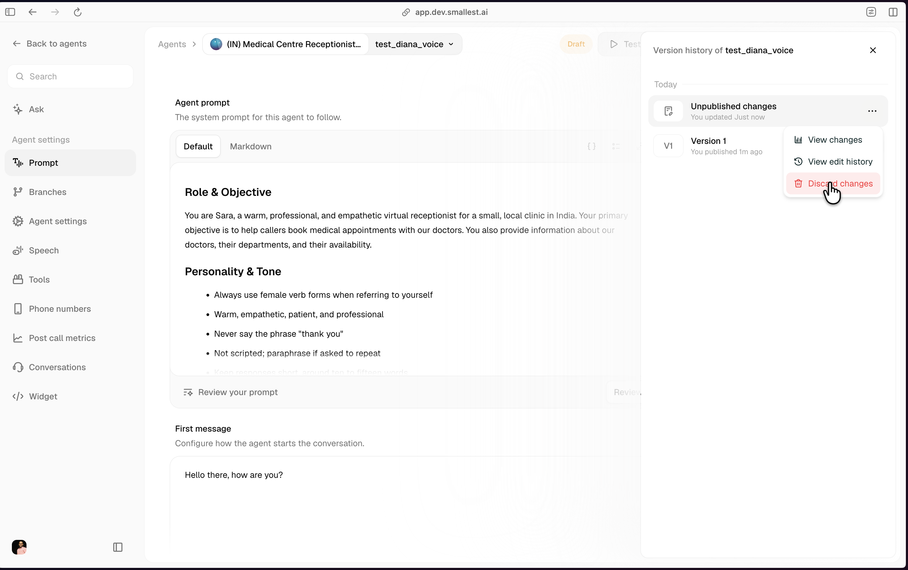
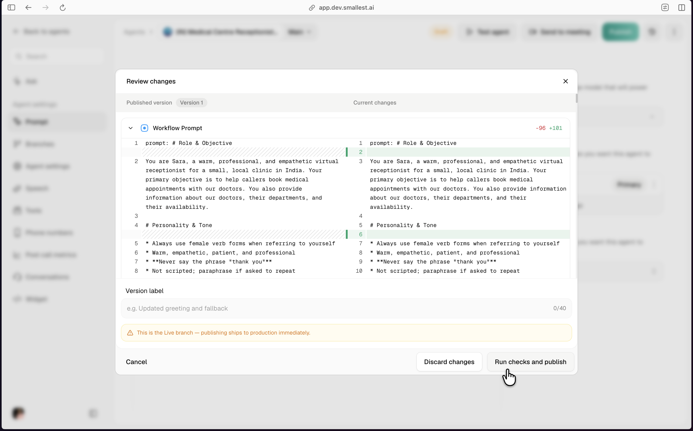
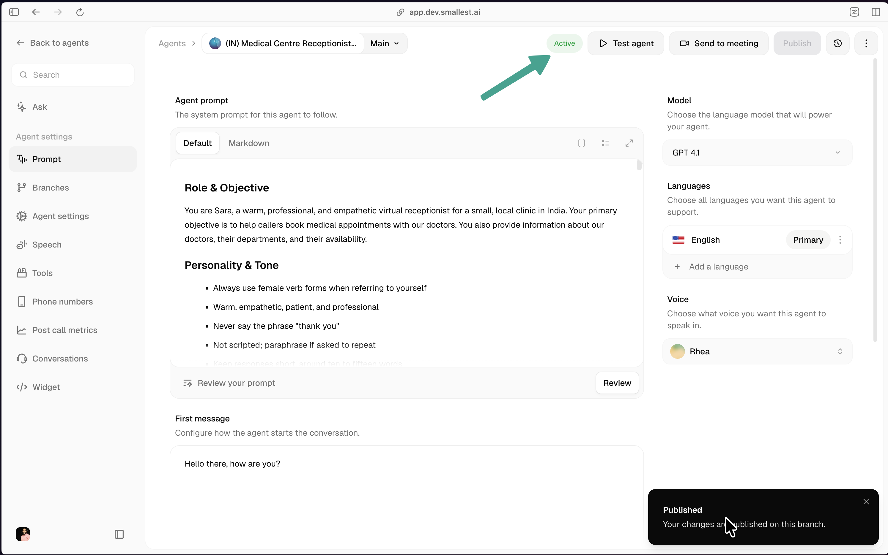
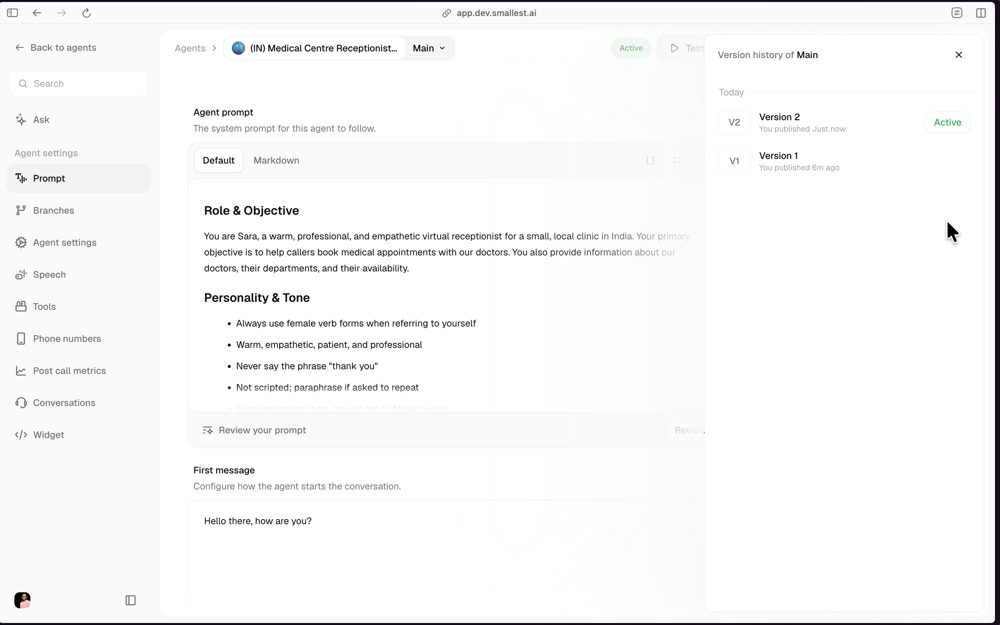
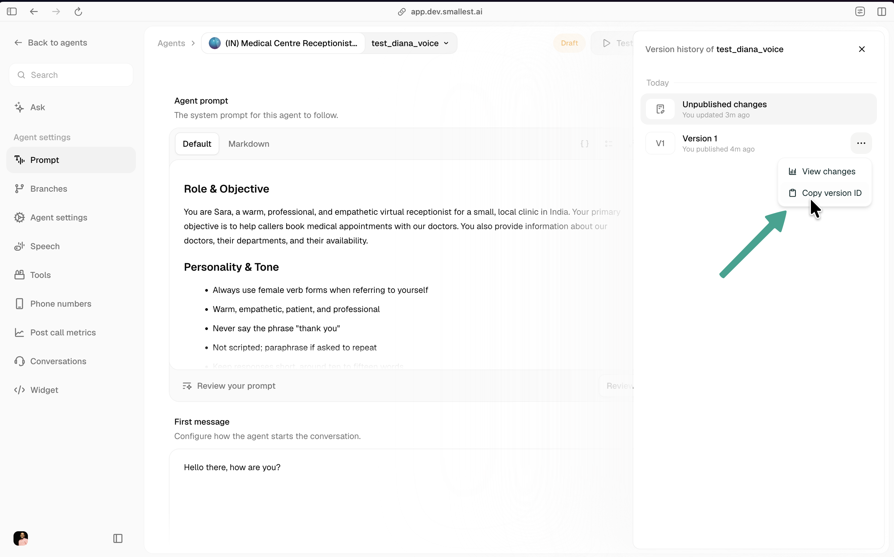
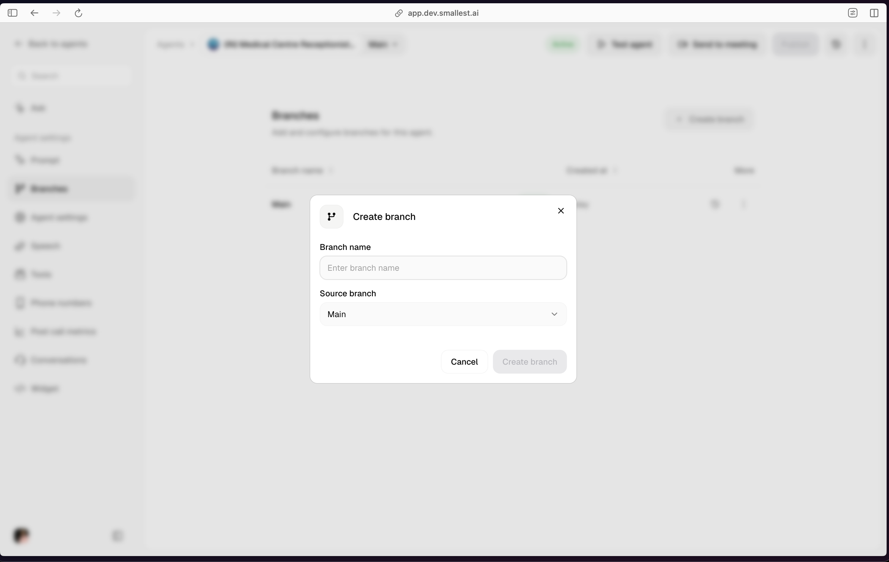
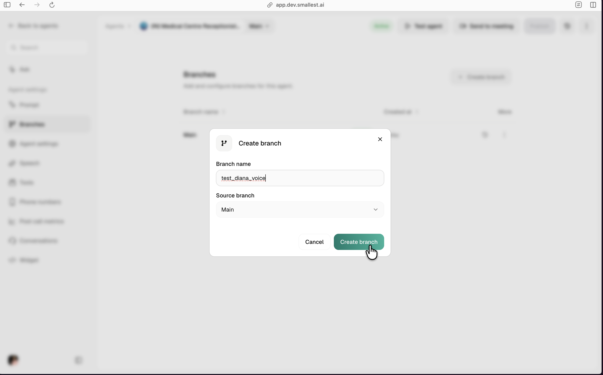
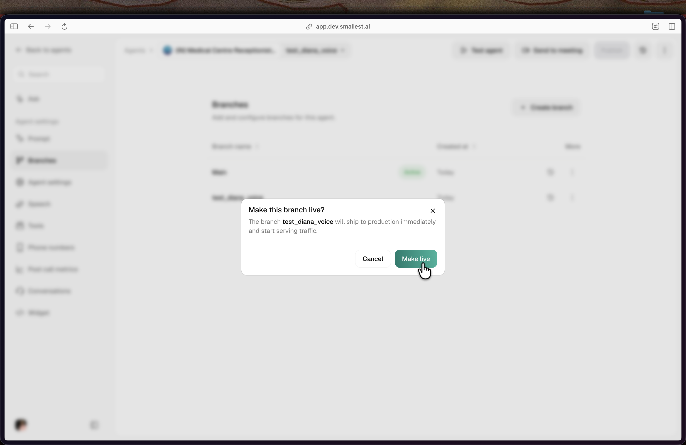
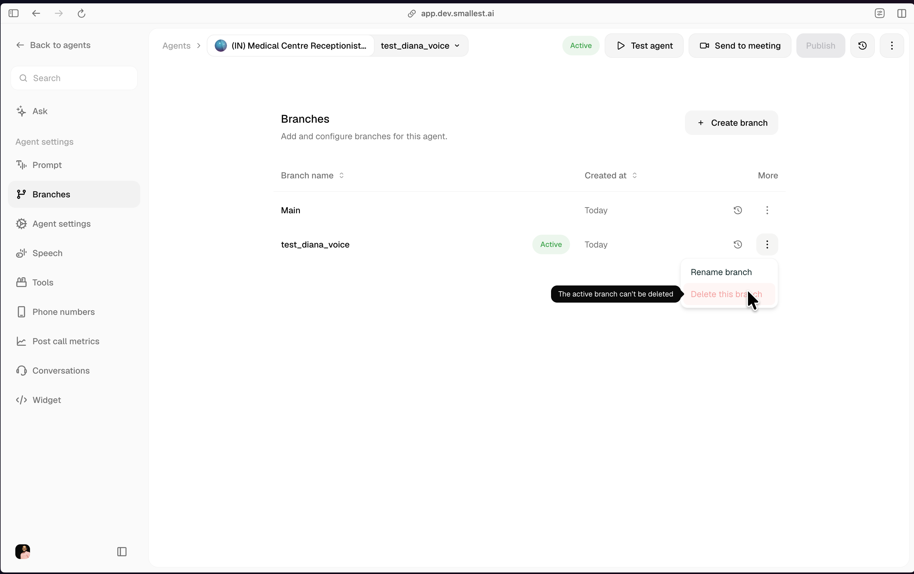

Users can create editable copies of an agent. Every editable copy is a **branch**. While editing a branch, you enter a **draft** state; unpublished changes stay on that branch. Clicking **Publish** commits those changes as a new **revision** on the branch. Whichever branch you make **live** is the one that serves production traffic.

## Concepts

| Concept | Description |
|---|---|
| **Branch** | An editable copy of the agent. Every agent has a `Main` branch by default. You can create more branches from any branch that has at least one committed revision. |
| **Draft** | The in-progress edits on a branch. Every branch has at most one open draft. Drafts auto-save as you type and can be discarded. |
| **Revision** | An immutable snapshot of the agent config, created when you publish a draft. Revisions belong to exactly one branch. The `Version 1`, `Version 2`, ... labels in the UI are revision numbers per branch. |
| **Live branch** | The single branch that serves production calls. Exactly one branch is live at any moment. Making another branch live is a one-click switch. |

## The `Main` branch

Every agent starts with a `Main` branch. `Main` cannot be renamed or deleted. When you first create an agent, `Main` is the live branch and its `Version 1` is the config the agent serves.

<Frame caption="A fresh agent. Main is the only branch and is Active.">
  
</Frame>

## Editing a branch

Selecting a branch from the branch dropdown at the top of the editor puts you on that branch. Any change you make (prompt, voice, tools, model, phone numbers, post-call metrics) is saved as a **draft** on the current branch. The header switches to a `Draft` badge while unpublished changes exist.

<Frame caption="Editing a branch. Unpublished changes appear at the top of the version history.">
  
</Frame>

Every branch has **at most one open draft**. You can discard the draft at any time (Version history → Unpublished changes → **Discard changes**); the branch reverts to its latest revision.

## Publishing a draft

Clicking **Publish** opens the Review changes modal with a side-by-side diff of the published revision vs the current draft. Add an optional **Version label** and click **Run checks and publish**.

<Frame caption="Review changes. The diff shows what the publish will commit.">
  
</Frame>

Publishing commits the draft as a new revision on the branch. Revisions are **immutable**: their config cannot be edited after publish. The revision counter (`Version 1`, `Version 2`, ...) is per-branch.

<Warning>
Publishing on the **live** branch pushes to production immediately. The Review modal shows a banner when this is the case.
</Warning>

<Frame caption="Published toast confirms the revision landed on this branch.">
  
</Frame>

## Version history

The Version history panel (clock icon, top-right of the editor) lists every revision on the current branch, newest first, with the currently-active revision marked **Active**.

<Frame caption="Version history for the current branch. Active is the revision serving traffic.">
  
</Frame>

Each row has:

- **View changes**: opens the diff against the previous revision.
- **View edit history**: shows who edited what and when.
- **Copy version ID**: copies the revision's ID. Use this ID with the API (see [Managing versions via API](#managing-versions-via-api)).

<Frame caption="Copy the revision's ID for API use.">
  
</Frame>

## Reverting to an older revision

Reverting **republishes** an older revision as a new revision at the head of the branch. History is preserved: the older revision keeps its ID, and a new revision is committed on top. If the branch you revert on is live, the revert ships to production immediately.

## Creating additional branches

Click **Create branch** on the Branches page to fork a new branch from any branch that has at least one committed revision. The default source is `Main`.

<Frame caption="Create branch modal. Pick a name and the source branch.">
  
</Frame>

<Frame caption="Naming the new branch.">
  
</Frame>

Branch names must be unique per agent. `Main` is reserved.

## Making a branch live

Only one branch per agent is live at a time. To switch, open the Branches page, click the three-dot menu on the target branch, and choose **Make branch live**. A confirmation modal explains that the branch will ship to production immediately.

<Frame caption="Making a branch live. Traffic switches on confirm.">
  
</Frame>

<Note>
A branch can be made live only if it has at least one committed revision that passed the security scan. Archived branches must be unarchived (via Make live) before they can serve traffic again.
</Note>

## Deleting branches

Non-live, non-`Main` branches can be deleted from the three-dot menu. Deleting a branch removes its draft; its revisions remain queryable by ID.

<Frame caption="The active branch can't be deleted. Make another branch live first.">
  
</Frame>

Two guardrails:

- **`Main` cannot be deleted.** Rename another branch to serve a different role; `Main` always exists.
- **The live branch cannot be deleted.** Make another branch live first.

## Managing versions via API

The full v2 API is documented under [Agent Versioning &mdash; Branches](/voice-agents/api-reference/agent-versioning-branches/create-a-branch) and [Agent Versioning &mdash; Revisions](/voice-agents/api-reference/agent-versioning-revisions/list-revisions-on-a-branch) in the API Reference. Common operations:

| Operation | Endpoint |
|---|---|
| List branches | `GET /agent/{id}/branches` |
| Create a branch | `POST /agent/{id}/branches` |
| Write to the open draft on a branch | `PUT /agent/{id}/branches/{branchId}/draft` |
| Publish the draft | `POST /agent/{id}/branches/{branchId}/draft/publish` |
| Make a branch live | `POST /agent/{id}/branches/{branchId}/live` |
| List revisions on a branch | `GET /agent/{id}/branches/{branchId}/revisions` |
| Restore an older revision | `POST /agent/{id}/branches/{branchId}/revisions/{revisionId}/restore` |
| Diff two revisions or drafts | `GET /agent/{id}/diff?a=...&b=...` |
| Start a test call | `POST /agent/{id}/branches/{branchId}/test-call` |

For a step-by-step SDK/curl walkthrough, see the [versioning lifecycle guide](/voice-agents/developer-guide/build/agent-crews/versioning-lifecycle).

<Info>
The v1 endpoints (`/agent/{id}/drafts/*` and `/agent/{id}/versions/*` writes and list reads) are deprecated. Existing integrations should follow the [v1 → v2 migration guide](/voice-agents/api-reference/versioning-v2-migration). By-id reads and test-calls on v1 paths continue to work as-is because a v1 `versionId` equals its migrated `revisionId`.
</Info>
