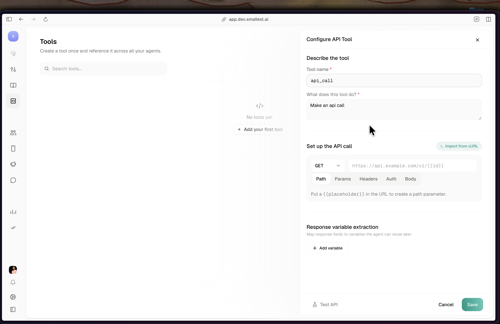
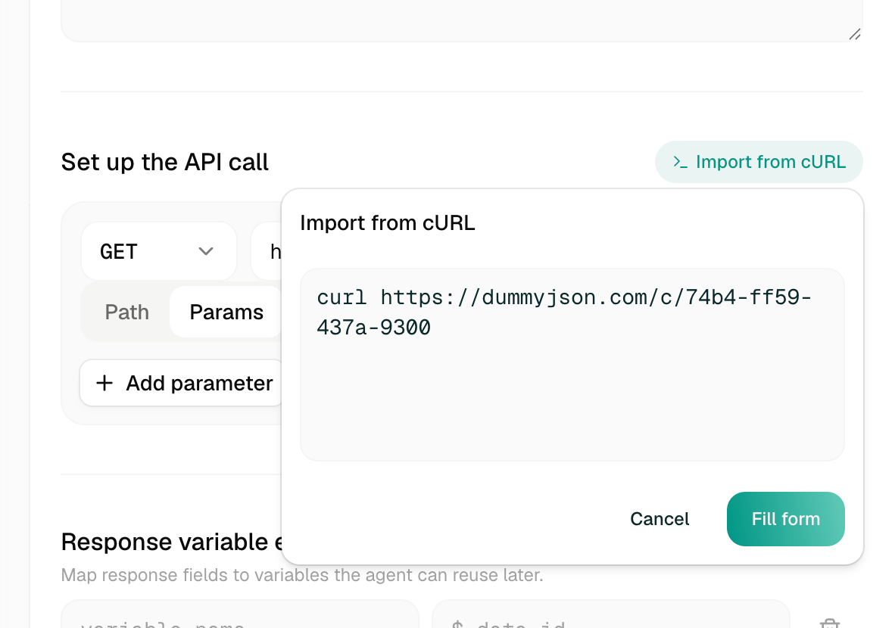
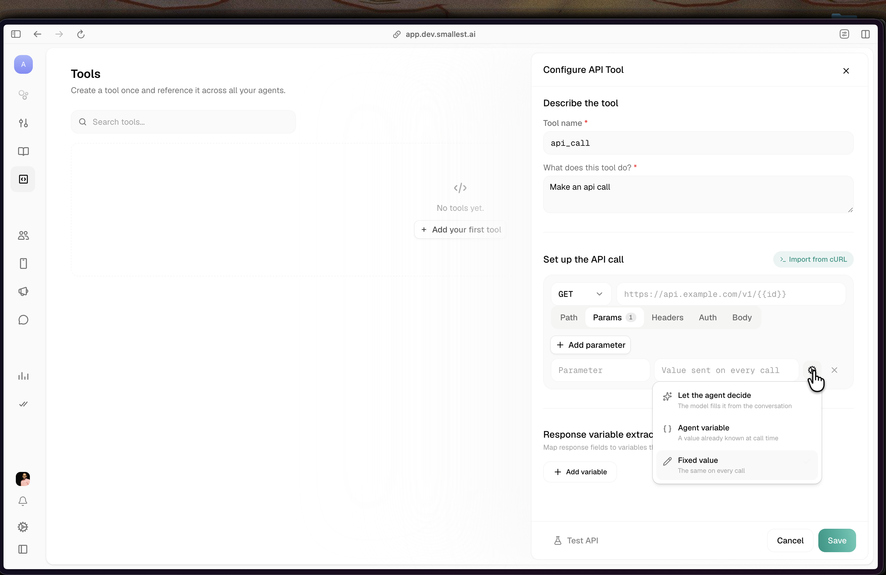
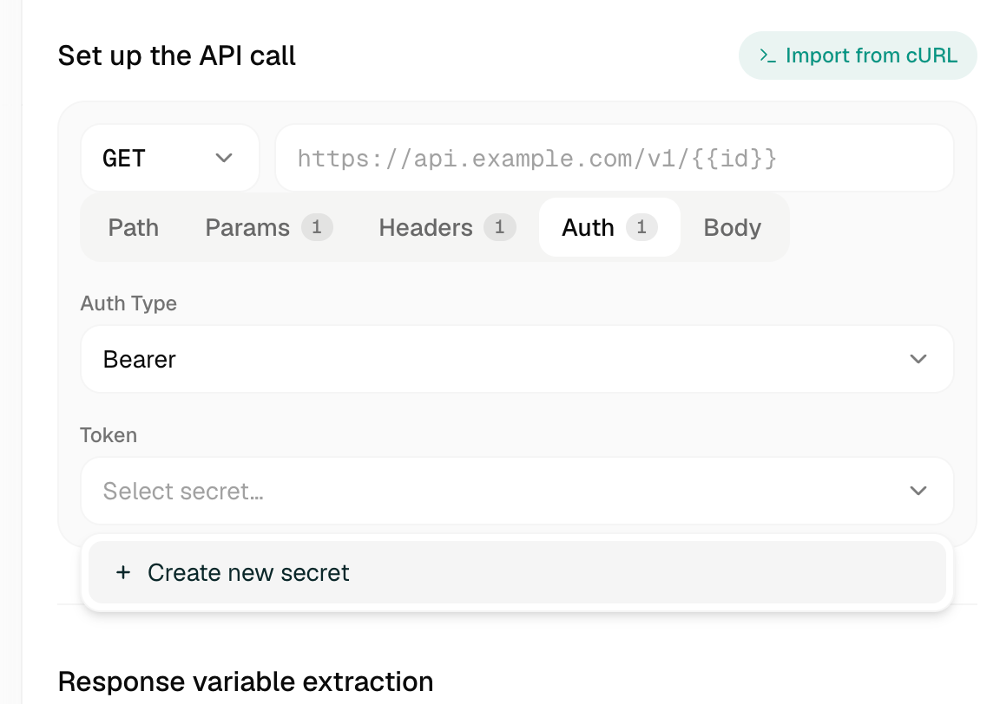
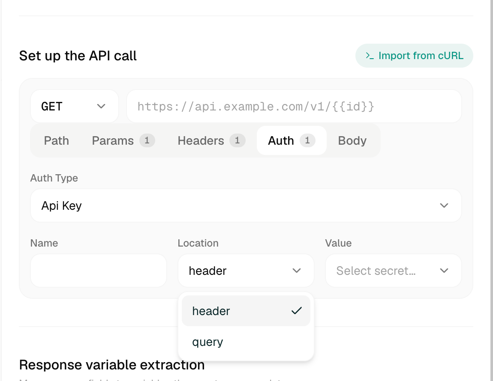
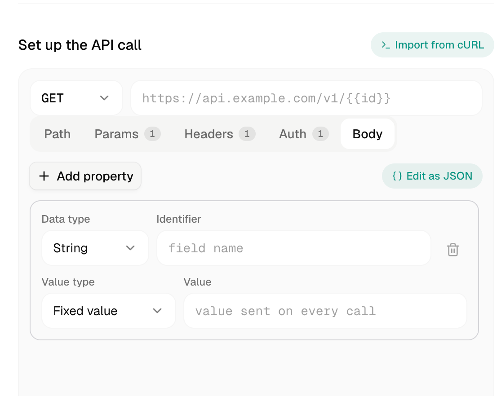

import { CodingAgentCallout } from "@/components/CodingAgentCallout";

An **API tool** calls your endpoint during the conversation and feeds the response back to the agent. Build it once in the [Tools library](/voice-agents/platform/create-agent/tools-library) (or from inside an agent) and reference it anywhere.

<Frame caption="The API-tool builder">
  
</Frame>

## Describe the tool

- **Tool name** — a short identifier.
- **What does this tool do?** — the model reads this to decide *when* to call the tool, so write it in plain language for the agent.

## Set up the API call

Pick the **method** (GET / POST / PUT / PATCH / DELETE) and enter the **URL**. Anything in double curly braces becomes a variable, e.g. `https://api.example.com/v1/orders/{{order_id}}`. A `{{placeholder}}` in the URL path shows up under the **Path** tab.

The call is configured across five tabs, each showing a count when populated:

| Tab | What it holds |
|---|---|
| **Path** | Path parameters from `{{placeholders}}` in the URL |
| **Params** | Query-string parameters |
| **Headers** | Request headers |
| **Auth** | Authentication (see [below](#auth-and-secrets)) |
| **Body** | Request body (POST/PUT/PATCH) |

### Import from cURL

Already have a working request? Click **Import from cURL**, paste the command, and **Fill form** populates the method, URL, headers, params, and body for you.

<Frame caption="Import from cURL">
  
</Frame>

## Value sourcing

Every path param, query param, header, and body field draws its value one of three ways:

<Frame caption="The three value sources on a parameter">
  
</Frame>

| Source | Meaning | Needs |
|---|---|---|
| **Let the agent decide** | The model fills it from the conversation | A clear description (e.g. "the customer's order number") + a type (Text / Number / Boolean / Enum) and a required flag |
| **Agent variable** | A value already known at call time | A variable — pick from **Custom** (your variables) or **System** (`call_id`, `conversation_type`, `agent_number`, `user_number`, `current_date`, `current_time`) |
| **Fixed value** | The same on every call | The constant value |

<Note>
On the **Body** tab the same three modes appear as **Agent decides / Agent variable / Fixed value** — same behavior, slightly shorter labels.
</Note>

## Auth and secrets

The **Auth** tab handles authentication. You never paste a raw key here — you reference a [secret](/voice-agents/platform/create-agent/secrets) by name, and the platform injects it into the outbound request at call time.

<Frame caption="Bearer auth backed by a secret">
  
</Frame>

| Auth type | Fields |
|---|---|
| **None** | — |
| **Bearer** | A **token** secret → sent as `Authorization: Bearer <value>` |
| **Api Key** | A **name**, a **location** (`header` or `query`), and a **value** secret |
| **Basic** | A **username** and a **password** secret → sent as `Authorization: Basic <base64>` |

<Frame caption="API-key auth: name, location, and a secret value">
  
</Frame>

<Warning>
The secret is resolved and injected **server-side at call time**, then stripped before the config reaches the runtime — it never appears in the served agent config, call logs, or webhooks. Because of that, the inline **Test API** (below) runs **without** the auth secret, so testing an authenticated tool may return `401`/`403`. Test against a public endpoint, or verify auth on a real call.
</Warning>

## Body

For POST/PUT/PATCH, build the body field by field — each field has a **data type** (String / Number / Boolean / Object / Array), an identifier, and a value source. Or switch to **Edit as JSON** for a structured schema view. Live validation blocks a save with a broken body; **Prettify** reformats only.

<Frame caption="The Body tab with per-field editing and Edit as JSON">
  
</Frame>

The **Edit as JSON** view is a per-field descriptor map. `value_type` is `llm` (carries a `description` + `required`), `agent_variable` (carries a `variable`), or `fixed` (carries a `literal`):

```json
{
  "customer_name": { "type": "text", "value_type": "llm", "description": "The customer's full name", "required": true },
  "user_id":       { "type": "string", "value_type": "agent_variable", "variable": "user_id" },
  "channel":       { "type": "string", "value_type": "fixed", "literal": "web" }
}
```

Nested shapes use `{"type": "object", "properties": { … }}` and `{"type": "array", "items": [ … ]}`.

## Timeout and response extraction

- **Timeout (ms)** — how long to wait for a response (default 5000).
- **Response variable extraction** — map fields from the response into variables the agent can reuse later, by name and JSONPath (e.g. `order_total` ← `$.total`). Add as many as you need.

## Test it

Click **Test API**, fill any sample inputs, and **Run test** to fire a live request and see the status + response inline — no separate tool needed.

## Related

<CardGroup cols={2}>
  <Card title="Tools library" href="/voice-agents/platform/create-agent/tools-library">
    Create once, reference across agents
  </Card>
  <Card title="Secrets" href="/voice-agents/platform/create-agent/secrets">
    The vault your tool Auth references
  </Card>
</CardGroup>

<CodingAgentCallout />
