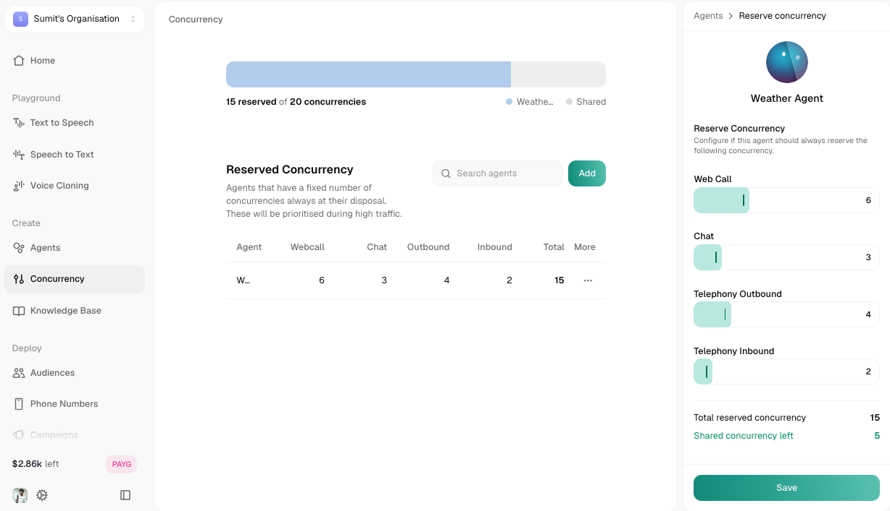
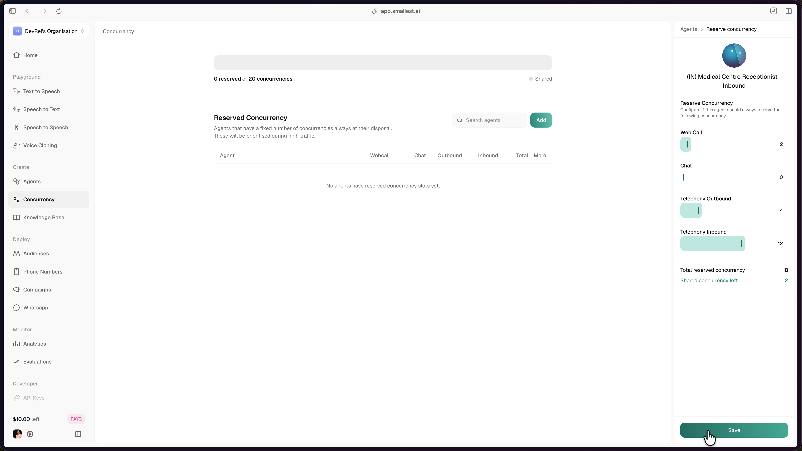
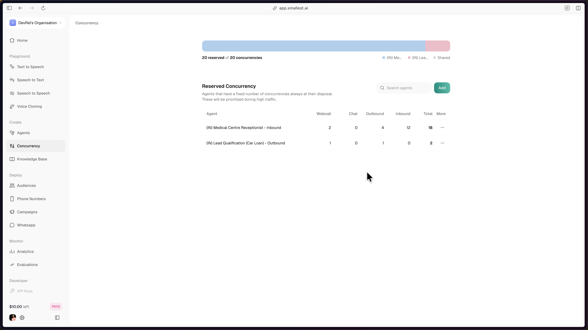

**Concurrency** is how many calls, across all your agents combined, can run at the same time. Your organization has a fixed number of slots; when a call starts it takes one, when it ends the slot is freed for the next call in line.

<Frame caption="The Concurrency page, showing the reserved/shared bar and the reserved-agents table">
  
</Frame>

Prefer to watch? Here's a quick walkthrough of setting up concurrency and reserving slots:

<iframe
  width="560"
  height="315"
  src="https://www.youtube.com/embed/p0JijUaT-vw"
  title="Set up concurrency and reserve call slots in Smallest AI Atoms"
  frameborder="0"
  allow="accelerometer; fullscreen; autoplay; clipboard-write; encrypted-media; gyroscope; picture-in-picture"
></iframe>

<Note>
  The limit applies across **all call types** together, webcall, chat, telephony outbound, and telephony inbound all draw from the same pool. Your exact org limit isn't fixed across all plans, it's shown live at the top of the Concurrency page ("X reserved of Y concurrencies"), and depends on your plan, check **Billing** or talk to your account team to change it.
</Note>

If every slot is full, new **outbound**, **webcall**, and **chat** requests are **queued** until a slot frees up. They wait, they are not dropped.

**Inbound telephony is different.** Incoming phone calls cannot be queued: when no slot is available, the caller hears a ring for ~30 seconds. If a slot frees within that window the call connects, otherwise it is disconnected. Plan headroom on inbound accordingly, either raise your org limit or reserve slots for the inbound agent. See the [inbound overflow FAQ](#faq) for detail.

## Reserved vs. Shared

<Warning>
**Reserved concurrency is a guaranteed floor, not a cap.** An agent with a reservation still borrows from the shared pool once its reserved slots are full. A `reserved: 5` agent can run more than 5 concurrent calls when the shared pool has capacity. The ceiling is the org's total concurrency limit, not the reservation.
</Warning>

By default, every slot is **shared**: any agent can use any open slot, first-come first-served. That's fine for a single agent, or several agents of equal priority.

If some agents matter more (say, support or payments vs. a low-priority internal test agent), you can **reserve** slots for them, per call type. Reserved slots are guaranteed to that agent and no one else can touch them, even while they sit idle.

Everything not reserved falls into the **shared pool**, available to any agent on a first-come, first-served basis.

**Example:** Your org limit is 20. Agent A reserves 12 slots, Agent B reserves 5. The shared pool has 3.
- **Agent A** can handle up to 15 simultaneous calls: its 12 reserved slots plus the 3 shared slots.
- **Agent B** is guaranteed its 5 reserved slots regardless of what Agent A is doing.
- **At full capacity** (12 + 3 + 5 = 20), any further calls for either agent are queued.

<Warning>
  Reserved slots are exclusive. If Agent A reserves 12 slots but is only using 4, the other 8 still sit idle and are **not** available to Agent B or anyone else.
</Warning>

## Who Can Use What

| Slot Type | Who can use it? | When? |
|---|---|---|
| **Agent's own reserved slots** | Only that agent | Always available, guaranteed |
| **Shared pool** | Any agent | First-come first-served, once an agent's own reserved slots are used up |
| **Another agent's reserved slots** | Nobody else | Never, reserved slots are exclusive |

## Setting Up Reservations

<Steps>
  ### Open Concurrency
  Go to **Concurrency** in the sidebar. The bar at the top shows total reserved vs. shared capacity; the **Reserved Concurrency** table below lists every agent with an active reservation.

  ### Add a reservation
  Click **Add**, search for and select an agent, then set how many slots to reserve for each call type: **Web Call**, **Chat**, **Telephony Outbound**, **Telephony Inbound**. The panel shows the running **Total reserved concurrency** and how much **Shared concurrency** is left as you go. Click **Save**.

  <Frame caption="Reserving per-channel slots for an agent. The panel tracks the running total and shared slots left.">
    
  </Frame>

  ### Edit or remove one
  Open the **⋯** menu on any row in the table and choose **Edit reservations** to change the numbers, or **Remove agent** to release all of that agent's reserved slots back to the shared pool.
</Steps>

Once you reserve for more than one agent, the top bar shows each agent's share of the pool. Here two agents split a 20-slot pool: the receptionist reserves 18, the car-loan agent reserves 2, which fills the pool completely and leaves the shared pool at zero.

<Frame caption="Two agents sharing a 20-slot pool (18 + 2), with the pool fully reserved">
  
</Frame>

<Note>
  You can't reserve more than your org has: the Save button disables itself if a reservation would push the shared pool below zero, and the same limit is enforced server-side. Only org admins can add, edit, or remove reservations.
</Note>

<Tip>
  Changes take effect immediately for new calls. Reducing an agent's reservation never interrupts calls already in progress, it only changes what's available for the next one.
</Tip>

## Best Practices

<AccordionGroup>
  <Accordion title="Start without reservations">
    If you have one agent, or several with equal priority, the shared pool already covers you. Don't reserve anything until you actually need to guarantee capacity for something specific.
  </Accordion>
  <Accordion title="Reserve only for what actually matters">
    Reserve slots for agents handling critical flows, support, payments, anything you can't afford to have queue. Leave lower-priority agents on the shared pool.
  </Accordion>
  <Accordion title="Don't reserve everything">
    Reserving 100% of your limit leaves nothing in the shared pool, agents can still work, but none of them can borrow capacity from an idle reservation. Leave some headroom.
  </Accordion>
  <Accordion title="Watch it during peak hours">
    If agents are consistently queuing, that's a sign to either rebalance reservations or raise your org's overall limit.
  </Accordion>
</AccordionGroup>

## FAQ

<AccordionGroup>
  <Accordion title="Can my agent exceed its reserved concurrency?">
    **Yes.** Reserved concurrency is a floor, not a ceiling. The dispatcher tries the agent's reserved slots first; once those are full, it falls back to the org's shared pool. So an agent with `reserved: 5` can run up to `5 + (shared pool size)` concurrent calls, bounded only by the org's total concurrency limit.

    Set the reservation to guarantee minimum capacity for a high-priority agent, not to cap it. To hard-limit a single agent below the org total, this feature does not cover that case; talk to your account team.
  </Accordion>
  <Accordion title="Why does the Analytics dashboard show higher concurrency than my agent's reservation?">
    The per-agent concurrency metric on the Analytics dashboard is the **total slots the agent held in that minute**: reserved slots plus any shared slots it acquired. So a `reserved: 5` agent that also borrowed 40 shared slots shows 45 for that minute, not 5. This is expected under the floor-not-cap model described above.

    If the dashboard number looks abnormally high (peak values well above the org total, or sustained values that do not match your call volume), that can indicate stuck calls where `call_end` events were not emitted. Contact support with a specific `callId` window and we can investigate.
  </Accordion>
  <Accordion title="What happens when the org hits its concurrency limit?">
    **Outbound, webcall, and chat** requests queue and are dispatched in order as slots free up. Nothing is dropped.

    **Inbound telephony behaves differently, see the next entry.**
  </Accordion>
  <Accordion title="What happens to an inbound call when all my inbound slots are full?">
    Unlike outbound, webcall, and chat calls — which are queued until a slot frees up — an inbound telephony call cannot be queued. When no slot (reserved or shared) is available, the incoming call **rings for ~30 seconds**; if a slot frees within that window the call connects, otherwise it is **disconnected**.

    **Recommendations**
    - Watch inbound utilisation on the Analytics page. If you regularly see peaks near the limit, callers are being disconnected without your knowledge.
    - Reserve inbound slots for the agent that handles your production inbound number. Reserved slots are guaranteed and cannot be taken by outbound/webcall/chat traffic on other agents.
    - If your inbound traffic is bursty, raise the org concurrency limit (talk to your account team) rather than relying on reservations alone.
  </Accordion>
  <Accordion title="Can I reserve more than my org's total limit?">
    No, total reservations across all agents can never exceed the org limit, the UI and the backend both enforce this.
  </Accordion>
  <Accordion title="Are reservations per call type or one combined number?">
    Per call type (webcall, chat, outbound, inbound), each with its own slider. An agent's total reservation is the sum of all four.
  </Accordion>
  <Accordion title="Can I change reservations while calls are active?">
    Yes. It applies immediately to new calls; anything already in progress runs to completion untouched.
  </Accordion>
  <Accordion title="How do I increase my org's concurrency limit?">
    Your limit is tied to your plan. Check the **Billing** page for your current plan, or talk to your account team to raise it.
  </Accordion>
</AccordionGroup>
