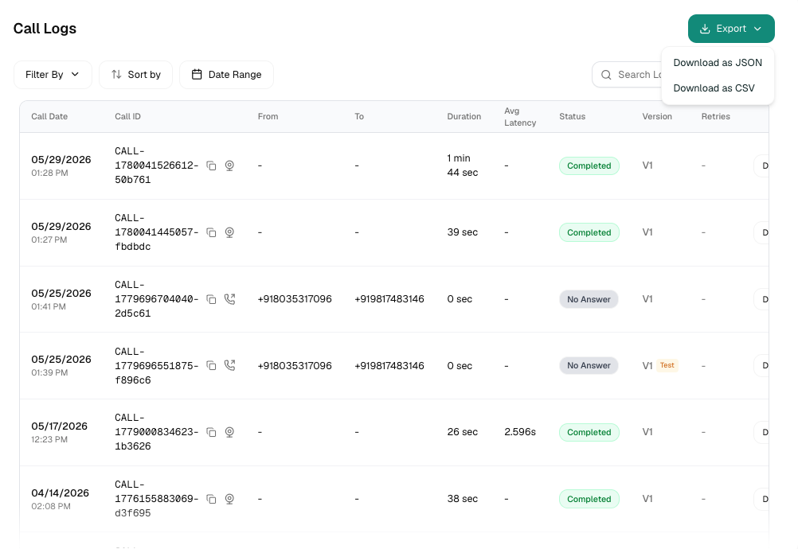

Every call your agent takes lands here. The **Conversations** tab is a per-agent log of every voice call, web call, chat, and WhatsApp conversation, with drill-down into the transcript, recording, tool calls, latency, and cost of any single one.

<Frame caption="Create webhook modal">
  
</Frame>

## The List
Each row is one conversation:

| Column | What it shows |
|---|---|
| **Call Date** | When the conversation started |
| **Call ID** | Unique identifier, click to copy. Hovering the icon next to it shows the channel: Telephony Inbound/Outbound, Web Call, Chat, or WhatsApp Chat/Voice |
| **From / To** | Caller and receiver numbers |
| **Duration** | Total call length |
| **Avg Latency** | Average agent response latency for that call |
| **Status** | Completed, Failed, No Answer, Blocked, In Progress, and others, hover a Failed or Blocked pill to see why |
| **Version** | Which agent version handled the call, with a **Test** tag for test calls |

<Note>
  Calls that are still Pending, Queued, or In Progress refresh automatically every couple of seconds, you don't need to reload the page to watch a live call's status up
</Note>

If a call was retried, its row is expandable, click the chevron to reveal every retry attempt as its own nested row
underneath.

## Filtering & Search

Filters live in a single dropdown and combine wi

| Filter | Options |
|---|---|
| **Conversation Type** | Inbound, Outbound, Webbound / Outbound |
| **Status** | Pending, In Queue, In Progress, Active, Completed, Failed, Cancelled, No Answer, Processing, Blocked |
| **End Reason** | Dial No Answer, User Hangup, t, Error, Voicemail |
| **Call Type** | All Attempts, Retry Attempts only, Initial Attempts only |
| **Duration** | 0-30s, 30-60s, 1-3 min, 3-5 min

Plus a **date/time range** picker (quick presets 7 days, 30 days, or a fully custom range), a**sort by** dropdown (Completed At, Created On, Duration, Avg Latency), and a **free-text search** box.

<Tip>
  Search matches the Call ID and the From/To pho content. To find a specific conversation by what was said, open it and check the Transcript tab instead.
</Tip>

<Note>
  Your filters are remembered per agent, if you navigate away and come back, your last filter set is still applied.
</Note>

<Warning>
  Filtering by agent version isn't available yet, even though a version badge is shown on every row.
</Warning>

## Call Detail

Click **Details** on any row to open the full coe top sits an audio player (0.5x-2x playbackspeed, download button) for calls with a recording. Calls with no audio, chat conversations, or ones that never connected,
show an explanatory empty state instead.

<AccordionGroup>

  <Accordion title="Overview">
    Call summary, agent name, model, voice, timestamps, disconnection reason, and average latency. Also includes a **cost
breakdown**: LLM, TTS, STT, telephony, and platfh shown as rate × quantity, plus any discountapplied.
  </Accordion>

  <Accordion title="Input Variables">
    Every variable value the conversation started with, name and value.
  </Accordion>

  <Accordion title="Transcript">
    The full back-and-forth: agent and caller turns, each timestamped. Empty for calls that never connected.
  </Accordion>

  <Accordion title="Events">
    A chronological timeline of everything that happened mid-call: pre-call API calls (with latency and any variables
extracted), tool calls (function name, latency, errors, and LLM/transcription events. Formulti-agent (Playbook) agents, this is grouped by node instead, with a merged view of every variable extracted along the
way.
  </Accordion>

  <Accordion title="Trace">
    Multi-agent (Playbook) calls only. A per-turPlaybook handled each turn and why, withclassify/LLM/tool-call spans shown as timing bars, and token usage (input, output, cache-read) at each step.
  </Accordion>

  <Accordion title="Metrics">
    Results of your configured Post-Call Metrics for this specific call, each with its extracted value and the AI's
reasoning behind it.
  </Accordion>

  <Accordion title="Turn Latency">
    Per-turn latency: when the caller stopped sprted responding, and the gap between the two,plus averages across the whole call.
  </Accordion>

</AccordionGroup>

<Tip>
  For multi-agent calls, click **View SOP graph** to see the entire routing path as an interactive graph, complete with a
replay button that walks through the path node b
</Tip>

## Exporting

- **Export** at the top of the list downloads every conversation matching your current filters, as CSV or JSON.
- **Export** inside a single conversation's detat call as JSON.
- The download button on the audio player saves that call's recording directly.

<Note>
  CSV export uses a lighter column set (date, Cahangup cause, status) than the JSON export, which includes everything shown in the detail view.
</Note>

## Related

<CardGroup cols={2}>
  <Card title="Post call metrics" href="/atoms/atoms-platform/features/post-call-metrics">
    Define what you want Atoms to extract from every call
  </Card>
  <Card title="Agent configuration" href="/atoms/atoms-platform/create-agent/agent-config">
    Every setting that shapes how your agent behave
  </Card>
</CardGroup>