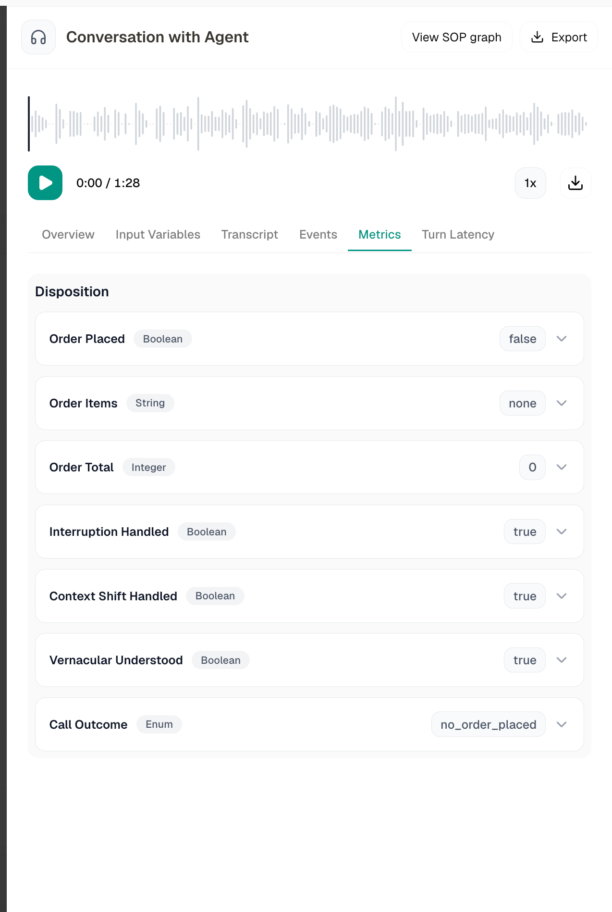

Every call your agent takes lands here. The **Conversations** tab (titled **Call Logs**) is a per-agent log of every voice call, web call, chat, and WhatsApp conversation, with drill-down into the transcript, recording, tool calls, latency, and cost of any single one.

<Frame caption="Call Logs">
  
</Frame>

## The List

Each row is one conversation:

| Column | What it shows |
|---|---|
| **Call Date** | When the conversation started |
| **Call ID** | Unique identifier, click to copy. The icon next to it shows the channel: Telephony Inbound/Outbound, Web Call, Chat, or WhatsApp |
| **From** | Caller number (blank for web calls and chats) |
| **To** | Receiver number |
| **Duration** | Total call length |
| **Avg Latency** | Average agent response latency for that call |
| **Status** | Completed, No Answer, Failed, In Progress, and others, hover a Failed or Blocked pill to see why |
| **Version** | Which agent version handled the call, with a **Test** tag for test calls |
| **Retries** | How many times the call was retried |
| **Details** | Opens the full call detail view |

<Note>
  Calls that are still Pending, Queued, or In Progress refresh automatically every couple of seconds, you don't need to reload the page to watch a live call's status change.
</Note>

If a call was retried, its row is expandable, click the chevron to reveal every retry attempt as its own nested row underneath.

## Filtering & Search

Filters live in the **Filter By** dropdown and combine with each other. Set the ones you want, then click **Apply Filters**.

| Filter | Options |
|---|---|
| **Conversation Type** | Inbound Calls, Outbound Calls, Web Calls, Chat, WhatsApp Chat, WhatsApp Inbound, WhatsApp Outbound |
| **Status** | Pending, In Queue, In Progress, Active, Completed, Failed, Cancelled, No Answer, Processing, Blocked |
| **End Reason** | Dial No Answer, User Hangup, Agent Hangup, Busy, Timeout, Error, Voicemail |
| **Call Type** | All Attempts, Retry Attempts, Initial Attempts |
| **Duration** | 0-30 seconds, 30-60 seconds, 1-3 minutes, 3-5 minutes, 5+ minutes |

Alongside the filters are a **Date Range** picker (quick presets or a custom range), a **Sort by** dropdown (Completed At, Created On, Duration, Avg Latency), and a **Search Logs** box.

<Tip>
  Search matches the Call ID and the From/To phone numbers. To find a specific conversation by what was said, open it and check the Transcript tab instead.
</Tip>

<Note>
  Your filters are remembered per agent, if you navigate away and come back, your last filter set is still applied.
</Note>

<Warning>
  Filtering by agent version isn't available yet, even though a version badge is shown on every row.
</Warning>

## Call Detail

Click **Details** on any row to open the full call detail. At the top sits an audio player (with playback-speed control and a download button) for calls with a recording. Calls with no audio, chat conversations, or ones that never connected show an explanatory empty state instead. The detail view is organized into tabs:

<Frame caption="The call detail view, here on the Metrics tab showing extracted call dispositions">
  
</Frame>

<AccordionGroup>

  <Accordion title="Overview">
    Call summary plus the essentials: agent name, model, voice, date and time, disconnection reason, and average latency. Includes a **Cost (Credits)** breakdown you can expand to see the per-component cost.
  </Accordion>

  <Accordion title="Input Variables">
    Every input variable the conversation started with, both the system values (`call_id`, `conversation_type`, `supported_languages`, `default_language`, `timezone`, `current_date`, and similar) and any custom variables you defined.
  </Accordion>

  <Accordion title="Transcript">
    The full back-and-forth: agent and caller turns, each timestamped. Empty for calls that never connected.
  </Accordion>

  <Accordion title="Events">
    An **Event Timeline** of everything that happened mid-call: each turn, pre-call and mid-call API/tool calls, and the final call-end marker, all timestamped.
  </Accordion>

  <Accordion title="Metrics">
    The **Disposition**: results of your configured Post-Call Metrics for this call, each with its type (Boolean, String, Integer, Enum), its extracted value, and expandable reasoning.
  </Accordion>

  <Accordion title="Turn Latency">
    Per-turn response latency. Summary cards show Turns, Avg Latency, Median, and Min / Max, and a table breaks down each turn: when the user stopped speaking (**User Ends**), when the agent started (**Agent Starts**), and the gap between the two (**Latency**).
  </Accordion>

</AccordionGroup>

<Tip>
  For multi-agent (Playbook) calls, click **View SOP graph** in the detail header to see the entire routing path as an interactive graph, with a replay button that walks through the path node by node.
</Tip>

## Exporting

- **Export** at the top of the list downloads every conversation matching your current filters. Choose **Download as JSON** or **Download as CSV**.
- **Export** inside a single conversation's detail view downloads just that call as JSON.
- The download button on the audio player saves that call's recording directly.

<Note>
  CSV export uses a lighter column set than the JSON export, which includes everything shown in the detail view.
</Note>

## Related

<CardGroup cols={2}>
  <Card title="Post call metrics" href="/voice-agents/platform/create-agent/agent-settings/post-call-metrics">
    Define what you want Atoms to extract from every call
  </Card>
  <Card title="Agent configuration" href="/voice-agents/platform/create-agent/agent-config">
    Every setting that shapes how your agent behaves
  </Card>
</CardGroup>
