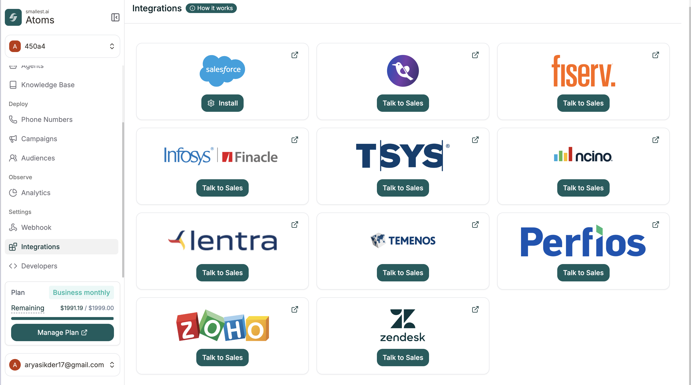
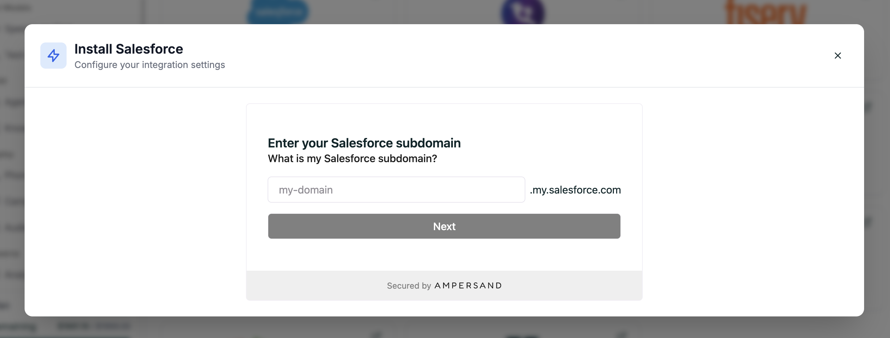

Integrations let your agent connect directly to external services like CRMs — without custom API configuration. Click, authenticate, and you're connected.

**Location:** Left Sidebar → Integrations

<Frame caption="Available integrations">
  
</Frame>

---

## Available Integrations

We support integrations with Salesforce, Zendesk, Zoho, Fiserv, TSYS, and more.

Some integrations (like Salesforce) are available to install directly. Others show **Talk to Sales** — reach out and we'll enable them for your account.

---

## Connecting Salesforce

<Steps>
  <Step title="Click Install">
    Find Salesforce on the integrations page and click **Install**.
  </Step>
  
  <Step title="Enter Your Subdomain">
    Enter your Salesforce subdomain (the part before `.my.salesforce.com`).
    
    <Frame caption="Salesforce connection modal">
      
    </Frame>
  </Step>
  
  <Step title="Authenticate">
    Follow the prompts to log in and authorize the connection.
  </Step>
</Steps>

Once connected, your agent can sync with Salesforce automatically.

---

## Need Something Else?

For services not listed, use [API Calls](/atoms/atoms-platform/single-prompt-agents/configuration-panel/api-calls) to connect to any REST API.

<CardGroup cols={2}>
  <Card title="API Calls" icon="plug" href="/atoms/atoms-platform/single-prompt-agents/configuration-panel/api-calls">
    Connect to any external service
  </Card>
  <Card title="Webhooks" icon="webhook" href="/atoms/atoms-platform/features/webhooks">
    Send data when events happen
  </Card>
</CardGroup>
