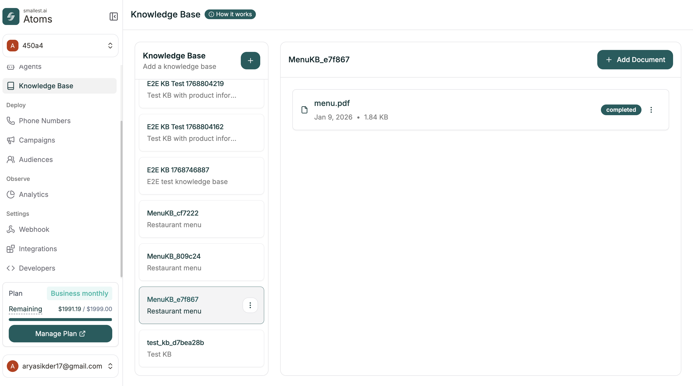
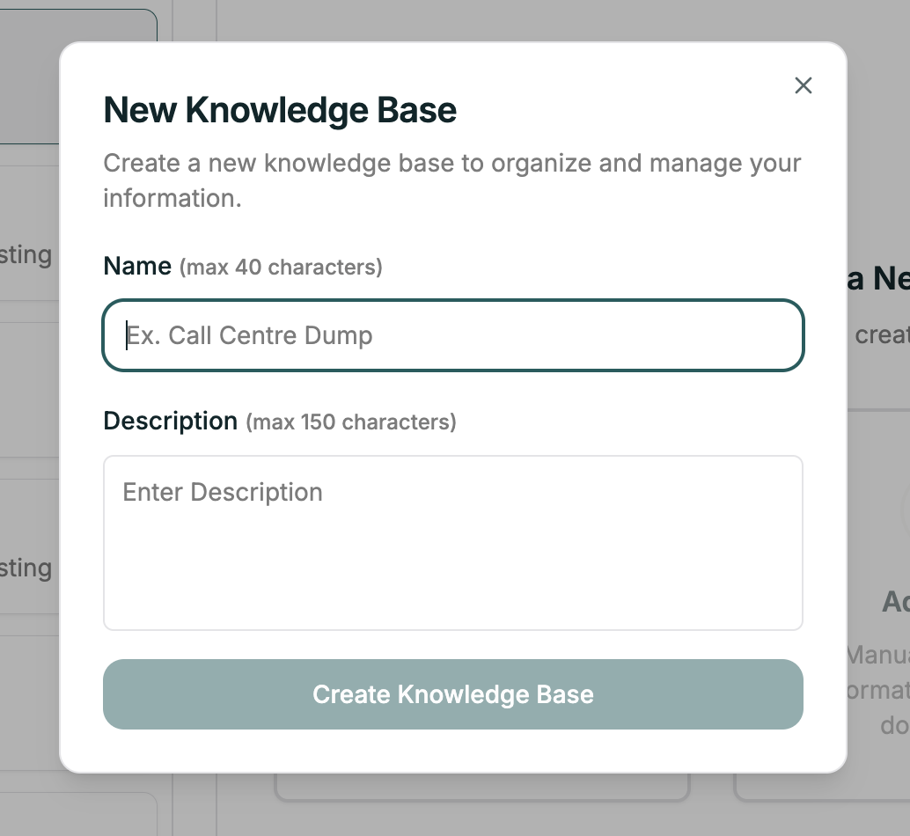
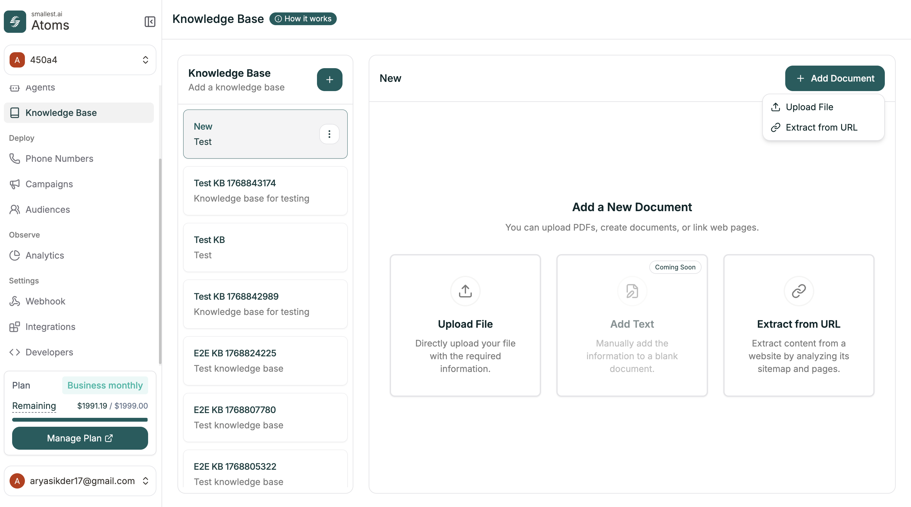

A Knowledge Base is a repository of documents and information that your agent can search during conversations. Instead of stuffing everything into a prompt, you upload content and let the agent retrieve what's relevant when needed.

**Location:** Left Sidebar → Knowledge Base

---

## Your Knowledge Bases

The Knowledge Base page shows all your KBs on the left. Click any KB to see its documents on the right.

<Frame caption="Knowledge Base with uploaded documents">
  
</Frame>

Each document shows its status — **completed** means it's ready for your agent to use.

---

## Creating a Knowledge Base

Click the **+** button next to "Knowledge Base" to create a new one.

<Frame caption="New Knowledge Base modal">
  
</Frame>

| Field | Description |
|-------|-------------|
| **Name** | Descriptive name (max 40 characters) |
| **Description** | Optional notes about this KB (max 150 characters) |

Click **Create Knowledge Base** to finish.

---

## Adding Documents

Once your KB is created, click **+ Add Document** to add content.

<Frame caption="Add Document options">
  
</Frame>

| Option | What it does |
|--------|--------------|
| **Upload File** | Upload PDFs and documents directly |
| **Extract from URL** | Pull content from a website by analyzing its sitemap |
| **Add Text** | Coming Soon — manually add text |

After uploading, documents are processed and indexed. Wait for **completed** status before expecting the agent to find the content.

---

## Connecting to Your Agent

Once you have a Knowledge Base with content:

1. Open your agent in the editor
2. Go to **Configuration Panel** (right sidebar)
3. Toggle **Knowledge Base** on
4. Select your KB from the dropdown

The agent can now search this KB during conversations.

---

## Tips

<Accordion title="Keep content current">
  Outdated information leads to wrong answers. Review and update regularly — especially policies, pricing, and procedures.
</Accordion>

<Accordion title="Structure for search">
  Use clear headings and concise paragraphs. Q&A format works well because it matches how callers actually ask questions.
</Accordion>

<Accordion title="Quality over quantity">
  Focused, relevant content retrieves better than massive document dumps. Don't upload everything — upload what matters.
</Accordion>

<Accordion title="Test after uploading">
  Ask your agent questions that should use the new content. Verify it finds and uses the right information.
</Accordion>

---

## Related

<CardGroup cols={2}>
  <Card title="Variables" icon="brackets-curly" href="/platform/single-prompt/config/variables">
    Dynamic values in conversations
  </Card>
  <Card title="API Calls" icon="plug" href="/platform/single-prompt/config/api-calls">
    Connect to external services
  </Card>
</CardGroup>
