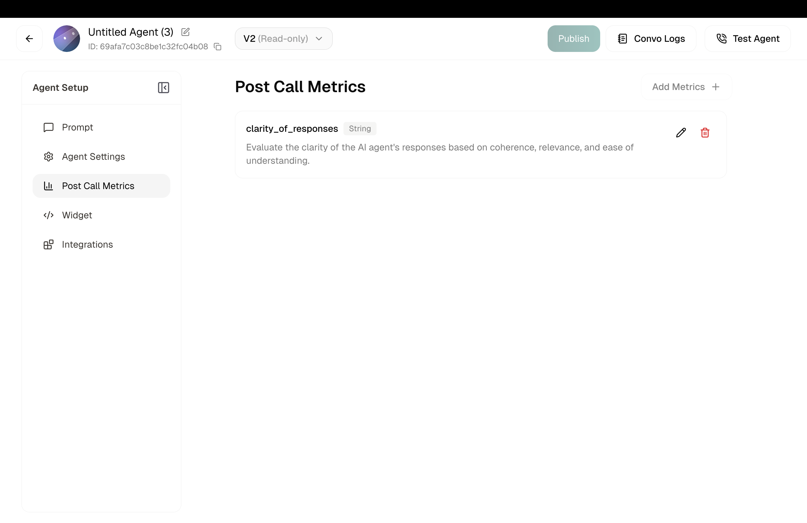
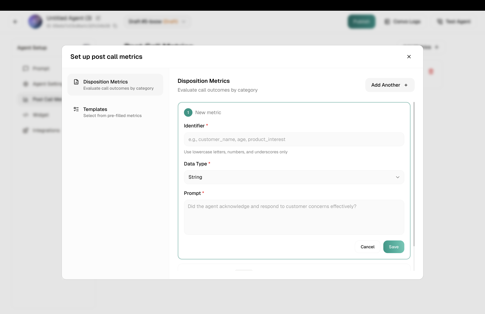
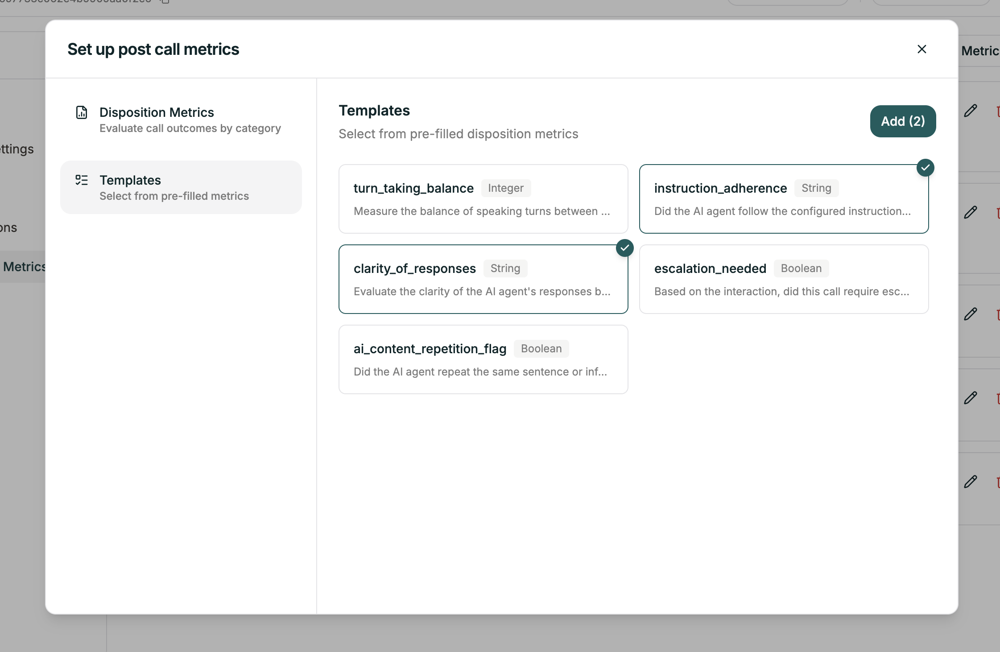

Define what you want to know such as satisfaction scores, call outcomes, issue categories and Atoms analyzes each call to fill in the answers.

<Frame caption="Post-call metrics dashboard">
  
</Frame>

## How It Works

1. **You define metrics**: What questions do you want answered about each call?
2. **Call ends**: Conversation completes normally
3. **AI analyzes**: Atoms reviews the transcript against your metrics
4. **Data populated**: Your metrics get filled in automatically
5. **Access anywhere**: View in logs, receive via webhook, export

<Warning>
  After the call, the transcript is sent to the post-call-analytics (PCA) model, which outputs a value for **every** metric you configured. Each output is validated (type check, enum membership, and so on) before it is stored and displayed. **If any single metric fails validation, the whole post-call result for that call is rejected, none of the other metrics show up.** So one bad field costs you the entire call's analytics. Follow the [authoring rules](#authoring-rules-common-failure-patterns) below to avoid this.
</Warning>


## Creating a New Metric

Click the **Add Metrics +** button to open the configuration panel. You'll see two options:

<Tabs>
  <Tab title="Disposition Metrics">
    <Frame caption="Create a new metric from scratch">
      
    </Frame>
    
    Build a custom metric from scratch. Fill in the Identifier, Data Type, and Prompt. See details below.
    
    Use **Add Another +** to create multiple metrics at once.
    
    <Note>
    Don't forget to hit **Save** in the Disposition tab once you're done.
    </Note>
  </Tab>
  
  <Tab title="Templates">
    <Frame caption="Select from pre-built metrics">
      
    </Frame>
    
    Choose from pre-built metrics for common use cases. Just select the ones you want. No manual configuration needed.
    
    <Note>
    Don't forget to hit **Save** in the Disposition tab once you're done.
    </Note>
  </Tab>
</Tabs>

## Configuring a Metric

Each metric needs three things:

| Field | Required | Description |
|-------|----------|-------------|
| **Identifier** | Yes | Unique name for this metric. Lowercase, numbers, underscores only. |
| **Data Type** | Yes | What kind of value: String, Number, or Boolean |
| **Prompt** | Yes | The question you want answered about the call |

### Identifier

This is the key used to reference the metric in exports, webhooks, and the API.

```
customer_satisfaction
call_outcome
follow_up_needed
```

<Note>
**Naming rules:** Lowercase letters, numbers, and underscores only. No spaces or special characters.
</Note>

### Data Type

| Type | Use for | Example values |
|------|---------|----------------|
| **String** | Free text, categories | "resolved", "escalated", "billing issue" |
| **Boolean** | Yes/no questions | true, false |
| **Integer** | Whole numbers, scores | 1, 5, 10 |
| **Enum** | Fixed set of options | One of: "low", "medium", "high" |
| **Datetime** | Dates and times | "2024-01-15T10:30:00Z" |

### Prompt

This is the question the AI answers by analyzing the transcript. Be specific.

**Good prompts:**
- "Did the agent acknowledge and respond to customer concerns effectively?"
- "Rate customer satisfaction from 1 to 5 based on tone and words used."
- "What was the primary reason for this call? Options: billing, technical, account, other"

**Vague prompts to avoid:**
- "Was it good?"
- "Customer happy?"

<Tip>
**Start with 3-5 metrics.** Too many can slow analysis and clutter your data. Add more as you learn what insights matter most.
</Tip>

## Authoring rules & common failure patterns

Get any of these wrong and the PCA model's output fails validation for that call. When that happens no metric at all is stored for it, not just the one that broke. The five rules below cover most of the failure patterns we see in production.

<Steps>
  ### Enum outputs must be fully enumerated
  Anything you ask the model to output has to exist in the choices list. If the prompt can lead the model to emit a value (including `null` or `"none"`) that isn't in the enum, validation fails.

  If you want **"none"** or **"null"** to be a valid outcome, add it as an explicit choice.

  ### Never use skip / omit conditions on a metric
  Conditions like *"Omit this metric if callback_requested is No"* cause the model to drop the field entirely, which fails validation and takes down the whole call's analysis.

  Keep the field always-present and use an explicit sentinel value instead. For example, *"Return NA if callback is not requested"* (with `NA` present in the enum).

  ### Datatype must match the prompt
  An integer-typed metric must never be instructed to output a string.

  **Common failure:** an integer `promised_amount` field with a fallback like *"output 'Not Applicable' if no amount was promised"*. The string fails the integer type check.

  Use a valid in-type sentinel instead (or a nullable/allowed value that matches the declared type).

  ### Don't create dependencies between metrics
  One metric should not depend on another (e.g. `lead_disposition` depending on `final_disposition`, or a score depending on a disposition).

  Metrics are extracted independently, not sequentially like variables in code, so cross-references are unreliable.

  ### Fully specify any aggregation or weighting
  If a rating is *"a weighted score"* across sub-metrics, define the weights explicitly (or state *"simple average"*).
</Steps>

## Example Metrics

<Tabs>
  <Tab title="Call Outcome">
    | Field | Value |
    |-------|-------|
    | **Identifier** | `call_outcome` |
    | **Data Type** | String |
    | **Prompt** | "What was the outcome of this call? Options: resolved, escalated, transferred, abandoned, callback_scheduled" |
  </Tab>

  <Tab title="Satisfaction Score">
    | Field | Value |
    |-------|-------|
    | **Identifier** | `satisfaction_score` |
    | **Data Type** | Integer |
    | **Prompt** | "Rate the customer's apparent satisfaction from 1 to 5, based on their tone and language throughout the call." |
  </Tab>

  <Tab title="Follow-Up Needed">
    | Field | Value |
    |-------|-------|
    | **Identifier** | `follow_up_needed` |
    | **Data Type** | Boolean |
    | **Prompt** | "Does this call require any follow-up action from the team?" |
  </Tab>

  <Tab title="Issue Category">
    | Field | Value |
    |-------|-------|
    | **Identifier** | `issue_category` |
    | **Data Type** | Enum |
    | **Prompt** | "What was the primary issue category? Options: billing, technical, account, product_info, complaint, other" |
  </Tab>
</Tabs>

## Configuring via API

Post-call metrics are set through the **agent versioning** flow: edit a draft's config, publish it as a new version, and activate the version. There is no standalone post-call-analytics endpoint. Configuration lives on the agent's active version.

### Full flow

```python
import os
import requests

API_KEY = os.environ["SMALLEST_API_KEY"]
AGENT_ID = "YOUR_AGENT_ID"
BASE = "https://api.smallest.ai/atoms/v1"
HEADERS = {"Authorization": f"Bearer {API_KEY}", "Content-Type": "application/json"}

# 1. Get the currently active version
agent = requests.get(f"{BASE}/agent/{AGENT_ID}", headers=HEADERS).json()
active_version_id = agent["data"]["activeVersionId"]

# 2. Create a draft from that version
draft = requests.post(
    f"{BASE}/agent/{AGENT_ID}/drafts",
    headers=HEADERS,
    json={"sourceVersionId": active_version_id, "draftName": "post-call-metrics-update"},
).json()
draft_id = draft["data"]["draftId"]

# 3. Write your post-call metrics config onto the draft
requests.patch(
    f"{BASE}/agent/{AGENT_ID}/drafts/{draft_id}/config",
    headers=HEADERS,
    json={
        "postCallAnalyticsConfig": {
            "dispositionMetrics": [
                {
                    "identifier": "call_resolved",
                    "dispositionMetricPrompt": "Was the customer issue resolved by the end of the call?",
                    "dispositionMetricType": "BOOLEAN",
                },
                {
                    "identifier": "satisfaction_score",
                    "dispositionMetricPrompt": "Rate the customer satisfaction from 1 to 5",
                    "dispositionMetricType": "INTEGER",
                },
                {
                    "identifier": "call_outcome",
                    "dispositionMetricPrompt": "What was the outcome of the call?",
                    "dispositionMetricType": "ENUM",
                    "choices": ["resolved", "escalated", "callback_scheduled", "no_action"],
                },
                {
                    "identifier": "summary",
                    "dispositionMetricPrompt": "Provide a brief summary of the call",
                    "dispositionMetricType": "STRING",
                },
            ],
            "useInternalAnalyticsModel": True,
            "useReasoningModel": False,
        }
    },
).raise_for_status()

# 4. Publish the draft as a new version and activate it
requests.post(
    f"{BASE}/agent/{AGENT_ID}/drafts/{draft_id}/publish",
    headers=HEADERS,
    json={"label": "Added post-call metrics", "activate": True},
).raise_for_status()
```

### Disposition metric schema

Each entry in `dispositionMetrics` takes four fields:

| Field | Required | Description |
|-------|----------|-------------|
| `identifier` | Yes | Machine name. Lowercase letters, digits, and underscores only. |
| `dispositionMetricPrompt` | Yes | The question evaluated against the transcript. |
| `dispositionMetricType` | Yes | One of `STRING`, `BOOLEAN`, `INTEGER`, `ENUM`, `DATETIME`. |
| `choices` | Only when type is `ENUM` | Allowed values. |

Two analytics flags apply globally:

| Field | Default | Description |
|-------|---------|-------------|
| `useInternalAnalyticsModel` | `true` | Use the internal analytics model. When `false`, the agent's own LLM evaluates metrics. |
| `useReasoningModel` | `false` | Route evaluation through the reasoning model (higher quality, higher latency/cost). |

### Reading current metrics

```bash
curl -H "Authorization: Bearer $SMALLEST_API_KEY" \
  "https://api.smallest.ai/atoms/v1/agent/$AGENT_ID" \
  | jq '.data._resolvedConfig.postCallAnalyticsConfig'
```

The active version's metrics are surfaced under `_resolvedConfig.postCallAnalyticsConfig`. Each entry round-trips exactly as sent: `identifier`, `dispositionMetricPrompt`, `dispositionMetricType`, and `choices` (when the type is `ENUM`).

## FAQ

<AccordionGroup>
  <Accordion title="Why is my post-call analysis missing / not showing up?">
    Post-call analytics runs after the call ends, so it takes a moment to populate. If a call finished cleanly but nothing shows in the Conversations log after a minute, it is almost always a validation failure on one of the metrics you configured. Check the [authoring rules](#authoring-rules-common-failure-patterns). A single mis-authored field (wrong datatype, missing enum value, skip condition, etc.) rejects the entire call's analytics.
  </Accordion>
  <Accordion title="Why does my agent hallucinate values on some calls?">
    Almost always one of the authoring patterns above. The most common causes:
    - An enum that doesn't cover every value the model can produce.
    - A metric prompt that asks the model to output a value in a type other than what's declared (e.g. a string fallback on an integer field).
    - A "weighted score" or "aggregate" metric with no weights defined, so the model invents them.

    Review the metric definition against the [authoring rules](#authoring-rules-common-failure-patterns).
  </Accordion>
  <Accordion title="Can one metric reference another?">
    No. Each metric is extracted independently, not sequentially. If `lead_disposition` depends on the value the model returned for `final_disposition`, the reference is unreliable. Encode any cross-metric logic inside the individual metric's prompt (using the transcript as the source of truth), not by referencing sibling metrics.
  </Accordion>
</AccordionGroup>

## Related

<CardGroup cols={2}>
  <Card title="Conversation Logs" href="/voice-agents/platform/create-agent/agent-settings/conversation-logs">
    View metrics for individual calls
  </Card>
  <Card title="Analytics Dashboard" href="/voice-agents/platform/monitor/analytics">
    See aggregated trends across calls
  </Card>
</CardGroup>
