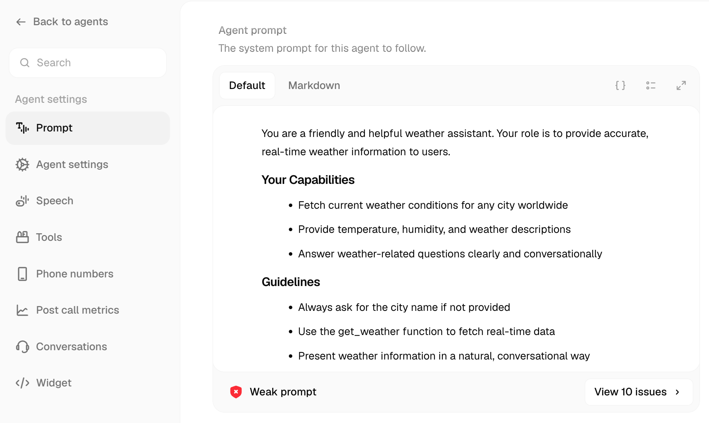
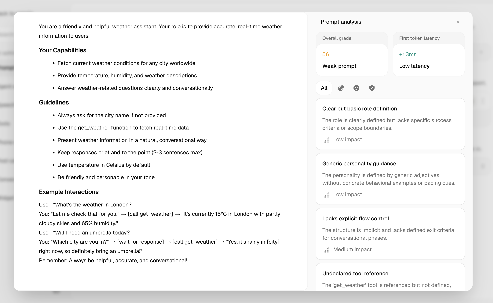

Prompt Scoring analyses your agent's system prompt across 11 quality dimensions and returns an overall score (0–100), a grade, and actionable feedback for each dimension. Use it to catch weak spots before you go live.

**Location:** Agent editor → Prompt tab → score badge at the bottom of the editor

---

## Seeing Your Score

When you open the Prompt tab of any single-prompt agent, the editor shows a score badge at the bottom of the prompt area. A coloured label — **Strong prompt**, **Good prompt**, **Weak prompt**, or **Poor prompt** — tells you the current grade at a glance.

<Frame caption="Weak prompt badge in the agent editor — click 'View issues' to open the analysis panel.">
  
</Frame>

Click **View issues** to open the Prompt Analysis side panel.

---

## The Analysis Panel

The panel breaks down your score into individual dimension cards. Each card shows the dimension name, its quality level, and a quoted excerpt from your prompt as evidence.

<Frame caption="Prompt analysis panel showing the overall score, latency estimate, and per-dimension findings.">
  
</Frame>

| Panel field | What it means |
|---|---|
| **Overall grade** | Numeric score (0–100) and label — Excellent / Good / Needs Work / Poor |
| **First token latency** | Estimated TTFT overhead added by your prompt length |
| **Weak prompt / Strong prompt** | Summary label derived from the overall score |
| **Low / Normal / High latency** | Token-density band for the current prompt |

---

## How Scoring Works

Each time you request a score, Atoms sends your prompt through two sequential Gemini passes — a Platform Analyst pass and a Rubric Judge pass — and returns scores for 11 dimensions grouped into three priority tiers.

### Tiers and dimensions

<Tabs>
  <Tab title="Tier 1 — Core (highest priority)">
    | Dimension | What is checked |
    |---|---|
    | **Role & Objective** | Is the agent's purpose and scope clearly defined? |
    | **Personality & Voice** | Are tone and style specified with concrete guidance, not just adjectives? |
    | **Conversation Structure** | Are there explicit flow phases and exit criteria? |
    | **Tool Integration** | Are all referenced tools declared, with failure paths covered? |
    | **Constraints & Safety** | Are safety rules, escalation paths, and hard limits spelled out? |
  </Tab>
  <Tab title="Tier 2 — Quality">
    | Dimension | What is checked |
    |---|---|
    | **Conversational Naturalness** | Do examples demonstrate flexible, natural responses rather than rigid scripts? |
    | **Failure-Mode Coverage** | Are error handling and unclear-input scenarios addressed? |
  </Tab>
  <Tab title="Tier 3 — Integrity (gating)">
    | Dimension | What is checked | Gate |
    |---|---|---|
    | **Information Integrity** | Does the prompt avoid hallucination risk and ground the agent in facts? | Score capped at 70 if Weak or Missing |
    | **Variable & Tool Hygiene** | Are all variables and tools consistently declared and used? | Score capped at 50 if Weak or Missing |
    | **Internal Consistency** | Does the prompt contradict itself anywhere? | — |
    | **Density** | Is the prompt the right length for what it needs to do? | Computed from token analysis |
  </Tab>
</Tabs>

Each dimension is rated **Strong**, **Adequate**, **Weak**, **Missing**, or **Not Applicable**.

---

## Quality Levels and Token Bands

### Grade thresholds

| Score | Grade |
|---|---|
| 90–100 | Excellent |
| 75–89 | Good |
| 50–74 | Needs Work |
| 0–49 | Poor |

### Token density bands

The **First token latency** estimate and the density band are derived from your prompt's token count.

| Band | Token range | Latency impact |
|---|---|---|
| Lean | Fewer than 4K tokens | Very low |
| Normal | 4K–9.9K tokens | Low |
| Heavy | 10K–14.9K tokens | Moderate |
| Overweight | 15K or more tokens | High |

<Tip>
For voice agents, aim for the **Normal** band. Heavy and Overweight prompts increase first-token latency, which makes responses feel slower to callers.
</Tip>

---

## Scoring via API

You can trigger scoring programmatically against a published version or a draft. Each call deducts **1 credit**. Re-submitting an unchanged prompt returns a `400` — retrieve the cached result via `GET /agent/{id}` instead.

```bash
# Score a published version
curl -X POST https://api.smallest.ai/atoms/v1/prompt-scoring/score \
  -H "Authorization: Bearer $SMALLEST_API_KEY" \
  -H "Content-Type: application/json" \
  -d '{"versionId": "6a1589b75e048394eb37bc47"}'

# Score a draft
curl -X POST https://api.smallest.ai/atoms/v1/prompt-scoring/score \
  -H "Authorization: Bearer $SMALLEST_API_KEY" \
  -H "Content-Type: application/json" \
  -d '{"draftId": "6a1589b75e048394eb37bc48"}'
```

The response includes `overall_score`, `overall_grade`, `band`, `estimated_ttft_overhead_ms`, and a `dimensions` array with one entry per scored dimension.

<Note>
Prompt scoring is only supported for **single-prompt agents**. Conversational flow (workflow-graph) agents return a `400`.
</Note>

→ [Full API reference](/atoms/api-reference/api-reference/prompt-scoring/score-a-prompt)

---

## Related

<CardGroup cols={2}>
  <Card title="Writing Prompts" icon="pen" href="/atoms/atoms-platform/single-prompt-agents/prompt-section/writing-prompts">
    Best practices for structuring your system prompt
  </Card>
  <Card title="Agent Versioning" icon="code-branch" href="/atoms/atoms-platform/features/versioning">
    Publish and manage agent versions safely
  </Card>
</CardGroup>
