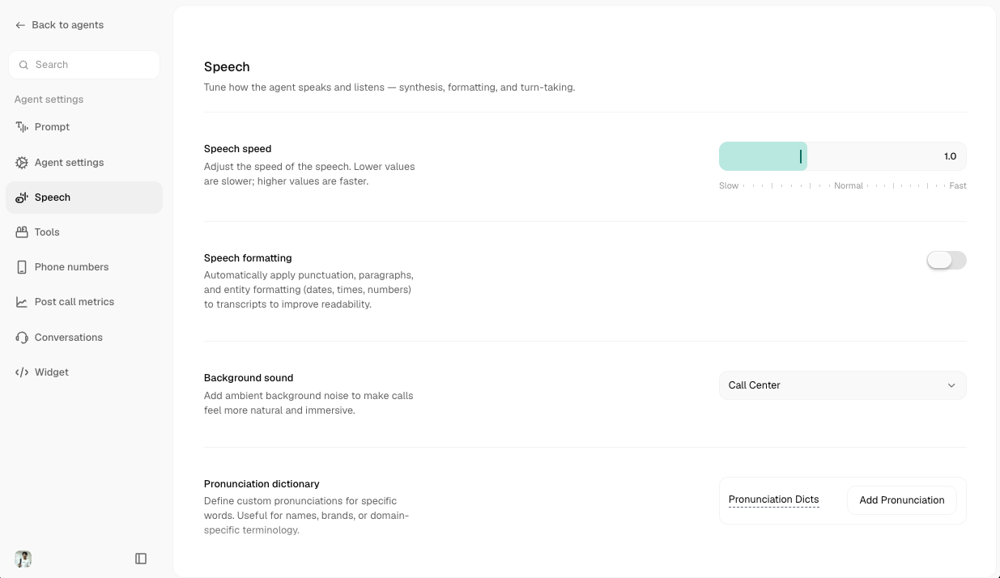

The **Speech** tab (left sidebar, in the agent editor) controls everything about the audio side of a call: how the voice sounds, when the agent lets the caller interrupt it, and how it reacts to background noise or speech it couldn't understand.

<Frame caption="Speech tab">
  
</Frame>

<Note>
  Not every field below shows up for every agent. Several depend on the voice engine and model you've picked on the [Prompt tab](/atoms/atoms-platform/create-agent/prompt), sliders like Voice Consistency, Similarity, and Enhancement only appear for engines that support them, and Voice Detection / Smart Turn Detection are hidden entirely for realtime voice models, since those handle audio end-to-end on their own.
</Note>

## Voice

| Setting | What it does | Default |
|---|---|---|
| **Speech Speed** | How fast the agent talks. | 1.2x (range 0.5x-2x) |
| **Voice Consistency** | Move it down to fix skipped words, up to fix repeated words. | Middle of the range |
| **Voice Similarity** | Higher values match the reference voice more closely; lower values give more flexibility. | Middle of the range |
| **Voice Enhancement** | Higher values give cleaner, more refined audio at the cost of a little latency. | Medium |
| **Background Sound** | Ambient audio layered under the agent's voice, Office, Cafe, Call Center, or Static. | None |
| **Speech Formatting** | Automatically applies punctuation, paragraphs, and entity formatting (dates, times, numbers) to make transcripts more readable. | On, where supported |

<Note>
  Speech Formatting only works for agents whose default language is English or Hindi, it's hidden or disabled otherwise. The same restriction applies to Smart Turn Detection, below.
</Note>

<Accordion title="Pronunciation Dictionary">
  Fix words the default voice mispronounces, names, brands, or domain-specific terms.

  Click **Add Pronunciation** and fill in two fields:

  | Field | Description |
  |---|---|
  | **Word** | The word as it normally appears |
  | **Pronunciation** | How you want it said instead |

  There's no phonetic-alphabet requirement, type it however reads naturally (e.g. `Cerebras` → `sir-EE-brass`). Entries show up as removable chips, and you can edit or delete them any time.
</Accordion>

<Tip>
  The voice itself, and the language(s) your agent speaks, are chosen on the [Prompt tab](/atoms/atoms-platform/create-agent/prompt), not here. The Speech tab only tunes how that chosen voice behaves.
</Tip>

## Turn-Taking & Interruptions

Controls for when the agent lets the caller speak, and when it lets itself be interrupted.

| Setting | What it does | Default |
|---|---|---|
| **Allow Interruptions** | When off, the caller's audio is suppressed while the agent is speaking (half-duplex). Useful for agent-to-agent calls or very noisy environments. | On |
| **Wait for User to Speak First** | Skips the agent's opening line and waits for the caller to speak first. | Off |
| **Mute User Until First Bot Response** | Mutes the caller until the agent finishes its opening line. | Off |
| **Interruption Backoff Timer** | A short grace period (in seconds) right after the agent starts talking, during which the caller can't interrupt it. Set to 0 to disable. Helps prevent both sides talking over each other. | 0s (range 0-10s) |
| **Smart Turn Detection** | Uses a model to predict when the caller has actually finished speaking, instead of just waiting for silence, cutting down on premature interruptions. Adds a little latency. | Off |

<Note>
  **Mute User Until First Bot Response** and **Wait for User to Speak First** are mutually exclusive, turning the second one on automatically turns the first off.
</Note>

<Note>
  Enabling Smart Turn Detection reveals a **Wait Time** slider (1-10s, default 3s): how long the agent waits when it's not confident the caller has finished, before responding anyway.
</Note>

## Listening

How the agent filters and interprets incoming audio before it ever reaches the language model.

<Accordion title="Voice Detection">
  Tunes how confidently the system decides "this sound is the caller speaking." Shown only for non-realtime models.

  | Field | What it does | Default |
  |---|---|---|
  | **Confidence** | How strict the system is when deciding if a sound is speech. Higher is less sensitive to background noise. | 0.7 |
  | **Min Volume** | Minimum loudness required to be treated as speech. | 0.6 |
  | **Trigger Time** | How long to wait after speech is detected before treating it as the caller speaking. | 0.2s |
  | **Release Time** | How long to wait after speech ends before the agent starts responding. | 0.4s |

  <Warning>
    Pushing Confidence or Min Volume to the extremes (below 0.1 or above 0.9) can make the agent miss the caller entirely, or trigger on background noise.
  </Warning>
</Accordion>

| Setting | What it does | Default |
|---|---|---|
| **Denoising** | Filters out background noise before it reaches the speech pipeline, reduces false triggers from environmental sound. | Off |
| **Handle Unrecognised Speech** | If the agent can't hear the caller clearly, it asks them to repeat instead of going silent. | On |

<Accordion title="Customizing the 'please repeat' response">
  When **Handle Unrecognised Speech** is on, you can optionally write your own responses for when the agent can't understand the caller (e.g. "Sorry, could you repeat that?"). Leave it empty to use Atoms' built-in, language-aware responses, that's the recommended default. Duplicate responses aren't allowed, and clearing a response's text deletes it.
</Accordion>

## Voicemail

| Setting | What it does | Default |
|---|---|---|
| **Voicemail Detection** | Detects when a call has reached voicemail instead of a live person. | Off |
| **Voicemail End Text** | What the agent says before hanging up once voicemail is detected. | A default sign-off message, auto-filled when you turn detection on |

## Privacy

| Setting | What it does | Default |
|---|---|---|
| **Personal Info Redaction (PII)** | Automatically redacts personally identifiable information from call transcripts. | Off |

<Warning>
  Enabling PII Redaction may affect transcript completeness for QA purposes.
</Warning>

## Related

<CardGroup cols={2}>
  <Card title="Prompt" href="/atoms/atoms-platform/create-agent/prompt">
    Pick your agent's voice, model, and supported languages
  </Card>
  <Card title="Agent Configuration" href="/atoms/atoms-platform/create-agent/agent-config">
    Timeouts, transfers, variables, and everything else that shapes a call
  </Card>
</CardGroup>