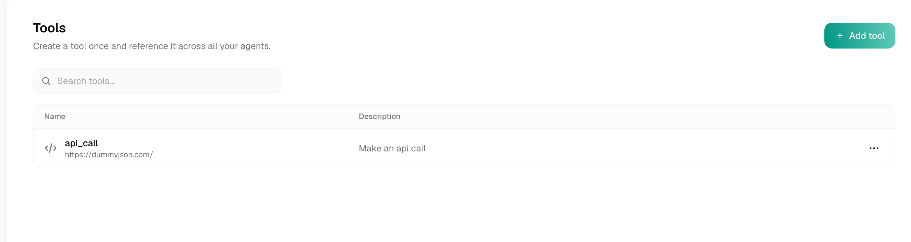
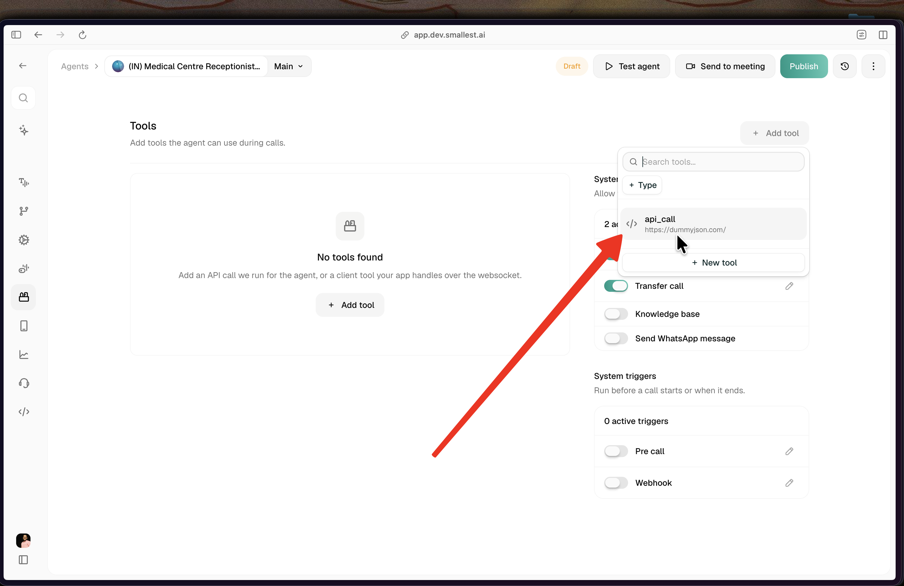

import { CodingAgentCallout } from "@/components/CodingAgentCallout";

Tools are **reusable, org-level resources**. Instead of rebuilding the same API call inside every agent, you create it once in the **Tools library** and reference it from as many agents as you like. Edit the library tool once and every agent that references it updates.

<Frame caption="The Tools library — create a tool once and reference it across all your agents">
  
</Frame>

## Where it lives

Open **Tools** from the left sidebar (the `</>` icon). This is org-scoped: every tool here is available to every agent in your workspace. The list is searchable and sortable; a tool with a name that clashes with another is flagged with a **duplicate name** chip.

## Create, reference, edit

<Steps>
  <Step title="Create a tool once">
    Click **Add tool** and pick a type — **API tool** (calls your API) or **Client tool** (runs in your app over the websocket). Configure it and save. It now lives in the library. See [API tool](/voice-agents/platform/create-agent/api-tool) and [Client tools](/voice-agents/platform/create-agent/client-tools) for the builders.
  </Step>
  <Step title="Reference it from an agent">
    In an agent's **Tools** tab, click **Add tool** and pick the existing library tool. It's attached **by reference** — no copy is made.

    <Frame caption="Attaching a library tool to an agent by reference, or creating a new one">
      
    </Frame>
  </Step>
  <Step title="Edit once, everyone updates">
    Edit the tool in the library and every agent that references it reflects the change on its next call. No per-agent re-deploy, no drift.
  </Step>
</Steps>

## One tool, one shared state

A referenced tool is a **single shared record** — agents point at it by id, they don't hold copies. So an edit to that tool applies everywhere it's referenced, no matter where you make the edit:

- Editing it on the **Tools library** page updates it for every agent that references it.
- Editing an **imported** tool from **inside an agent** edits that same shared record too — so the change also lands on the library tool and on every other agent referencing it, not just the agent you're in.

<Warning>
There is no per-agent copy of a referenced tool. If you want one agent to use a different version, **duplicate** the tool (creating a separate library tool with its own id) and reference the copy, or keep a legacy inline tool on that agent. Otherwise every edit is global.
</Warning>

## Creating a tool inside an agent

Creating a tool from within an agent (**Add tool → New tool**) now writes it to the org library **and references it** on that agent — it is no longer an agent-only copy. **Import** attaches an existing library tool by reference.

<Note>
Agents built before this change keep any inline tools they already had. Those legacy inline tools still render and edit in place, so nothing breaks — they simply aren't in the library.
</Note>

## Deleting a tool

A tool that is referenced by one or more agents can't be deleted until you remove it from those agents first — the delete is blocked with a message telling you how many agents still use it. This prevents silently breaking a live agent.

## Related

<CardGroup cols={2}>
  <Card title="API tool" href="/voice-agents/platform/create-agent/api-tool">
    The API-tool builder: method, URL, params, headers, auth, body, and inline test
  </Card>
  <Card title="Secrets" href="/voice-agents/platform/create-agent/secrets">
    Store API keys and tokens encrypted, referenced by tool Auth
  </Card>
  <Card title="Client tools" href="/voice-agents/platform/create-agent/client-tools">
    Tools your own app runs over the websocket
  </Card>
  <Card title="Tools overview" href="/voice-agents/platform/create-agent/tools-overview">
    System tools and the per-agent Tools tab
  </Card>
</CardGroup>

<CodingAgentCallout />

{/* coding-agent-callout-injected */}
