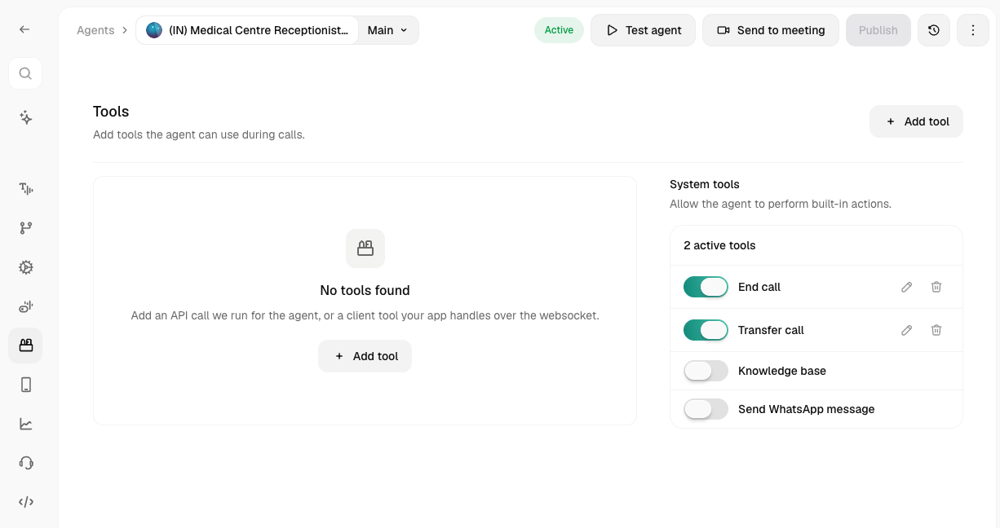
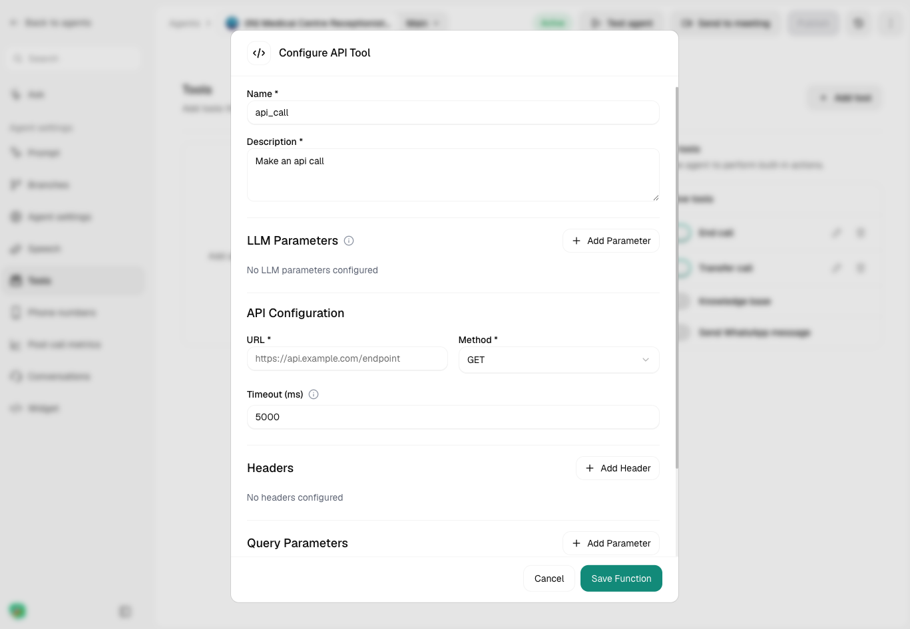
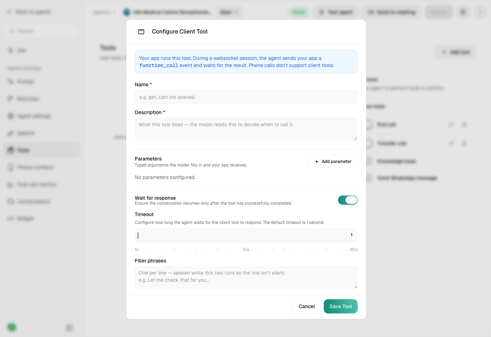

import { CodingAgentCallout } from "@/components/CodingAgentCallout";

The Tools tab (left sidebar, in the agent editor) is where you add capabilities like hanging up, transferring calls, knowledge base search, or API calls. Each tool has a Name and Description, which the model uses to decide when to use it.

<Note>
Custom API and client tools are now **reusable across agents** — build one in the [Tools library](/voice-agents/platform/create-agent/tools-library) and reference it anywhere. This page covers the per-agent Tools tab and built-in System tools.
</Note>

<Frame caption="The Tools tab, showing System tools on the right and custom tools on the left">
  
</Frame>

## System Tools

Built-in actions, each is just a toggle, switching one on for the first time opens its configuration form.

<Accordion title="End Call">
  Tells the agent when to hang up.

  | Field | Description |
  |---|---|
  | **Name** | Internal identifier for the function |
  | **Description** | What the AI reads to decide when to trigger it |

  <Tip>
    Be specific, vague descriptions cause premature hang-ups. "End when the customer confirms their issue is resolved" works better than "end the call."
  </Tip>
</Accordion>

<Accordion title="Transfer Call">
  Hands the conversation off to a human.

  | Field | Description |
  |---|---|
  | **Name / Description** | Same as above |
  | **Transfer Number** | The destination phone number |
  | **Type** | **Cold Transfer** (handed off immediately, no debrief) or **Warm Transfer** (the AI briefs the next agent first) |

  Warm Transfer adds three more sections:

  - **During Transfer Call** - pick On-hold Music (Ringtone, Relaxing Sound, Uplifting Beats, or None).
  - **During Agent Connection** - a **Whisper Message**: spoken only to the human receiving the transfer, before they're connected to the caller. Written as a prompt or a static sentence.
  - **After Transfer Connects** - a **Three-way Message**: spoken to both parties once the transfer connects.

  <Warning>
    "Transfer only if a human answers" is visible here but marked **Coming Soon**, it can't be enabled yet.
  </Warning>
</Accordion>

<Accordion title="Knowledge Base">
  Lets the agent search a knowledge base for relevant context mid-call.

  | Field | Description |
  |---|---|
  | **Name / Description** | Same as above |
  | **Knowledge Base** | Pick from your existing knowledge bases |
  | **Filler Phrases** | Comma-separated phrases the agent can say while the search runs |

  <Note>
    The knowledge base itself has to already exist, this tool just attaches one. Create and populate one from the Knowledge Base section first.
  </Note>
</Accordion>

## Custom Tools

For anything not covered by a system tool, connect your own API or app logic. Click **Add tool** and choose a type. Creating one here adds it to the [Tools library](/voice-agents/platform/create-agent/tools-library) and references it on this agent, so you can reuse it elsewhere. Full builders: [API tool](/voice-agents/platform/create-agent/api-tool) and [Client tools](/voice-agents/platform/create-agent/client-tools).

<Accordion title="API Tool">
  <Frame caption="The Tools tab, showing System tools on the right and custom tools on the left">
    
  </Frame>
  Calls your API during the conversation and feeds the response back to the agent.

  | Field | Description |
  |---|---|
  | **Name / Description** | Same pattern, the model reads the description to decide when to call it |
  | **LLM Parameters** | Values the model extracts from the conversation, referenced elsewhere as `{{parameter_name}}`. Each has a name, type (Text/Number/Boolean/Enum), description, and required flag |
  | **URL / Method** | Endpoint and HTTP method (GET/POST/PUT/PATCH/DELETE) |
  | **Timeout** | How long to wait for a response, default 5000ms (range 1000-30000ms) |
  | **Headers** | Key/value pairs |
  | **Query Parameters** | Key/value pairs |
  | **Request Body** | JSON, for POST/PUT/PATCH only, supports `{{param}}` templating |
  | **Response Variable Extraction** | Pull fields out of the response into variables, by name and JSON path (e.g. `$.data.user.name`) |
</Accordion>

<Accordion title="Client Tool">
  <Frame caption="The Tools tab, showing System tools on the right and custom tools on the left">
    
  </Frame>
  Runs inside your own app instead of hitting an API, useful when the "tool" is really a function in your frontend (e.g. update a cart, navigate a screen).

  <Note>
    Client tools only work on websocket sessions (webcall, widget). Phone calls don't support them.
  </Note>

  | Field | Description |
  |---|---|
  | **Name / Description** | The model reads the description to decide when to call it |
  | **Parameters** | Same shape as an API tool's LLM Parameters, typed arguments your app receives |
  | **Wait for response** | If on, the conversation pauses until your app returns a result. Reveals a timeout slider (1-60s, default 1s) |
  | **Filler Phrases** | One per line, spoken while the tool runs so the pause isn't silent |
</Accordion>

## Related

<CardGroup cols={2}>
  <Card title="Agent Config" href="/voice-agents/platform/create-agent/agent-config">
    Timeouts, transfers, variables, and everything else that shapes a call
  </Card>
  <Card title="Prompt" href="/voice-agents/platform/create-agent/prompt">
    Structure, persona, and how tools fit into your prompt
  </Card>
</CardGroup>

<CodingAgentCallout />

{/* coding-agent-callout-injected */}
