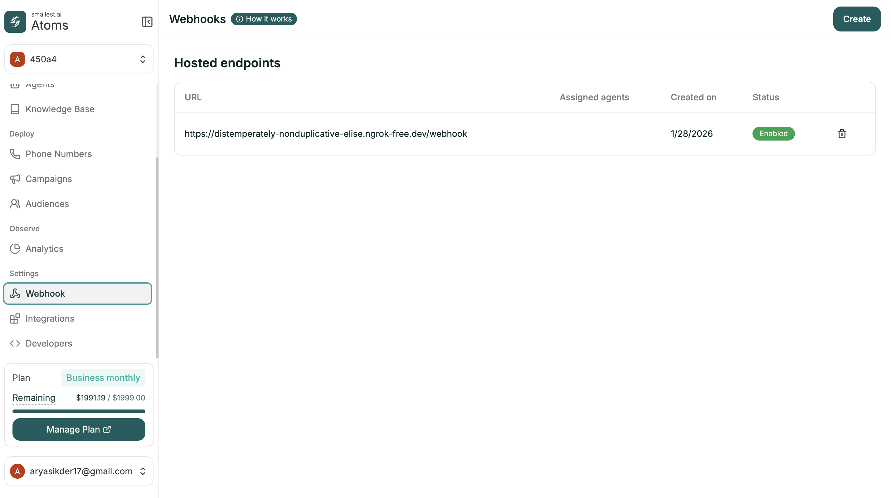
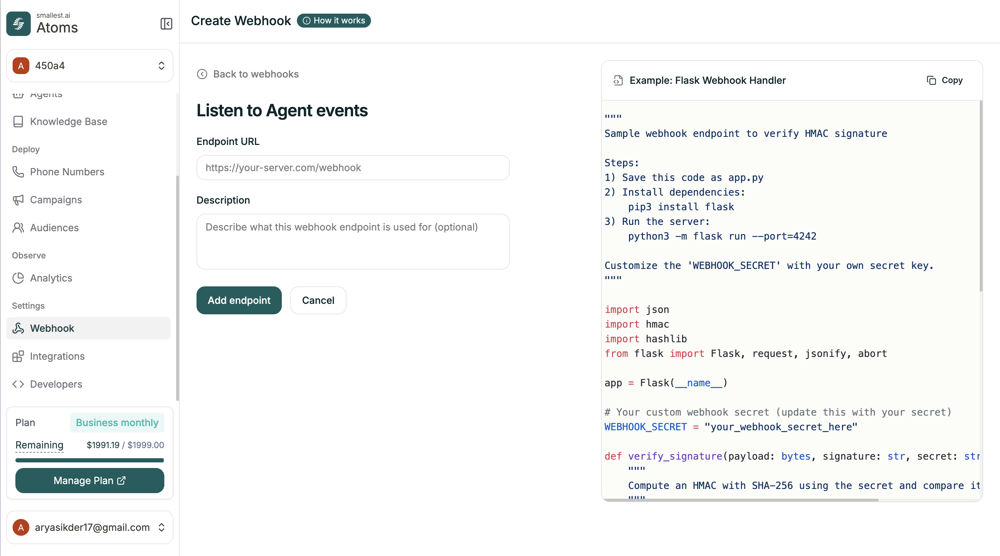
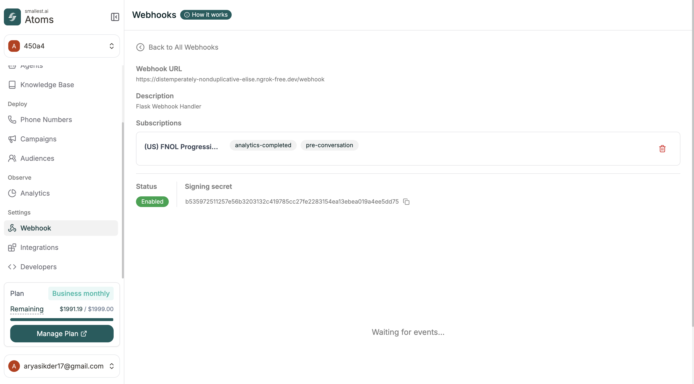

Webhooks notify your systems in real-time when events happen — a call starts, ends, or analytics complete. Atoms sends an HTTP POST to your URL with the relevant data.

---

## Managing Webhooks

All webhooks are created and managed from the dashboard.

**Location:** Left Sidebar → Settings → Webhook

<Frame caption="Webhooks page on dashboard">
  
</Frame>

The table shows all your webhooks with their URL, assigned agents, created date, and status.

---

## Creating a Webhook

Click **Create** to add a new webhook endpoint.

<Frame caption="Create webhook modal">
  
</Frame>

| Field | Description |
|-------|-------------|
| **Endpoint URL** | Your server URL that receives the POST requests |
| **Description** | Optional note about what this webhook is for |

The right panel shows example Flask code for handling webhooks with HMAC signature verification.

Click **Add endpoint** to save.

---

## Webhook Details

Click any webhook to see its details and subscriptions.

<Frame caption="Webhook detail page">
  
</Frame>

| Field | What It Shows |
|-------|---------------|
| **Webhook URL** | The endpoint receiving events |
| **Description** | Your note |
| **Subscriptions** | Which agents are using this webhook and what events |
| **Status** | Enabled or disabled |
| **Signing Secret** | For verifying requests are from Atoms |

---

## Adding to an Agent

Once a webhook exists, connect it to your agent.

**Location:** Agent Editor → Agent Settings → Webhook tab

<Frame caption="Webhook tab in agent settings">
  
</Frame>

Select your webhook from the list. The agent will now send events to that endpoint.

---

## Events

| Event | When It Fires |
|-------|---------------|
| **pre-conversation** | Call is about to start |
| **analytics-completed** | Post-call analysis is ready |

Subscribe to the events you need when connecting the webhook to an agent.

---

## Payload Data

Each event sends relevant data:

**pre-conversation:**
- Caller phone number
- Agent ID
- Call direction
- Timestamp

**analytics-completed:**
- Full transcript
- Call duration
- Post-call metrics
- Variables collected

---

## Tips

<Accordion title="Verify signatures">
  Use the signing secret to verify requests actually come from Atoms. The example code in the Create modal shows how.
</Accordion>

<Accordion title="Handle failures gracefully">
  If your endpoint is down, events may be lost. Log everything and consider retry logic.
</Accordion>

<Accordion title="One webhook, multiple agents">
  You can connect the same webhook to multiple agents. The payload includes the agent ID so you know which agent sent it.
</Accordion>

---

## Related

<CardGroup cols={2}>
  <Card title="Integrations" icon="plug" href="/platform/features/integrations">
    Connect Salesforce, Zendesk, and more
  </Card>
  <Card title="API Calls" icon="code" href="/platform/single-prompt/config/api-calls">
    Make requests during conversations
  </Card>
</CardGroup>
