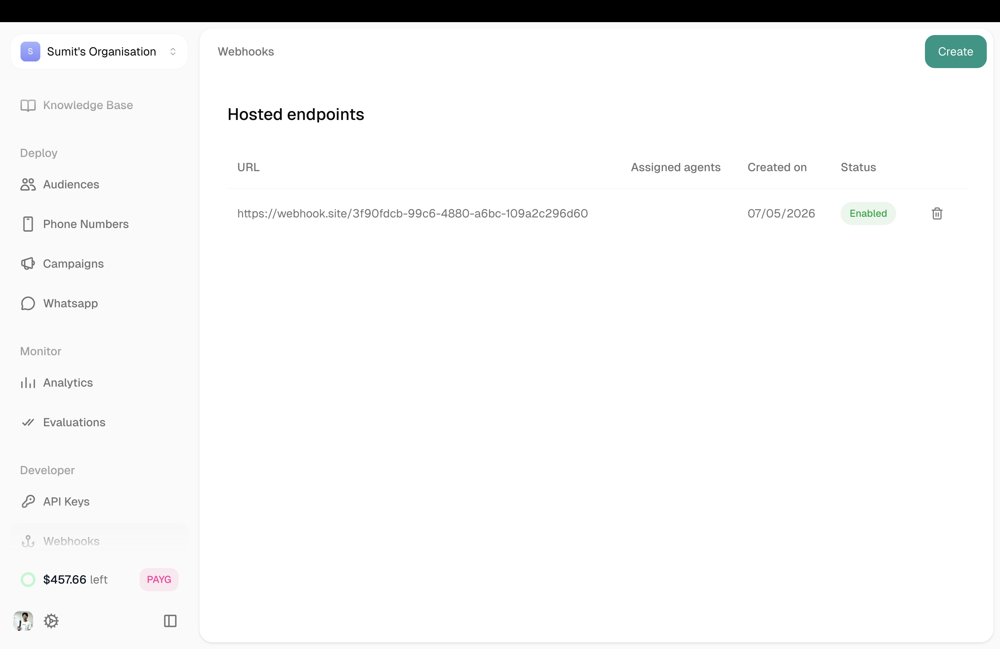
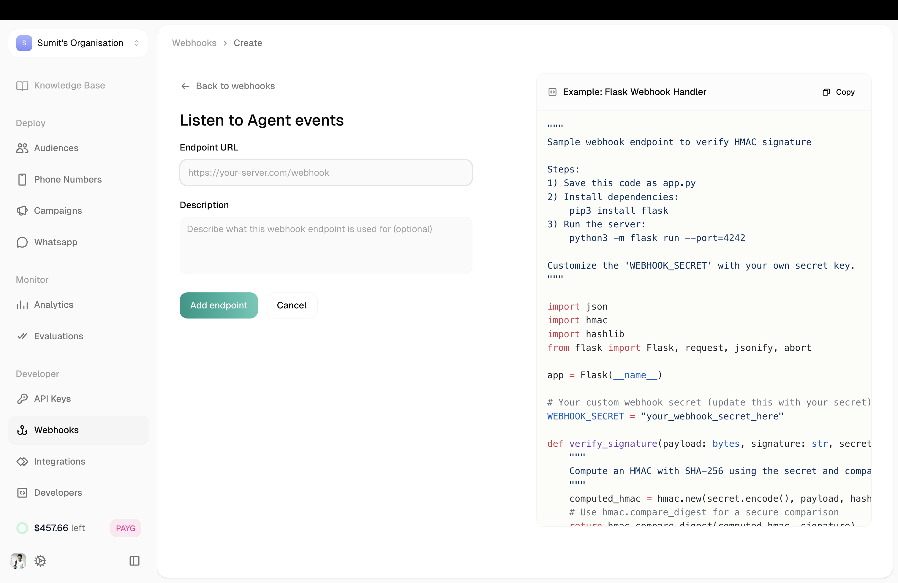
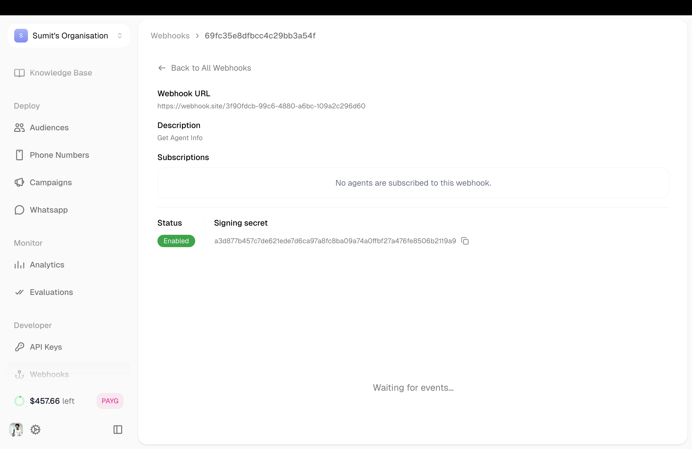
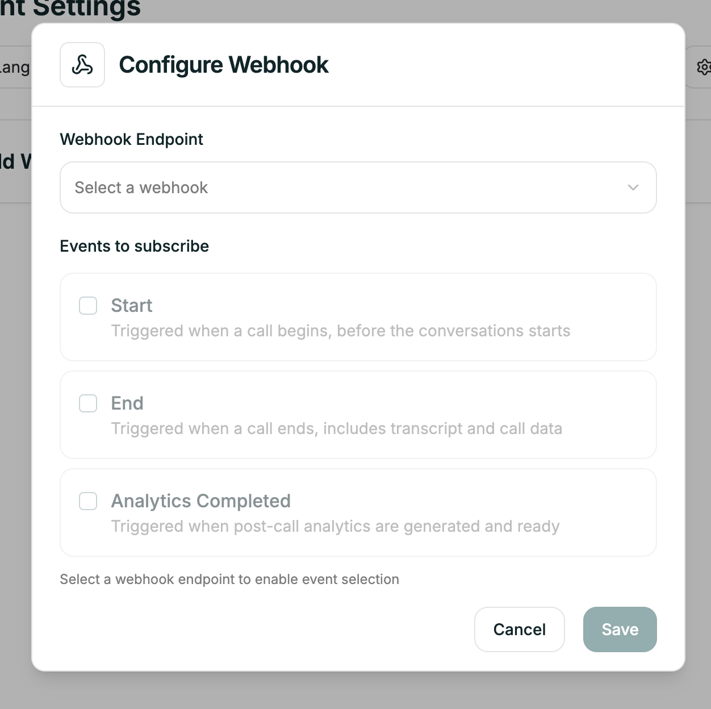

import { CodingAgentCallout } from "@/components/CodingAgentCallout";

Webhooks notify your systems in real-time during the call lifecycle. Atoms sends an HTTP POST to your URL for each event you subscribe to.

Three events fire per call:

| Event | When it fires | Contains |
|---|---|---|
| `pre-conversation` | Before the agent speaks | Caller numbers, agent ID, call ID |
| `post-conversation` | After the call ends | Full transcript, recording URL, call metadata, agent variables |
| `analytics-completed` | After post-call analytics are computed | Summary, disposition + success metrics, call metadata |

All three events share the same `callId` - use it as the join key when correlating events for the same call.

---

## Managing Webhooks

All webhooks are created and managed from the dashboard.

**Location:** Left Sidebar → Settings → Webhook

<Frame caption="Webhooks page on dashboard">
  
</Frame>

The table shows all your webhooks with their URL, assigned agents, created date, and status.

---

## Creating a Webhook

Click **Create** to add a new webhook endpoint.

<Frame caption="Create webhook modal">
  
</Frame>

| Field | Description |
|-------|-------------|
| **Endpoint URL** | Your server URL that receives the POST requests |
| **Description** | Optional human-readable label (e.g. `"Debt Collection Agent's Endpoint"`) - echoed back in every event body |

The right panel shows example Flask code for handling webhooks with HMAC signature verification.

Click **Add endpoint** to save.

---

## Webhook Details

Click any webhook to see its details and subscriptions.

<Frame caption="Webhook detail page">
  
</Frame>

| Field | What it shows |
|-------|---------------|
| **Webhook URL** | The endpoint receiving events |
| **Description** | Your note |
| **Subscriptions** | Which agents are using this webhook and what events |
| **Status** | Enabled or disabled |
| **Signing Secret** | Per-webhook HMAC key. Use it to verify request authenticity. See [Verifying signatures](#verifying-signatures). |

---

## Adding to an Agent

Once a webhook exists, connect it to your agent.

**Location:** Agent Editor → Agent Settings → Webhook tab

<Frame caption="Webhook tab in agent settings">
  
</Frame>

Select your webhook from the list, then check which events (`pre-conversation`, `post-conversation`, `analytics-completed`) you want to receive. The agent will now POST to that endpoint for each subscribed event.

---

## Verifying signatures

Every request Atoms sends to your endpoint carries an `X-Signature` header. Verify it before trusting the body.

**Algorithm**

- HMAC-SHA256, hex-encoded.
- Key: the webhook's signing secret (shown on the webhook detail page, or returned as `decryptedSecretKey` from `GET /webhook` in the API Reference).
- Message: the raw request body bytes, exactly as delivered. Do not re-serialize.

```
X-Signature = hex( HMAC_SHA256( signingSecret, raw_request_body ) )
```

**Python (Flask)**

```python
import hmac, hashlib
from flask import Flask, request, abort

SIGNING_SECRET = "..."  # from the dashboard or GET /webhook

app = Flask(__name__)

@app.post("/webhook")
def receive():
    provided = request.headers.get("X-Signature", "")
    expected = hmac.new(
        SIGNING_SECRET.encode(),
        request.get_data(),  # raw bytes, not request.json
        hashlib.sha256,
    ).hexdigest()
    if not hmac.compare_digest(provided, expected):
        abort(401)
    # trust request.json now
    ...
    return "", 200
```

**Node (Express)**

```js
import crypto from "node:crypto";
import express from "express";

const app = express();
const SIGNING_SECRET = process.env.WEBHOOK_SECRET;

// Capture raw body so the HMAC matches byte-for-byte.
app.use(express.json({ verify: (req, _res, buf) => { req.rawBody = buf; } }));

app.post("/webhook", (req, res) => {
  const provided = req.header("X-Signature") ?? "";
  const expected = crypto
    .createHmac("sha256", SIGNING_SECRET)
    .update(req.rawBody)
    .digest("hex");

  const a = Buffer.from(provided, "hex");
  const b = Buffer.from(expected, "hex");
  if (a.length !== b.length || !crypto.timingSafeEqual(a, b)) {
    return res.status(401).end();
  }
  // trust req.body now
  res.status(200).end();
});
```

<Warning>
Use a constant-time comparison (`hmac.compare_digest` in Python, `crypto.timingSafeEqual` in Node) to avoid timing side channels.
</Warning>

---

## Managing webhooks via API

Everything you can do from the dashboard is also available under the **Webhooks** section of the API Reference. Notable behaviors:

- **`GET /webhook`** and **`GET /webhook?webhookId=<id>`** both return the signing secret in the `decryptedSecretKey` field, so you can fetch it programmatically without hitting the dashboard.
- **`POST /webhook`** returns only the new webhook's ID. Call `GET /webhook?webhookId=<id>` right after to retrieve the signing secret.
- **`PATCH /webhook/{id}`** can update `endpoint`, `description`, and `headers` only. Event subscriptions cannot be changed with `PATCH`; add or remove them via the `POST /agent/{agentId}/webhook-subscriptions` and `DELETE /agent/{agentId}/webhook-subscriptions` endpoints, or from the agent editor.

### Deleting a webhook

`DELETE /webhook/{id}` fails with **400** if the webhook is still assigned to any agent:

```
Cannot delete webhook: It is currently assigned to one or more agents.
Please remove all agent assignments first.
```

Clean unassign path: call `DELETE /agent/{agentId}/webhook-subscriptions` for each agent that has the webhook attached, then retry the delete. Removing the webhook from the agent's **Webhook** tab in the dashboard does the same thing.

---

## Event envelope

Every webhook event shares the same top-level envelope:

| Field | Type | Description |
|---|---|---|
| `url` | string | The webhook URL endpoint. |
| `description` | string | Human-readable label configured on the webhook. |
| `event` | string | `{agentId}.{eventType}` - e.g. `69fc7dd072a0c1d28d948ace.post-conversation`. |
| `metadata` | object | Event-specific payload. See per-event sections below. |
| `id` | string | Unique webhook delivery ID (separate from `callId`). |

### Common `metadata` fields (present in all events)

| Field | Type | Description |
|---|---|---|
| `metadata.agentId` | string | The Atoms agent ID that handled the call. |
| `metadata.eventType` | string | One of `pre-conversation`, `post-conversation`, `analytics-completed`. |
| `metadata.conversationType` | string | Channel type. Known values: `telephonyOutbound`, `telephonyInbound`. |
| `metadata.callId` | string | Unique call identifier (e.g. `CALL-1778226705739-7e4c17`). |

---

## 1. `pre-conversation`

Fired **before** the agent begins speaking. Use this to enrich CRM data, log call attempts, or gate outbound calls.

### `metadata` fields

| Field | Type | Description |
|---|---|---|
| `agentId` | string | Agent ID. |
| `eventType` | string | `"pre-conversation"` |
| `conversationType` | string | e.g. `"telephonyOutbound"` |
| `toPhone` | string | Destination phone number in E.164 format. |
| `fromPhone` | string | Originating phone number in E.164 format. |
| `callId` | string | Unique call ID. |

### Example body

```json
{
  "url": "https://example.com/webhook",
  "description": "Debt Collection Agent's Endpoint",
  "event": "69fc7dd072a0c1d28d948ace.pre-conversation",
  "metadata": {
    "agentId": "69fc7dd072a0c1d28d948ace",
    "eventType": "pre-conversation",
    "conversationType": "telephonyOutbound",
    "toPhone": "+916296641821",
    "fromPhone": "+918035317096",
    "callId": "CALL-1778226705739-7e4c17"
  },
  "id": "69fd96118fd277fc807e4c23"
}
```

<Note>
`pre-conversation` does **not** contain `callData`, `transcript`, `variables`, `analytics`, or `recordingUrl`.
</Note>

---

## 2. `post-conversation`

Fired **after** the call ends. Contains the full transcript, call metadata, recording URL, and all agent variables that were in scope during the conversation.

### `metadata` fields

| Field | Type | Description |
|---|---|---|
| `agentId` | string | Agent ID. |
| `eventType` | string | `"post-conversation"` |
| `conversationType` | string | e.g. `"telephonyOutbound"` |
| `callId` | string | Unique call ID. |
| `recordingUrl` | string | URL to the composite call recording (`.wav`). |
| `callData` | object | Call-level metadata - see table below. |
| `transcript` | array | Ordered list of transcript turns - see table below. |
| `variables` | object | Key-value map of all agent variables injected into the call. |

### `metadata.callData`

| Field | Type | Description |
|---|---|---|
| `fromNumber` | string | Originating phone number (E.164). |
| `toNumber` | string | Destination phone number (E.164). |
| `callDuration` | number | Total call duration in **seconds** (float). |
| `callStatus` | string | Terminal status. Known values: `completed`, `no-answer`, `busy`, `failed`, `canceled`. |
| `callDirection` | string | `"telephony_outbound"` or `"telephony_inbound"`. |
| `answerTime` | string | ISO 8601 timestamp when the call was answered (UTC). |
| `endTime` | string | ISO 8601 timestamp when the call ended (UTC). |

### `metadata.transcript[]` (array of objects)

Each element represents one speaking turn.

| Field | Type | Description |
|---|---|---|
| `role` | string | `"agent"` or `"user"`. |
| `content` | string | The spoken text for this turn. |
| `timestamp` | string | ISO 8601 timestamp of when this turn began (UTC). |

### `metadata.variables`

A flat key-value object. The platform always injects a fixed set of standard keys. Any additional keys come from the agent's own configuration (Agent Settings → Variables) or from prompt-declared placeholders.

**Standard variables the platform always sets**

| Key | Description |
|---|---|
| `call_id` | Same as `metadata.callId`. |
| `user_number` | Caller's phone number (E.164). Same as `callData.fromNumber` for inbound. |
| `agent_number` | Number the agent answered on (E.164). Same as `callData.toNumber` for inbound. |
| `conversation_type` | `telephonyInbound` or `telephonyOutbound`. |
| `agent_gender` | From the agent's voice configuration. |
| `default_language` | The agent's default language code (e.g. `en`, `hi`). |
| `supported_languages` | Comma-separated list of language codes the agent is configured to accept. |
| `current_date`, `current_time`, `current_day` | Rendered at call start in the agent's `timezone`. Available as `{{current_date}}` etc. in prompts. |
| `timezone` | The agent's configured timezone (e.g. `Asia/Kolkata`). |

Custom keys (e.g. `agent_name`, `customer_name`, `due_amount`) sit alongside these.

<Warning>
The `variables` object is otherwise fully dynamic. New custom keys can appear at any time depending on the agent's prompt or the payload passed to the outbound call API. Your code should handle unknown keys gracefully. Store them in a generic JSON column rather than mapping each to a fixed column.
</Warning>

### Example body

```json
{
  "url": "https://example.com/webhook",
  "description": "Debt Collection Agent's Endpoint",
  "event": "69fc7dd072a0c1d28d948ace.post-conversation",
  "metadata": {
    "agentId": "69fc7dd072a0c1d28d948ace",
    "eventType": "post-conversation",
    "conversationType": "telephonyOutbound",
    "callId": "CALL-1778226705739-7e4c17",
    "recordingUrl": "https://db2izkvf1oocn.cloudfront.net/call-recordings/CALL-.../composite.wav",
    "callData": {
      "answerTime": "2026-05-08T07:51:58.813Z",
      "callDirection": "telephony_outbound",
      "callDuration": 49.350622,
      "callStatus": "completed",
      "endTime": "2026-05-08T07:52:48.164Z",
      "fromNumber": "+918035317096",
      "toNumber": "+916296641821"
    },
    "transcript": [
      { "role": "agent", "content": "नमस्ते, मैं Nisha बोल रही हूँ…", "timestamp": "2026-05-08T07:52:05.123Z" },
      { "role": "user", "content": "हाँ बोलिए", "timestamp": "2026-05-08T07:52:07.369Z" }
    ],
    "variables": {
      "call_id": "CALL-1778226705739-7e4c17",
      "user_number": "+916296641821",
      "agent_number": "+918035317096",
      "conversation_type": "telephonyOutbound",
      "agent_gender": "female",
      "default_language": "hi",
      "supported_languages": "hi,en",
      "current_date": "2026-05-08",
      "current_day": "Friday",
      "current_time": "13:21",
      "timezone": "Asia/Kolkata",
      "agent_name": "Nisha",
      "customer_name": "Rahul Sharma",
      "due_amount": "29000"
    }
  },
  "id": "69fd96578d7c3809f58ce555"
}
```

---

## 3. `analytics-completed`

Fired **after** Atoms finishes running the configured disposition and success metrics on the transcript. Arrives some time after `post-conversation`.

### `metadata` fields

| Field | Type | Description |
|---|---|---|
| `agentId` | string | Agent ID. |
| `eventType` | string | `"analytics-completed"` |
| `conversationType` | string | e.g. `"telephonyOutbound"` |
| `callId` | string | Unique call ID. |
| `analytics` | object | Contains `summary`, `dispositionMetrics`, and `successMetrics`. |
| `callData` | object | Same structure as `post-conversation.callData` - but the `callDirection` field may be absent. |

### `metadata.analytics`

| Field | Type | Description |
|---|---|---|
| `summary` | string | LLM-generated plain-text summary of the call. |
| `dispositionMetrics` | array | Array of metric objects - see schema below. |
| `successMetrics` | array | Array of metric objects (same schema as disposition metrics). May be empty `[]`. |

### `analytics.dispositionMetrics[]` and `analytics.successMetrics[]`

Each metric is a self-describing object. The set of metrics is configured per-agent and can vary.

| Field | Type | Description |
|---|---|---|
| `identifier` | string | Machine-readable metric name (e.g. `turn_taking_balance`, `escalation_needed`). |
| `value` | integer / string / boolean | The evaluated result. Type depends on `dispositionMetricType`. |
| `confidence` | number | Confidence score (0–1). |
| `reasoning` | string | LLM-generated explanation for the assigned value. |
| `dispositionMetricPrompt` | string | The prompt/question that was used to evaluate this metric. |
| `dispositionMetricType` | string | Data type of `value`. One of: `INTEGER`, `STRING`, `BOOLEAN`. |

### Example body

```json
{
  "url": "https://example.com/webhook",
  "description": "Debt Collection Agent's Endpoint",
  "event": "69fc7dd072a0c1d28d948ace.analytics-completed",
  "metadata": {
    "agentId": "69fc7dd072a0c1d28d948ace",
    "eventType": "analytics-completed",
    "conversationType": "telephonyOutbound",
    "callId": "CALL-1778226705739-7e4c17",
    "analytics": {
      "summary": "The call involved the agent discussing an overdue EMI payment…",
      "dispositionMetrics": [
        {
          "identifier": "turn_taking_balance",
          "value": 2,
          "confidence": 1,
          "reasoning": "The user had 4 speaking turns while the agent had 5…",
          "dispositionMetricPrompt": "Measure the balance of speaking turns…",
          "dispositionMetricType": "INTEGER"
        },
        {
          "identifier": "escalation_needed",
          "value": false,
          "confidence": 1,
          "reasoning": "The call did not present complex issues…",
          "dispositionMetricPrompt": "Based on the interaction, did this call require escalation?",
          "dispositionMetricType": "BOOLEAN"
        }
      ],
      "successMetrics": []
    },
    "callData": {
      "fromNumber": "+918035317096",
      "toNumber": "+916296641821",
      "callDuration": 49.350622,
      "callStatus": "completed",
      "answerTime": "2026-05-08T07:51:58.813Z",
      "endTime": "2026-05-08T07:52:48.164Z"
    }
  },
  "id": "69fd96632b717269846aa433"
}
```

---

## Event lifecycle and ordering

```
Call initiated
      │
      ▼
┌─────────────────┐
│ pre-conversation│  ← Fired before agent speaks
└────────┬────────┘
         │
   Call in progress…
         │
         ▼
┌──────────────────┐
│ post-conversation│  ← Fired after call ends (has transcript + recording)
└────────┬─────────┘
         │
   Analytics processing…
         │
         ▼
┌─────────────────────┐
│ analytics-completed │  ← Fired after metrics are computed
└─────────────────────┘
```

All three events share the same `callId` - use it as the join key.

---

## Integration notes

1. **`variables` is dynamic** - never hard-code column mappings. Store as JSON or iterate keys.
2. **`dispositionMetrics` / `successMetrics` are agent-configured** - the set of identifiers and their types will differ across agents.
3. **`pre-conversation` uses `toPhone` / `fromPhone`** while `post-conversation` and `analytics-completed` use `toNumber` / `fromNumber` - normalize these in your ingestion layer.
4. **Timestamps** are always UTC ISO 8601 strings.
5. **`callDuration`** is a float representing seconds (not milliseconds).
6. **`recordingUrl`** only appears in `post-conversation`.
7. **`transcript`** only appears in `post-conversation`.
8. **`analytics`** (summary + metrics) only appears in `analytics-completed`.

---

## FAQ

<AccordionGroup>
  <Accordion title="What's the delivery timeout?">
    30 seconds per request. If your endpoint hasn't returned a response in that window, Atoms marks the delivery as failed.
  </Accordion>

  <Accordion title="Does Atoms retry failed deliveries?">
    No. A non-2xx response or a network-level failure (timeout, DNS, TLS, connection refused) is logged as `FAILED` and the event moves on. Handle retries on your side: acknowledge fast with a 2xx, then process asynchronously; if your endpoint is down, drain from your own persistent queue once you recover.
  </Accordion>

  <Accordion title="What IPs does Atoms send from?">
    No fixed egress IP is published. Use the `X-Signature` header for authenticity; don't rely on IP allow-lists.
  </Accordion>

  <Accordion title="Can one webhook fan out to multiple agents?">
    Yes. Assign the same webhook to several agents in the agent editor. The `metadata.agentId` field on every event tells you which agent produced it.
  </Accordion>

  <Accordion title="Is event ordering guaranteed?">
    Within a single call, the three events fire in this sequence: `pre-conversation` → `post-conversation` → `analytics-completed`. Deliveries themselves are best-effort; treat `metadata.callId` as the join key and reconcile on your side rather than assuming exact arrival order across concurrent calls.
  </Accordion>

  <Accordion title="How do I test webhooks locally?">
    Run a receiver on `localhost` and expose it with a tunnel (ngrok, cloudflared, etc.). Register the tunnel URL as the webhook endpoint from the dashboard, then place a test call. Live payloads land on your local process.
  </Accordion>

  <Accordion title="How do I fetch the signing secret programmatically?">
    Call `GET /webhook?webhookId=<id>` (or `GET /webhook` to get all). The response includes a `decryptedSecretKey` field with the plaintext HMAC key.
  </Accordion>

  <Accordion title="Can I change which events a webhook subscribes to?">
    Not through `PATCH /webhook/{id}` (it only updates `endpoint`, `description`, `headers`). Add or remove event subscriptions via the `POST /agent/{agentId}/webhook-subscriptions` and `DELETE /agent/{agentId}/webhook-subscriptions` endpoints, or from the agent editor.
  </Accordion>

  <Accordion title="Why do I get 400 when deleting a webhook?">
    The webhook is still assigned to at least one agent. Remove the assignment (either from the agent's Webhook tab or via `DELETE /agent/{agentId}/webhook-subscriptions`), then retry `DELETE /webhook/{id}`.
  </Accordion>

  <Accordion title="Are variable keys stable?">
    The 11 platform-set standard keys (`call_id`, `user_number`, `agent_number`, `conversation_type`, `agent_gender`, `default_language`, `supported_languages`, `current_date`, `current_time`, `current_day`, `timezone`) are stable. Any additional keys come from the agent's own config and can change whenever the prompt or outbound-call payload changes, so store `variables` as JSON on your side.
  </Accordion>
</AccordionGroup>

---

## Related

<CardGroup cols={2}>
  <Card title="Integrations" href="/voice-agents/integrate/integrations">
    Connect Salesforce, Zendesk, and more
  </Card>
  <Card title="Agent Config" href="/voice-agents/build/agent-settings">
    Make API requests during conversations
  </Card>
</CardGroup>

<CodingAgentCallout />

{/* coding-agent-callout-injected */}
