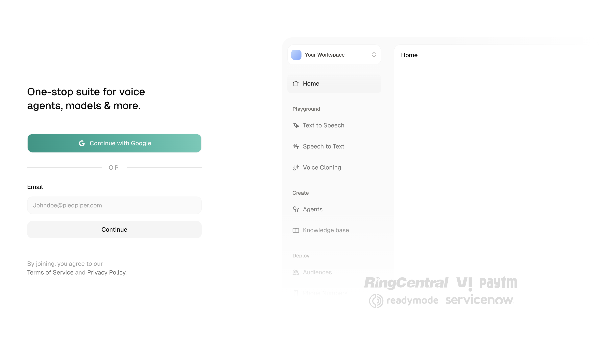
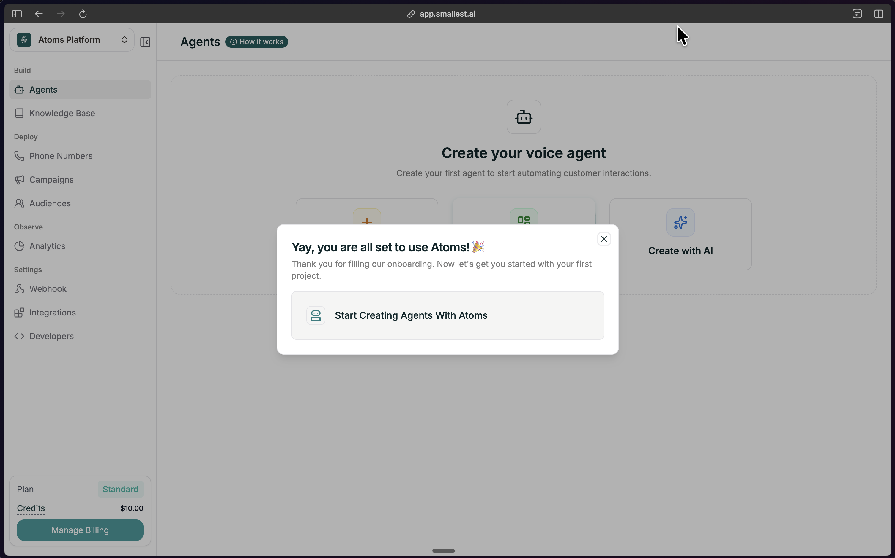
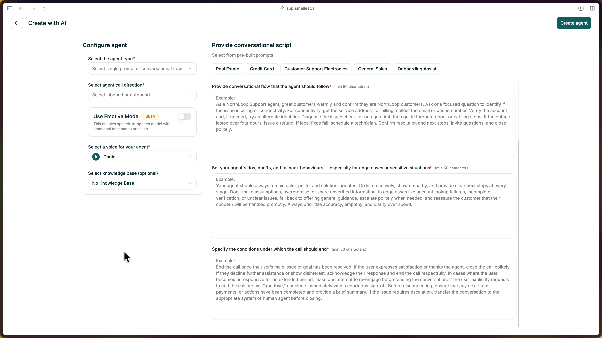

Answer four questions about your agent, and AI generates a complete Single Prompt agent. You can refine and test it before deploying.

---

## Step 1: Sign in to the platform

Sign in at [**app.smallest.ai**](https://app.smallest.ai/login?utm_source=documentation&utm_medium=docs). If you don't have an account yet, create one from the same page.

<Frame caption="Atom Voice Agent Platform Sign Up Page">
  
</Frame>

Once you're in, you'll see your dashboard.

<Frame caption="Atom Voice Agent Platform Welcome Screen">
  
</Frame>

---

## Step 2: Open Create Agent

From your dashboard, click the green **Create Agent** button in the top right.

<Frame caption="Dashboard with Create Agent button">
  
</Frame>

---

## Step 3: Choose Create with AI

In the modal, select the **Create with AI** option (the third option). Then choose **Single Prompt** as your agent type.

<Frame caption="Select Create with AI and choose Single Prompt">
  
</Frame>

---

## Step 4: Configure Your Agent (Left Panel)

Before writing your prompts, set the basics in the left panel:

| Field | What to choose |
|-------|----------------|
| **Agent Type** | Single Prompt (already selected) |
| **Call Direction** | **Inbound** if customers call in, **Outbound** if the agent makes calls |
| **Emotive Model** | Toggle on for more expressive voice (Beta), or leave off |
| **Voice** | Pick a voice from the library — use the preview to listen |
| **Knowledge Base** | Optionally attach an existing KB so the agent can use your docs/FAQs |

---

## Step 5: Fill the Four Prompts (Right Panel)

Describe your agent in four short prompts. Each needs at least 50 characters. The AI uses these to generate the full agent.

**1. Role & Objective** — Who is this agent and what's their goal?
Example: *"You are Sam, a friendly support agent for TechStore. Your goal is to help customers with orders, returns, and product questions."*

**2. Conversational Flow** — What steps should the agent follow?
Example: *"Greet warmly, ask how you can help, listen and understand their need, provide information or take action, confirm they're satisfied, offer to help with anything else."*

**3. Dos, Don'ts & Fallbacks** — How should the agent behave in tricky situations?
Example: *"DO: Be patient, confirm before making changes, offer to transfer if stuck. DON'T: Share other customers' info or make promises you can't keep. If you don't know: say so and offer to find out or transfer."*

**4. End Conditions** — When should the call end?
Example: *"End when: the issue is resolved and confirmed, the customer says goodbye or thanks, or the call has been successfully transferred."*

<Tip>
Click a **template** tab (Real Estate, Credit Card, Customer Support Electronics, etc.) to pre-fill all four prompts, then edit as needed.
</Tip>

---

## Step 6: Create the Agent

Click **Create agent** in the top right. Atoms will generate your agent (about 30 seconds). When you see the success message, click **Go to Agent** to open the editor.

<Frame caption="The Single Prompt editor">
  
</Frame>

Your prompt, voice, model, and Knowledge Base (if you added one) are already configured. Refine the prompt text if you like.

---

## Step 7: Test Your Agent

Click **Test Agent** in the top-right to start a test call.

You can test your agent in three ways:

- **Web Call** — talk to your agent through your browser microphone
- **Telephony Call** — enter a phone number and get a call from your agent
- **Chat** — text-based conversation with your agent

<Frame caption="Test your agent via Web Call, Telephony, or Chat">
  
</Frame>

Talk through a few scenarios:

- Ask a normal question
- Ask something unexpected
- Interrupt mid-response

Listen for clarity and that the agent follows your guidelines.

---

## You Built a Single Prompt Agent

You now have a working **Single Prompt agent**. Here's what happens when someone calls:

1. **Pulse** transcribes their speech in 64ms
2. **Your prompt** tells the AI how to respond
3. **Lightning** speaks the response in 175ms

Total: under 800ms per turn.

### Understand What You Built

<Card title="How Single Prompt Agents Work" icon="message" href="/atoms/atoms-platform/single-prompt-agents/overview">
  How one prompt powers an entire conversation — and when to use it vs. Conversational Flow.
</Card>

### Customize Your Agent

<CardGroup cols={2}>
  <Card title="Refine Your Prompt" icon="pen" href="/atoms/atoms-platform/single-prompt-agents/prompt-section/writing-prompts">
    Structure and improve your agent's instructions
  </Card>
  <Card title="Add Knowledge Base" icon="book" href="/atoms/atoms-platform/features/knowledge-base">
    Ground responses in your actual docs and data
  </Card>
  <Card title="Deploy to Phone" icon="phone" href="/atoms/atoms-platform/deployment/phone-numbers">
    Get a real phone number and go live
  </Card>
  <Card title="Configure Settings" icon="gear" href="/atoms/atoms-platform/single-prompt-agents/agent-settings/general-settings">
    Voice, model, language, and behavior settings
  </Card>
</CardGroup>

### Need Help?

<Card title="Join Discord" icon="fa-brands fa-discord" href="https://discord.gg/5evETqguJs">
  Ask questions, share what you're building, and get help from the community.
</Card>