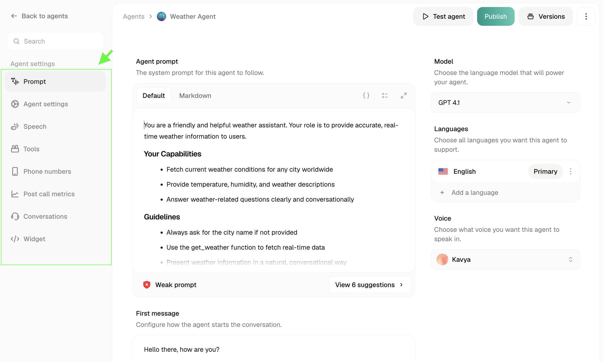

<Frame caption="Agent Configuration Dashboard">
  
</Frame>

Once your agent's prompt is in place, these settings control how it behaves, connects to your systems, and gets monitored over time. Jump to any section below.

## Configure Behavior

<Card title="Prompt" href="/voice-agents/platform/create-agent/prompt">
  The core instructions that define your agent's role, behavior, and guardrails.
</Card>

<CardGroup cols={2}>
  <Card title="Variables" href="/voice-agents/platform/create-agent/agent-settings/variables">
    Insert dynamic values into your prompt using `{{variable_name}}`.
  </Card>
  <Card title="API Calls" href="/voice-agents/platform/create-agent/agent-settings/api-calls">
    Fetch or send data mid-call, like looking up an order or booking a slot.
  </Card>
  <Card title="Widget" href="/voice-agents/platform/create-agent/agent-settings/widget">
    Embed a voice or chat widget directly on your website.
  </Card>
  <Card title="Versioning" href="/voice-agents/platform/create-agent/agent-settings/versioning">
    Save and restore previous versions of your agent configuration.
  </Card>
</CardGroup>

## Monitor & Improve
<Card title="Prompt Scoring" href="/voice-agents/platform/create-agent/agent-settings/prompt-scoring">
  Automatically evaluate how well your agent follows its prompt.
</Card>
<CardGroup cols={2}>
  <Card title="Post-Call Metrics" href="/voice-agents/platform/create-agent/agent-settings/post-call-metrics">
    Review summaries, transcripts, and performance data after each call.
  </Card>
  <Card title="Conversation Logs" href="/voice-agents/platform/create-agent/agent-settings/conversation-logs">
    Review transcripts and debug agent behavior after a call.
  </Card>
</CardGroup>