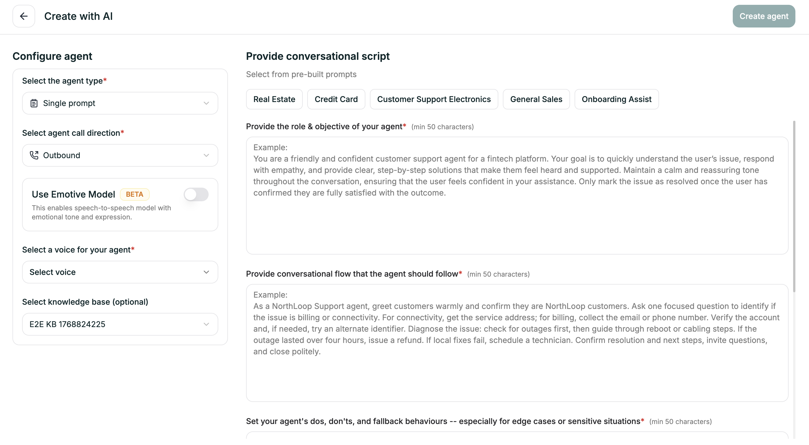

Don't want to start from scratch? Describe what you want in four prompts, and our AI will generate a complete Single Prompt agent — ready for you to customize.

---

## Getting There

<Steps>
  <Step title="Open Create Agent">
    From your dashboard, click the green **Create Agent** button in the top right.
  </Step>
  
  <Step title="Choose Create with AI">
    Select the third option in the modal.
    
    <Frame caption="Creation method selection">
      
    </Frame>
  </Step>
  
  <Step title="Select Single Prompt">
    Choose **Single Prompt** as your agent type.
    
    <Frame caption="Create with AI interface">
      
    </Frame>
  </Step>
</Steps>

---

## Configure Agent (Left Panel)

Set up the basics before writing your prompts:

| Field | What to Choose |
|-------|----------------|
| **Agent Type** | Single Prompt (already selected) |
| **Call Direction** | Inbound or Outbound |
| **Emotive Model** | Toggle on for emotional expression (Beta) |
| **Voice** | Pick from the voice library |
| **Knowledge Base** | Optionally attach an existing KB |

---

## The Four Prompts (Right Panel)

Each prompt helps AI understand a different aspect of your agent. All require at least 50 characters.

<Accordion title="1. Role & Objective">
  *Who is this agent and what's their goal?*
  
  **Tips:**
  - Be specific about the company/industry
  - Define the primary goal clearly
  - Include personality traits (friendly, professional, empathetic)
  - Mention what success looks like
</Accordion>

<Accordion title="2. Conversational Flow">
  *What steps should the agent follow?*
  
  **Tips:**
  - Think about the typical call from start to finish
  - Include verification steps if needed
  - Mention key decision points (what changes the path?)
  - End with how to close the conversation
</Accordion>

<Accordion title="3. Dos, Don'ts & Fallbacks">
  *How should the agent behave, especially in tricky situations?*
  
  **Tips:**
  - List explicit "always do" behaviors
  - List explicit "never do" constraints
  - Think about edge cases: what if verification fails? caller gets frustrated? agent doesn't know the answer?
  - Define escalation paths
</Accordion>

<Accordion title="4. End Conditions">
  *When should the call end?*
  
  **Tips:**
  - Issue resolved and confirmed
  - Customer says goodbye or thanks
  - Successful transfer to human
  - No response after multiple attempts
</Accordion>

---

## Pre-Built Prompts

Not sure what to write? Click any template tab to pre-fill all four prompts:

- Real Estate
- Credit Card
- Customer Support Electronics
- General Sales
- Onboarding Assist

Use **Clear All** to reset and start fresh.

---

## After You Click Create

AI generates your agent and opens the editor with everything already set up:

- **Prompt** — fully written based on your four inputs
- **Voice** — the one you selected
- **Model** — configured and ready
- **Knowledge Base** — attached if you chose one

From there, refine as needed and test.

<CardGroup cols={2}>
  <Card title="Prompt Editor" icon="pen" href="/platform/single-prompt/writing-prompts">
    Review and refine the generated prompt
  </Card>
  <Card title="Test Your Agent" icon="flask" href="/platform/analytics/testing">
    See how it performs
  </Card>
</CardGroup>
