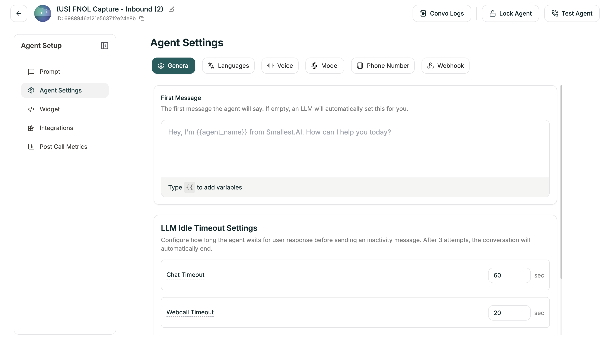

General Settings let you configure the agent's opening message and how long it waits before prompting idle callers.

**Location:** Left Sidebar → Agent Settings → General tab

<Frame caption="General Settings tab">
  
</Frame>

---

## First Message

Set a static first message that the agent speaks when a conversation begins. This is useful for campaigns at scale since it avoids generating the opening message via the LLM each time, reducing costs significantly.

If left empty, the agent falls back to generating the first message from the LLM as usual.

<Tip>
  You can use variables in the first message with double curly braces, e.g. `{{agent_name}}` or `{{company}}`.
</Tip>

---

## LLM Idle Timeout Settings

Configure how long the agent waits for user response before sending an inactivity message. After 3 attempts with no response, the conversation automatically ends.

| Setting | Default | Description |
|---------|---------|-------------|
| **Chat Timeout** | 60 sec | For text chat conversations |
| **Webcall Timeout** | 20 sec | For browser-based voice calls |
| **Telephony Timeout** | 20 sec | For phone calls |

Each timeout triggers an inactivity prompt. If the user still doesn't respond after 3 prompts, the agent ends the conversation gracefully.

---

## Related

<CardGroup cols={2}>
  <Card title="Voice Settings" icon="volume" href="/atoms/atoms-platform/single-prompt-agents/agent-settings/voice-settings">
    Speech speed and detection tuning
  </Card>
  <Card title="End Call" icon="phone-slash" href="/atoms/atoms-platform/single-prompt-agents/configuration-panel/end-call">
    Configure call termination
  </Card>
</CardGroup>
