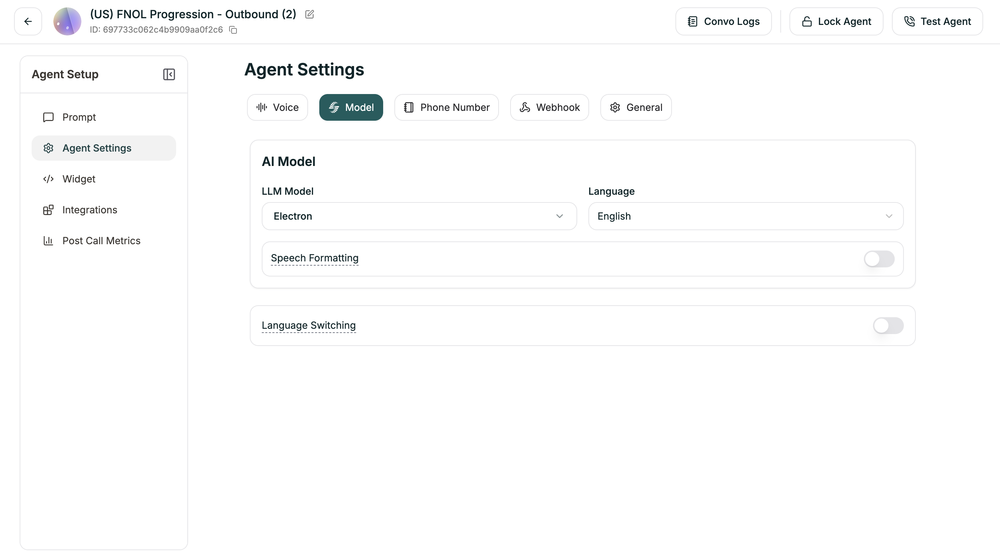

Model Settings control how the AI behaves — the model powering responses, language handling, and formatting preferences.

**Location:** Left Sidebar → Agent Settings → Model tab

<Frame caption="Model tab for Single Prompt agents">
  
</Frame>

---

## AI Model

Choose the LLM powering your agent and its primary language.

| Setting | Description |
|---------|-------------|
| **LLM Model** | The AI model (Electron, GPT-4o, etc.) |
| **Language** | Primary language for responses |

You can also set the model in the [Prompt Section](/atoms/atoms-platform/single-prompt-agents/prompt-section/model-selection) dropdown at the top of the editor.

---

## Speech Formatting

When enabled (default: ON), the system automatically formats transcripts for readability — adding punctuation, paragraphs, and proper formatting for dates, times, and numbers.

---

## Language Switching

Enable your agent to switch languages mid-conversation based on what the caller speaks (default: ON).

### Advanced Settings

When Language Switching is enabled, you can fine-tune detection:

| Setting | Range | Default | What it does |
|---------|-------|---------|--------------|
| **Minimum Words for Detection** | 1-10 | 2 | How many words before considering a switch |
| **Strong Signal Threshold** | 0-1 | 0.7 | Confidence level for immediate switch |
| **Weak Signal Threshold** | 0-1 | 0.3 | Confidence level for tentative detection |
| **Consecutive Weak Signals** | 1-8 | 2 | How many weak signals needed to switch |

**Understanding the thresholds:**

- **Strong Signal:** Very confident the caller switched → switches immediately
- **Weak Signal:** Somewhat confident → waits for more evidence
- **Higher thresholds** = More certain before switching (fewer false switches)
- **Lower thresholds** = Quicker to switch (more responsive)

For most cases, the defaults work well. Adjust only if you're seeing unwanted switching behavior.

---

## Related

<CardGroup cols={2}>
  <Card title="Voice Settings" icon="volume" href="/atoms/atoms-platform/single-prompt-agents/agent-settings/voice-settings">
    Speech speed, pronunciation, and detection
  </Card>
  <Card title="Prompt Editor" icon="pen" href="/atoms/atoms-platform/single-prompt-agents/prompt-section/writing-prompts">
    Where you write your agent's instructions
  </Card>
</CardGroup>
