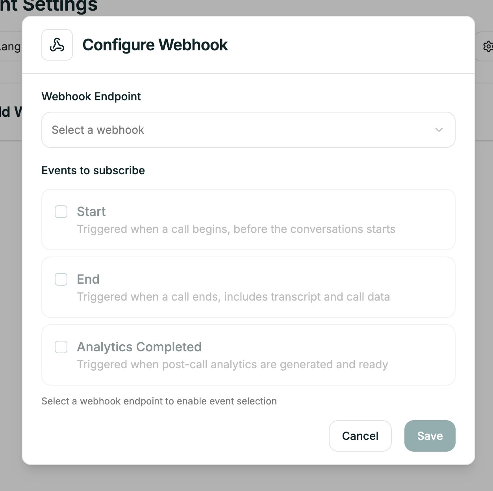

Webhooks push real-time data to your systems when call events happen — starts, ends, analytics ready. Use them to update CRMs, create tickets, trigger workflows, or feed analytics pipelines.

**Location:** Agent Settings → Webhooks

---

## Adding to Your Agent

Once a webhook endpoint exists, connect it to your agent here.

<Frame caption="Webhook tab in agent settings">
  
</Frame>

Select your webhook from the dropdown. The agent will now send events to that endpoint.

---

## Next

<Card title="Webhooks" icon="webhook" href="/atoms/atoms-platform/features/webhooks">
  Create endpoints, manage subscriptions, and view payload details
</Card>
