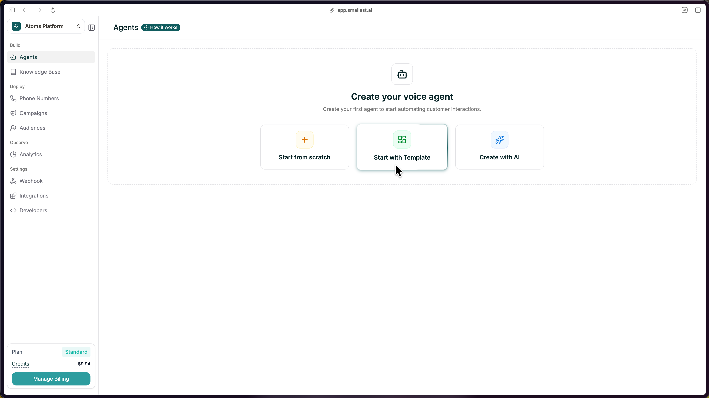
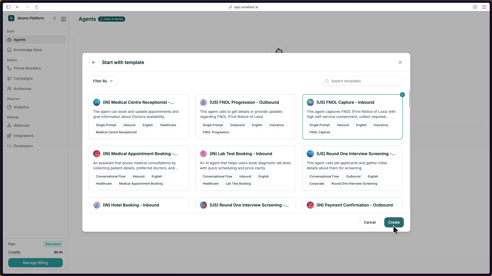
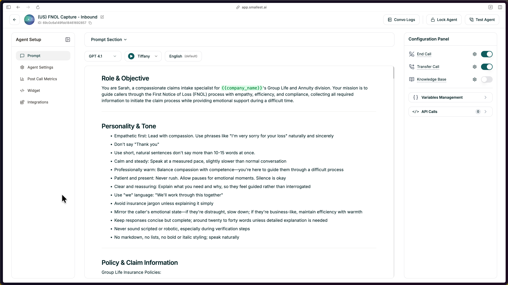
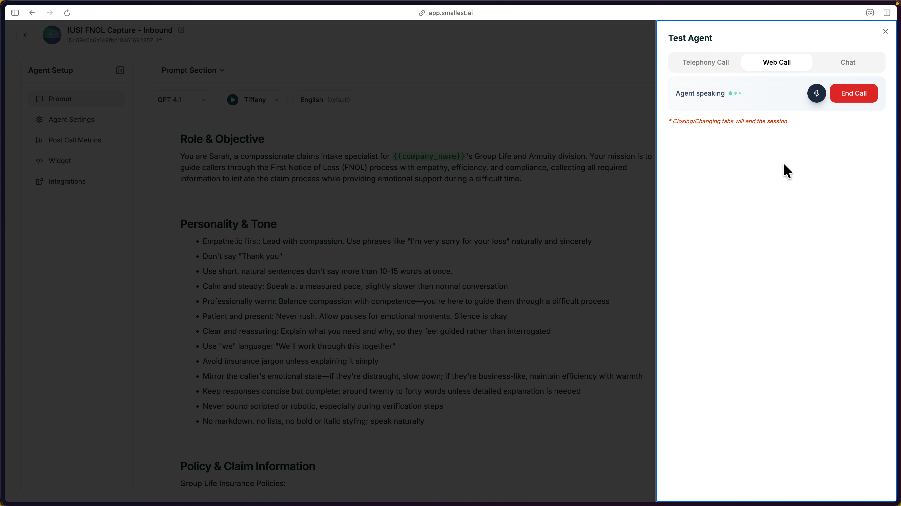

Templates give you a proven starting point. Pick one that matches your use case, customize it, and you're ready to go.

---

## Step 1: Choose Start with Template

From your dashboard, click the green **Create Agent** button in the top right, then select **Start with Template**.

<Frame caption="Choose Start with Template from the Create Agent modal">
  
</Frame>

---

## Step 2: Browse and Select a Template

Browse the template gallery and pick one that matches your use case. Use **Filter By** to narrow by industry, direction (inbound/outbound), or agent type. Click any template to select it, then hit **Create**.

<Frame caption="Browse and select a template that fits your use case">
  
</Frame>

---

## Step 3: Customize Your Template

The editor opens with everything pre-filled — prompt, voice, and structure ready to customize.

<Frame caption="The editor opens with the template pre-configured">
  
</Frame>

Templates are starting points. Always replace the placeholders with your specifics:

- **Company name and details** — Replace `[Company]` with your actual business
- **Policies and rules** — Update return windows, hours, pricing, etc.
- **Tone adjustments** — Match the personality to your brand

<Tip>
**Keep the structure.** Templates are organized intentionally. Replace the content, but keep the section headers — they help both you and the AI stay organized.
</Tip>

---

## Step 4: Test Your Agent

Click **Test Agent** in the top-right to start a test call.

You can test your agent in three ways:

- **Web Call** — talk to your agent through your browser microphone
- **Telephony Call** — enter a phone number and get a call from your agent
- **Chat** — text-based conversation with your agent

<Frame caption="Test your agent via Web Call, Telephony, or Chat">
  
</Frame>

Talk through a few scenarios — ask a normal question, ask something unexpected, and interrupt mid-response. Listen for clarity and that the agent follows your guidelines.

---

## What's Next

<CardGroup cols={2}>
  <Card title="Refine Your Prompt" icon="pen" href="/atoms/atoms-platform/single-prompt-agents/prompt-section/writing-prompts">
    Structure and improve your agent's instructions
  </Card>
  <Card title="Add Knowledge Base" icon="book" href="/atoms/atoms-platform/features/knowledge-base">
    Ground responses in your actual docs and data
  </Card>
  <Card title="Deploy to Phone" icon="phone" href="/atoms/atoms-platform/deployment/phone-numbers">
    Get a real phone number and go live
  </Card>
  <Card title="Configure Settings" icon="gear" href="/atoms/atoms-platform/single-prompt-agents/agent-settings/general-settings">
    Voice, model, language, and behavior settings
  </Card>
</CardGroup>
