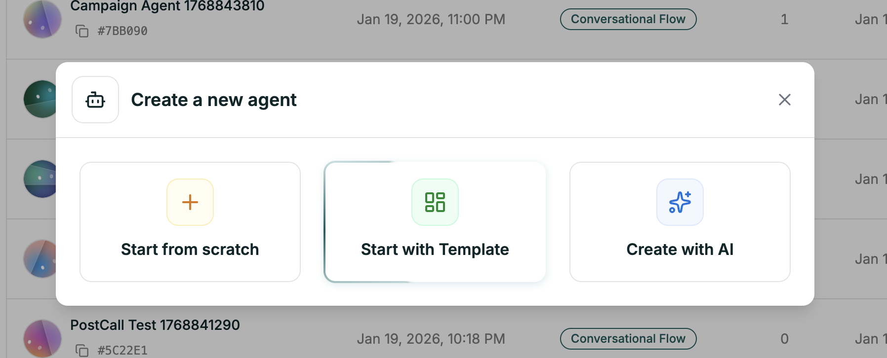
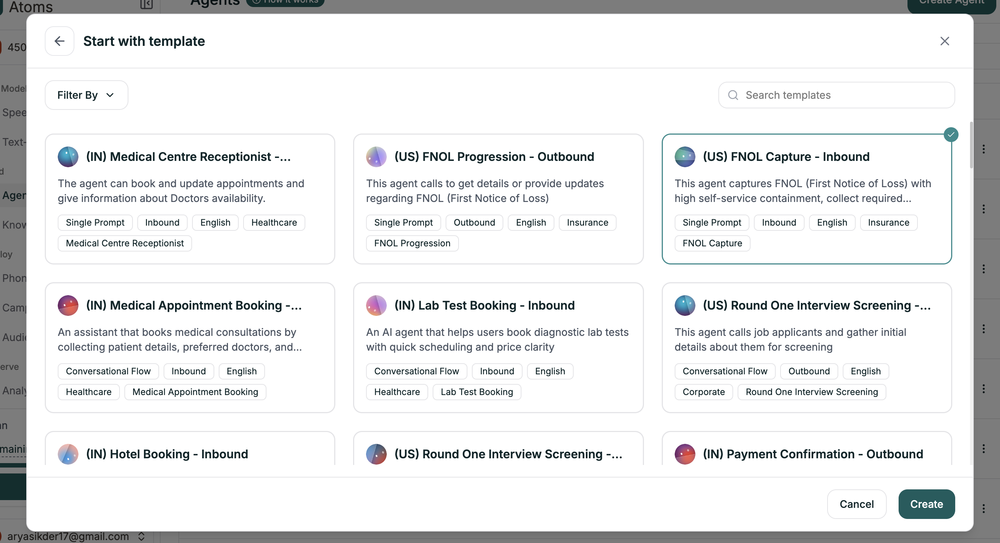

Templates give you a proven starting point. Pick one that matches your use case, customize it, and you're ready to go.

---

## Getting There

<Steps>
  <Step title="Open Create Agent">
    From your dashboard, click the green **Create Agent** button in the top right.
  </Step>
  
  <Step title="Choose Start with Template">
    Select the second option in the modal.
    
    <Frame caption="Creation method selection">
      
    </Frame>
  </Step>
  
  <Step title="Browse and Select">
    Use **Filter By** to narrow by industry, direction (inbound/outbound), or agent type. Click any template to select it, then hit **Create**.
    
    <Frame caption="Template gallery">
      
    </Frame>
  </Step>
</Steps>

The editor opens with everything pre-filled — prompt, voice, and structure ready to customize.

---

## What Templates Include

Each template comes with a complete starting point:

| Component | What You Get |
|-----------|--------------|
| **Structured Prompt** | Role, objectives, conversational flow, guidelines — all laid out in markdown sections |
| **Voice Selection** | A voice that fits the use case |
| **Common Scenarios** | Examples of conversations the agent should handle |
| **Best Practices** | Tips specific to that industry or use case |

Templates follow the same markdown structure you'd use when building from scratch. This means the **Prompt Section** dropdown navigation works immediately — jump between sections like Role & Objective, Personality & Tone, and Conversational Flow.

---

## Customizing Your Template

Templates are starting points. Always replace the placeholders with your specifics:

- **Company name and details** — Replace `[Company]` with your actual business
- **Policies and rules** — Update return windows, hours, pricing, etc.
- **Tone adjustments** — Match the personality to your brand

<Tip>
**Keep the structure.** Templates are organized intentionally. Replace the content, but keep the section headers — they help both you and the AI stay organized.
</Tip>

---

## What's Next

<CardGroup cols={2}>
  <Card title="Prompt Editor" icon="pen" href="/platform/single-prompt/writing-prompts">
    Understand the editor and markdown sections
  </Card>
  <Card title="Test Your Agent" icon="flask" href="/platform/analytics/testing">
    Validate before deploying
  </Card>
</CardGroup>
