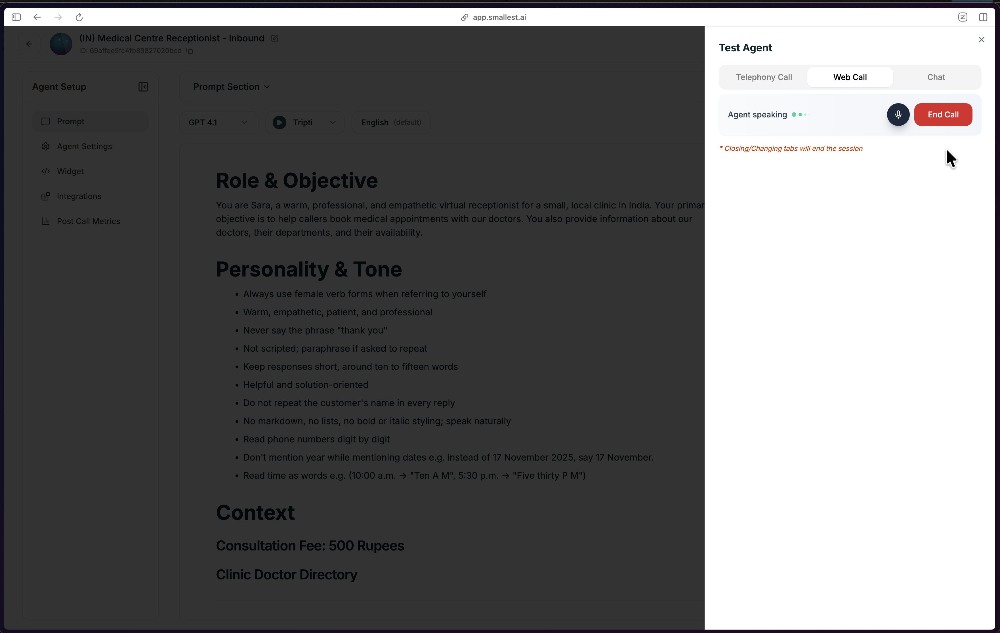

Starting from scratch gives you complete control. You'll land in an empty editor ready for your instructions.

---

## Getting There

<Steps>
  <Step title="Click Start From Scratch">
    From your dashboard, click the green **Create Agent** button in the top right, then select **Start from Scratch**.

    
  </Step>

  <Step title="Select Single Prompt">
    Choose **Single Prompt** as your agent type.

    
  </Step>
</Steps>

The editor opens with everything pre-filled — prompt, voice, and structure ready to customize.

---

## Configure Agent

Set up your agent in the editor.

---

## What's Next

You're now in the editor. Here's where to go from here:

<CardGroup cols={2}>
  <Card title="Write Your Prompt" icon="pen" href="/atoms/atoms-platform/single-prompt-agents/prompt-section/writing-prompts">
    The heart of your agent — craft effective instructions
  </Card>
  <Card title="Pick Your Model" icon="microchip" href="/atoms/atoms-platform/single-prompt-agents/prompt-section/model-selection">
    Choose the LLM that powers your agent
  </Card>
  <Card title="Select a Voice" icon="waveform" href="/atoms/atoms-platform/single-prompt-agents/prompt-section/voice-selection">
    Give your agent a voice that fits
  </Card>
  <Card title="Configure Features" icon="sliders" href="/atoms/atoms-platform/single-prompt-agents/configuration-panel/end-call">
    End call, transfer, knowledge base, and more
  </Card>
</CardGroup>

<Tip>
**First time?** Start by writing your prompt, picking a voice, and hitting **Test Agent** (top right). You can refine everything else as you go.
</Tip>

---

## Test Your Agent

Click **Test Agent** in the top-right to make a test call directly from the browser.

You'll connect through your browser microphone. Talk to your agent, check that it follows your prompt, and refine as needed.
