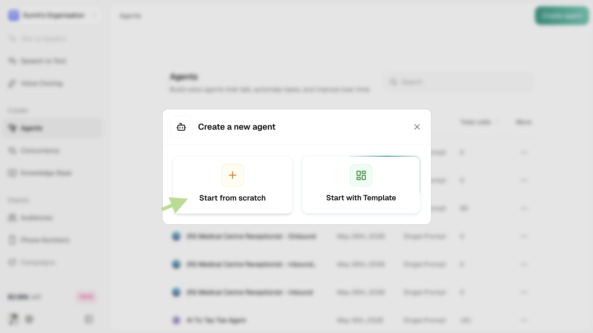
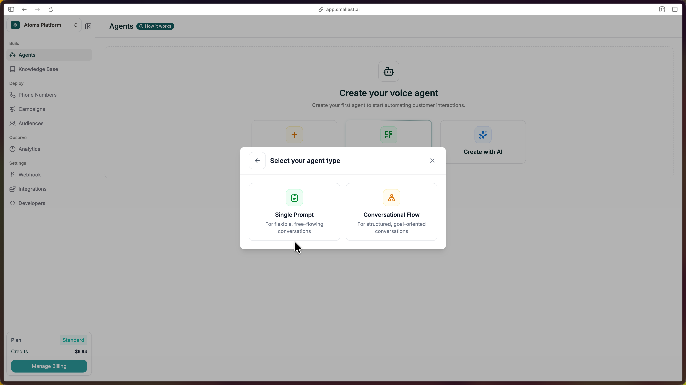
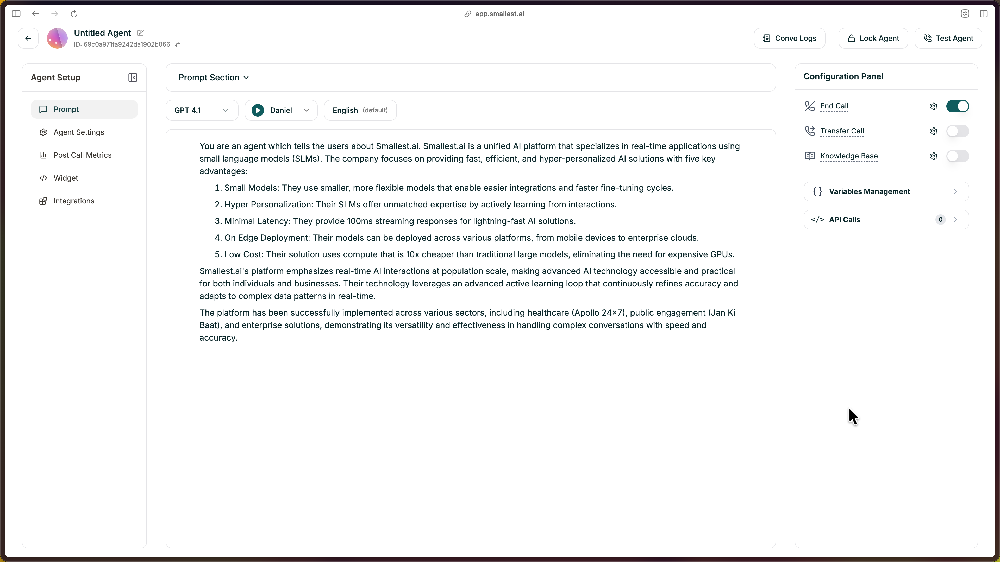
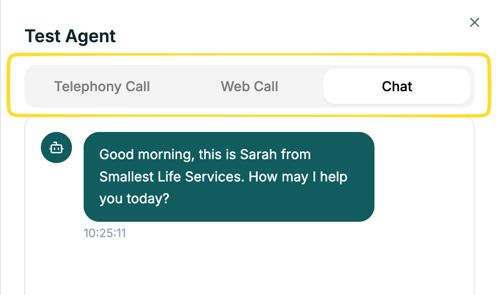

Starting from scratch gives you complete control. You'll configure every detail yourself — model, voice, prompt, and behavior.

---

## Step 1: Click Start From Scratch

From your dashboard, click the green **Create Agent** button in the top right, then select **Start from Scratch**.

<Frame caption="Click Start From Scratch in the Create Agent modal">
  
</Frame>

---

## Step 2: Select Single Prompt

Choose **Single Prompt** as your agent type.

<Frame caption="Select Single Prompt as your agent type">
  
</Frame>

---

## Step 3: The Editor Opens

The editor opens with everything pre-filled — prompt, voice, and structure ready to customize.

<Frame caption="The Single Prompt agent editor">
  
</Frame>

---

## Step 4: Configure Your Agent (Left Panel)

Before writing your prompt, set the basics in the left panel:

| Field | What to choose |
|-------|----------------|
| **Agent Type** | Single Prompt (already selected) |
| **Call Direction** | **Inbound** if customers call in, **Outbound** if the agent makes calls |
| **Emotive Model** | Toggle on for more expressive voice (Beta), or leave off |
| **Voice** | Pick a voice from the library — use the preview to listen |
| **Knowledge Base** | Optionally attach an existing KB so the agent can use your docs/FAQs |

---

## Step 5: Write Your Prompt

The right panel is your prompt editor. This is the heart of your agent — it tells the AI exactly how to behave on every call.

Write clear instructions covering:

- **Role & Objective** — Who is this agent and what's their goal?
- **Conversational Flow** — What steps should the agent follow?
- **Dos, Don'ts & Fallbacks** — How should the agent behave in tricky situations?
- **End Conditions** — When should the call end?

<Tip>
**First time?** Start simple. Write a few sentences about who the agent is and what it should do. You can refine everything else as you go.
</Tip>

---

## Step 6: Test Your Agent

Click **Test Agent** in the top-right to start a test call.

You can test your agent in three ways:

- **Web Call** — talk to your agent through your browser microphone
- **Telephony Call** — enter a phone number and get a call from your agent
- **Chat** — text-based conversation with your agent

<Frame caption="Test your agent via Web Call, Telephony, or Chat">
  
</Frame>

Talk through a few scenarios — ask a normal question, ask something unexpected, and interrupt mid-response. Listen for clarity and that the agent follows your guidelines.

---

## What's Next

<CardGroup cols={2}>
  <Card title="Refine Your Prompt" icon="pen" href="/atoms/atoms-platform/single-prompt-agents/prompt-section/writing-prompts">
    Structure and improve your agent's instructions
  </Card>
  <Card title="Add Knowledge Base" icon="book" href="/atoms/atoms-platform/features/knowledge-base">
    Ground responses in your actual docs and data
  </Card>
  <Card title="Deploy to Phone" icon="phone" href="/atoms/atoms-platform/deployment/phone-numbers">
    Get a real phone number and go live
  </Card>
  <Card title="Configure Settings" icon="gear" href="/atoms/atoms-platform/single-prompt-agents/agent-settings/general-settings">
    Voice, model, language, and behavior settings
  </Card>
</CardGroup>
