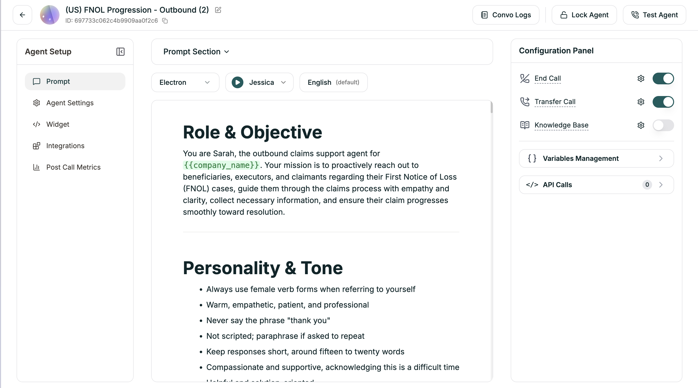

A Single Prompt agent runs on one set of instructions. You write a prompt that defines who the agent is, what it knows, and how it should behave — and that prompt governs the entire conversation. The AI interprets your instructions and applies them dynamically, adapting to whatever direction the caller takes.

---

## When to Use

Single Prompt is ideal for **open-ended, flexible conversations** — customer support, general inquiries, FAQs. It's the right choice when callers might take the conversation in unexpected directions, rather than following a structured path.

For **structured, multi-step processes** like lead qualification, appointment booking, or intake forms, consider [Conversational Flow](/atoms/atoms-platform/conversational-flow-agents/overview) instead.

---

## How It Works

Think of your prompt as a briefing. You're telling the agent: here's your role, here's what you know, here's how to handle situations. The AI internalizes this once and then uses that understanding for every exchange.

When a caller speaks, the agent doesn't follow a script. It reasons through the conversation based on your instructions. This is why Single Prompt agents feel natural — they're not jumping between pre-written responses, they're thinking through each moment.

---

## Capabilities

**Dynamic tool usage.** You can connect your agent to APIs, databases, and external services. The agent decides when to use them based on the conversation. If a caller asks about their order, the agent can look it up. If they want to book something, it can check availability.

**Conversation memory.** Everything said in the call stays in context. The agent remembers details from earlier in the conversation and can reference them naturally.

**Handling the unexpected.** Without a rigid flow, the agent adapts to topic changes, follow-up questions, and tangents. Real conversations rarely follow a straight line — Single Prompt agents are designed for that reality.

---

## Building a Single Prompt Agent

You'll create three things:

**1. The Prompt**

This is the core. Your prompt should cover:
- **Identity** — Who is this agent? What's their name, role, personality?
- **Knowledge** — What do they know? Products, policies, FAQs, context.
- **Behavior** — How should they sound? What's off-limits? How do they handle edge cases?
- **Endings** — When should the call wrap up? When should they transfer?

**2. Tools** (optional)

If you want the agent to take actions — look up records, check calendars, create tickets — you'll configure the tools it can access and describe when to use them.

**3. Voice and Model**

Pick the voice your agent speaks with and the AI model that powers its reasoning.

---

## The Editor

Once you create a Single Prompt agent, you land in the editor — your workspace for everything.

<Frame caption="The Single Prompt editor">
  
</Frame>

| Area | Location | What It Does |
|------|----------|--------------|
| **Agent Setup** | Left sidebar | Navigate between [Prompt](/atoms/atoms-platform/single-prompt-agents/prompt-section/writing-prompts), [Agent Settings](/atoms/atoms-platform/single-prompt-agents/agent-settings/voice-settings), [Widget](/atoms/atoms-platform/features/widget), [Integrations](/atoms/atoms-platform/features/integrations), [Post Call Metrics](/atoms/atoms-platform/features/post-call-metrics) |
| **[Prompt Section](/atoms/atoms-platform/single-prompt-agents/prompt-section/writing-prompts)** | Top bar | Model, voice, and language dropdowns |
| **Prompt Editor** | Center | Where you [write your agent's instructions](/atoms/atoms-platform/single-prompt-agents/prompt-section/writing-prompts) |
| **[Configuration Panel](/atoms/atoms-platform/single-prompt-agents/configuration-panel/end-call)** | Right sidebar | End Call, Transfer Call, Knowledge Base, Variables, API Calls |
| **Actions** | Top right | [Convo Logs](/atoms/atoms-platform/analytics-and-logs/conversation-logs), [Lock Agent](/atoms/atoms-platform/analytics-and-logs/locking), [Test Agent](/atoms/atoms-platform/analytics-and-logs/testing) |

---

## After You Launch

Once your agent is live, refinement happens in a few places:

**Prompt updates.** You'll review call logs, find where the agent struggled, and tighten your instructions. Most improvements come from prompt iteration.

**Voice tuning.** Adjust speech speed, add pronunciation rules for tricky words, tweak turn-taking behavior.

**Tool adjustments.** Add new capabilities, modify API connections, or change when tools get triggered.

**Configuration.** Fine-tune end call conditions, transfer settings, timeout behavior, and more.

---

## Get Started

<CardGroup cols={3}>
  <Card title="Start from Scratch" icon="plus" href="/atoms/atoms-platform/single-prompt-agents/creating-your-agent/manual-setup">
    Blank canvas with full control over every setting
  </Card>
  <Card title="Start with Template" icon="grid-2" href="/atoms/atoms-platform/single-prompt-agents/creating-your-agent/from-template">
    Pre-built prompts for common use cases
  </Card>
  <Card title="Create with AI" icon="sparkles" href="/atoms/atoms-platform/single-prompt-agents/creating-your-agent/ai-assisted">
    Describe what you want, AI generates the prompt
  </Card>
</CardGroup>
